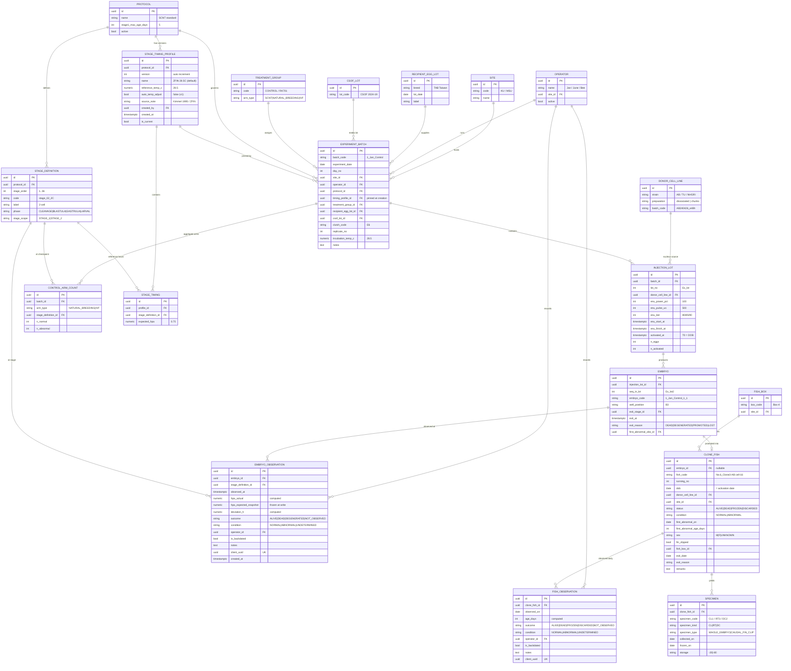

# Requirement Analysis — ระบบติดตามผลการทดลอง Cloning ปลา (SCNT Tracking System)

| | |
|---|---|
| **เอกสาร** | Requirement Analysis / Solution Design |
| **เวอร์ชัน** | **v0.3** (ปรับตามคำตอบ Open Questions รอบที่ 2 — ล็อก tech stack) |
| **วันที่** | 2026-08-20 |
| **ลูกค้า** | ห้องปฏิบัติการ Cloning โรงพยาบาลสัตว์ |
| **สถานะ** | **พร้อมเริ่ม implement** — Open Questions ปิดครบทุกข้อ · tech stack ล็อกแล้ว · ไม่มีอะไรบล็อก |

### สิ่งที่เปลี่ยนจาก v0.2

| # | การเปลี่ยนแปลง | ผลกระทบ |
|---|---|---|
| 1 | **ล็อก tech stack: Static SPA + Go backend** (แทน Next.js fullstack) | เขียนหัวข้อ 11 ใหม่ทั้งหมด + เพิ่ม 11.5 "สัญญาความพกพา" และ 11.6 แผน demo |
| 2 | **ตัดระบบ tolerance / ไฟเขียว-เหลือง-แดง ออก** (Q-N5) | ลบ `tolerance_h` จาก schema · แสดงส่วนต่างเป็นตัวเลขตรง ๆ · ตัด FR-1.10 |
| 3 | **ตัดการปรับตามอุณหภูมิออกจาก v1** (Q-N2) | FR-1.8 → v2 · คงคอลัมน์ `incubation_temp_c` ไว้เฉย ๆ เพื่อไม่ต้อง migrate ทีหลัง |
| 4 | **Abnormal mark ครั้งเดียวจบ** (Q-N4) | FR-4.17 ง่ายลง — ไม่มี workflow ยืนยันซ้ำ |
| 5 | **ตัด notification ออกจาก v1** (Q-N6) | เหลือแค่หน้า Due Now |
| 6 | **ยืนยัน Tier 1 สำหรับความทนเครือข่าย** (Q-N1: "หลุดบ้าง ไม่บ่อยมาก") | คงตามแผน 3 วัน |
| 7 | **R-01 (hosting) ลดจาก 🔴 เหลือ 🟡** | เพราะสถาปัตยกรรมใหม่ทำให้ย้าย hosting ได้โดยไม่ต้องรื้อ |
| 8 | Roadmap ปรับเป็น **~9.5 สัปดาห์** | ตัดงานที่ไม่ต้องทำแล้วออก |

### สิ่งที่เปลี่ยนจาก v0.1

| # | การเปลี่ยนแปลง | ผลกระทบ |
|---|---|---|
| 1 | **เพิ่มระบบ "เวลามาตรฐาน" + การวัดความเร็ว-ช้า** เป็นฟีเจอร์หลัก (จากคำตอบ Q1) | เพิ่มตาราง `stage_timing_profile`, หน้าตั้งค่า, แผง dashboard ใหม่ |
| 2 | **เส้นแบ่ง Stage 1/2 = อายุเกิน 5 วันและยังรอด** (Q3) | Stage 1 เหลือ 26 checkpoints, มีระบบเลื่อนขั้นกึ่งอัตโนมัติ |
| 3 | **ตัวอ่อน/ปลา Abnormal ติดตามต่อจนตาย** เพียงแต่ mark จุดที่พบความผิดปกติ (Q4) | เพิ่มการติดตาม "จุดเริ่มผิดปกติ" |
| 4 | **ตัด Data Migration ออกทั้งหมด** (Q10) | ลดขอบเขต ~2 สัปดาห์ · ตัดหัวข้อ 12 เดิม · ลดความเสี่ยง 3 ข้อ |
| 5 | **R Export เลื่อนขึ้นเป็น Must** (Q5) | FR-7.4 |
| 6 | **ทบทวนเรื่อง Offline ใหม่ทั้งหมด** — ผมประเมินเกินจริงใน v0.1 | ลดจาก 2 สัปดาห์เหลือ ~3 วัน (ดูหัวข้อ 11.4) |
| 7 | **เพิ่มความเสี่ยงเรื่อง Hosting** เป็นความเสี่ยงอันดับ 1 (จากคำตอบ Q9) | R-01 ใหม่ — ต้องเคลียร์ก่อนเขียนโค้ดบรรทัดแรก |
| 8 | ยืนยันด้วยข้อมูลว่า **DOB = วัน activation** ⇒ ทั้ง 2 stage ใช้นาฬิกาเดียวกัน | ทำให้ data model ง่ายลงอย่างมาก (หัวข้อ 5.1) |

---

## 0. Executive Summary

ห้องปฏิบัติการทำการโคลนปลาม้าลาย (zebrafish) ด้วยเทคนิค **SCNT — Somatic Cell Nuclear Transfer** แล้วติดตามอัตราการรอดชีวิตของตัวอ่อนและปลาที่เกิดขึ้น ปัจจุบันบันทึกด้วยกระดาษ → คีย์เข้า Excel ภายหลัง ทำให้เกิด double entry, ข้อมูลคลาดเคลื่อน, และไฟล์ Excel แตกโครงสร้างไปเรื่อย ๆ

### ข้อค้นพบที่กำหนดรูปร่างของระบบ

**① ทั้งสองระยะใช้นาฬิกาเดียวกัน — ตรวจสอบยืนยันแล้ว**

จากการเทียบข้อมูลจริง: **DOB ของปลาโคลนทั้ง 46 ตัวใน `Cloned fish status` ตรงกับวันที่ทำการทดลองใน `raw data` ครบ 100%** แปลว่า `DOB` ไม่ใช่วันฟัก แต่คือ **วันที่ทำ nuclear transfer / activation** และคอลัมน์ `AGE of clone` ก็คือจำนวนวันนับจากวันนั้น

⇒ Stage 1 กับ Stage 2 ไม่ใช่ระบบสองระบบที่ต้องเชื่อมกัน แต่คือ **เส้นเวลาเดียวกันที่ดูด้วยความละเอียดต่างกัน**

```
T0 = Activation ─────────────────────────────────────────────────────▶
     │◀──── Stage 1: ละเอียดระดับชั่วโมง (26 checkpoints, 0–5 วัน) ────▶│◀── Stage 2: รายวัน (วันที่ 6 → 365) ──▶
     0h   0.75h  1h  …  6h  …  24h(1D)  48h(2D)  …  120h(5D)          d6   d7   …   d365
```

**② "เวลามาตรฐาน" ที่ลูกค้าต้องการ มีอยู่แล้วในไฟล์ของเขาเอง — และเป็นมาตรฐานสากลที่ตีพิมพ์แล้ว**

ค่าชั่วโมงในวงเล็บที่อยู่ในหัวคอลัมน์ Excel ของลูกค้า (`2-cell (0.75 h)`, `Shield (6 h)`, `90%epi (9 h)`) **ตรงกับ Kimmel et al. 1995 / ZFIN Zebrafish Developmental Staging Series ทุกค่า** ซึ่งเป็นตารางอ้างอิงมาตรฐานของวงการ zebrafish ที่อุณหภูมิ 28.5°C

⇒ เราไม่ต้องรอลูกค้าให้ค่ามา ระบบเริ่มต้นด้วยค่ามาตรฐานสากลได้เลย แล้วให้ปรับทีหลังตามที่ต้องการ (รายละเอียดหัวข้อ 5.6 และภาคผนวก C)

**③ ลูกค้ากำลังเปลี่ยนวิธีเก็บข้อมูลอยู่แล้วด้วยตัวเอง**

ไฟล์ v2 (เม.ย. 2026 →) เปลี่ยนจากการนับรวมต่อ lot มาเป็นรายฟองพร้อม `Embryo_ID`, matrix 0/1 ต่อ stage, และ stage dictionary แยก sheet — คือกำลังพยายามทำสิ่งที่ระบบเราควรทำ แต่ทำใน Excel ไม่ไหว

### หลักการออกแบบ 6 ข้อ

1. **หนึ่งแถวคือหนึ่ง observation** — เลิกใช้คอลัมน์ต่อเวลา (ปัจจุบันมี `d1`…`d220` และจะทะลุ 365 คอลัมน์เมื่อครบปี)
2. **Survival เป็น monotonic** — ตายแล้วไม่ฟื้น ⇒ UI บันทึกเฉพาะ *การเปลี่ยนแปลง* นี่คือกุญแจของ "กรอกให้เร็วที่สุด"
3. **เวลาคำนวณให้ ไม่ให้คนกรอก** — ระบบรู้ `activated_at` อยู่แล้ว จึงคำนวณ hpa, อายุ, checkpoint ที่ถึงกำหนด และ **ส่วนต่างจากเวลามาตรฐาน** ให้เอง
4. **Derived data ไม่เก็บลงฐาน** — `% of development`, `AGE of clone` คำนวณตอน query ทุกครั้ง
5. **ค่าอ้างอิงเป็น config ที่แก้ได้ ไม่ใช่โค้ด** — เวลามาตรฐานต่อ stage แก้ได้จากหน้าเว็บภายในไม่กี่วินาที โดยไม่กระทบข้อมูลเก่า
6. **ไม่มี migration** — ระบบเริ่มจากศูนย์ ไฟล์เก่าเป็นเอกสารอ้างอิงเท่านั้น (แต่ schema ต้องรองรับทุกข้อมูลที่เขาเคยเก็บ — พิสูจน์ในภาคผนวก A)

---

## 1. บริบทและความเข้าใจ Domain

### 1.1 ภาพรวมกระบวนการทดลอง

```
[Donor cell line]        [Recipient egg]
 AB / TU / NHGRI           TAB Taiwan (clutch: E1, E4, E6, E7...)
 dissociated / chunks      Lot of CSOF: CSOF 2024-19, CSOF 2021-3, ...
        │                        │
        │                        ▼
        │                  ① Enucleation  (Power %, Pulse µs, LED)
        │                        │  Ex_start → Ex_fin
        └───────────┬────────────┘
                    ▼
              ② Injection (Nuclear transfer)  → แบ่งเป็น "Lot No." ต่อรอบ
                    │  N in lot = จำนวนไข่ในรอบนั้น
                    ▼
              ③ Activation  ← ⏱ T0  (= DOB ของปลาที่จะเกิดในอนาคตด้วย)
                    │
                    ▼
 ┌────────────────────────────────────────────────────────────────┐
 │  STAGE 1: EMBRYO — 26 checkpoints, ชั่วโมงที่ 0 ถึงวันที่ 5      │
 │  1C→2C→4C→8C→16C→32C→64C→128C→256C→512C→1K                     │
 │  →High→Oblong→Sphere→Dome                                       │
 │  →30%epi→50%epi→Germ ring→Shield→75%epi→90%epi                  │
 │  →1D→2D→3D→4D→5D                                                │
 │  บันทึก: เวลาที่ส่อง / รอด-ตาย-สลาย / Normal-Abnormal            │
 │  ระบบคำนวณให้: hpa จริง เทียบกับเวลามาตรฐาน → เร็ว/ช้าเท่าไหร่   │
 └────────────────────────────────────────────────────────────────┘
                    │  ⚡ อายุเกิน 5 วัน + ยังมีชีวิต → เลื่อนเป็นปลาโคลน
                    ▼
 ┌────────────────────────────────────────────────────────────────┐
 │  STAGE 2: CLONE FISH — รายวัน d6 → d365                        │
 │  STATUS: Alive / Dead / Frozen / Discarded                      │
 │  + SEX, cut tail (fin clip), Zebrafish box                      │
 │  + Specimen code สำหรับ DNA (CL / RT / DC)                       │
 │  + จุดที่พบความผิดปกติครั้งแรก (ติดตามต่อจนตาย ไม่ตัดออก)         │
 └────────────────────────────────────────────────────────────────┘
```

**กลุ่มเปรียบเทียบคู่ขนาน** (บันทึกแบบนับรวม ไม่ต้องรายฟอง — ยืนยันจาก Q6):
`Natural breeding` · `IVF` · `SCNT Control` · `SCNT + Small molecule (RK701)`
เก็บ Normal/Abnormal ณ checkpoint หลัก: `4-cell`, `Shield–75%Epiboly`, `Day-1`, `Day-2`, `Day-3`

### 1.2 Glossary

| ศัพท์ | ความหมาย | พบใน dataset |
|---|---|---|
| **SCNT** | Somatic Cell Nuclear Transfer — เทคนิคโคลน | ชื่อ notebook วิเคราะห์ |
| **Donor cell** | เซลล์ต้นแบบที่ย้ายนิวเคลียส | `AB`, `TU`, `NHGRI`, `AB240426_e48h` |
| **Strain / Cell line** | สายพันธุ์ปลาที่ให้ donor cell | `AB` / `TU` / `NHGRI` |
| **Preparation** | รูปแบบเตรียมเซลล์ | `dissociated cells`, `Chunks cells-01` |
| **Recipient egg** | ไข่ผู้รับ | `TAB Taiwan 29-04-2025` |
| **Clutch** | ชุดไข่จากแม่ปลาชุดเดียวกัน | `Code of Egg` = `E1`,`E4`,`E6`,`E7` |
| **Lot of CSOF** | ล็อตน้ำยา/อาหารเลี้ยง | `CSOF 2024-19`, `CSOF 2021-3` |
| **Enucleation** | ดูดนิวเคลียสไข่ออก | `Power (%)`, `Pulse (us)`, `LED` |
| **Ex_lot / Lot No.** | รอบการฉีดย่อยภายในวันเดียว | `1`, `2`, `3`… |
| **Activation** | กระตุ้นให้ไข่เริ่มแบ่งตัว = **T0 = DOB** | `Activated time` |
| **hpa** | hours post-activation — นาฬิกาหลักของ Stage 1 | ตัวเลขในวงเล็บ เช่น `2-cell (0.75 h)` |
| **เวลามาตรฐาน (Reference timing)** | ชั่วโมงที่ *ควรจะ* ถึงแต่ละ stage | หัวคอลัมน์ Excel — ตรงกับ Kimmel/ZFIN |
| **Deviation** | ส่วนต่างระหว่างเวลาจริงกับเวลามาตรฐาน (+ = ช้ากว่า, − = เร็วกว่า) | *(ใหม่ — จาก Q1)* |
| **Degenerated** | ตัวอ่อนสลาย (แยกจาก "ตาย") | แถว `Degenerated` ใน worksheet |
| **Observed Dead** | ตายที่ stage นั้น ๆ | แถว `Observed Dead` |
| **Nor / Ab** | ปกติ / ผิดปกติ | แถว `Nor/Ab` |
| **Clone fish** | ตัวอ่อนที่อายุเกิน 5 วันและรอด | `No.39_Clone2-NHGRI cell` |
| **Frozen** | การุณยฆาต + แช่แข็งเก็บตัวอย่าง | `STATUS = Frozen`, `Freeze -80`, `Freeze -20` |
| **cut tail** | ตัดครีบหางไปตรวจ DNA | `cut tail = True/False` |
| **Site** | สถานที่ทำการทดลอง | `KU`, `MSU` |
| **Operator** | ผู้ทำการทดลอง/บันทึก | `Jan`, `June`, `Bee`, `Toon` |

---

## 2. ผลการวิเคราะห์ข้อมูลปัจจุบัน (As-Is Analysis)

> **หมายเหตุขอบเขต:** เนื่องจาก**ไม่ต้อง migrate ข้อมูลเก่า** (Q10) หัวข้อนี้จึงมีไว้เพื่อ 2 อย่างเท่านั้น — (ก) ให้เข้าใจวิธีทำงานจริงของลูกค้า และ (ข) เป็นเช็คลิสต์ว่า schema ใหม่ต้องรองรับข้อมูลอะไรบ้าง ไม่มีข้อไหนกลายเป็นงาน import

### 2.1 สินทรัพย์ข้อมูลที่ได้รับ

| # | ไฟล์ | บทบาท | โครงสร้างที่พบ |
|---|---|---|---|
| 01 | `Experiment_Cloning_01_Raw data v1.xlsx` | **ระบบเดิม (v1)** — บันทึกจริง Sep 2025 → Q1 2026 | 10 sheets: `work sheet_Cloning` (แบบฟอร์มพิมพ์ไปกรอกในแลป), `raw data` (410 แถวข้อมูล), `June`/`Jan`, `Summary`, `% of development`, `Cloned fish status` (+`Master`), `Specimen Code for DNA Analysis`, `NBD` (ว่าง) |
| 02 | `Experiment_Cloning_02_Working data v1.xlsx` | **ชั้นเตรียมข้อมูล** สำหรับสถิติ | 11 sheets แยกตาม site: `KU_raw`/`KU_clean`/`KU_Pivot`/`KU_Sum`/`KU_Clone`, `MSU_*` |
| 03 | `Experiment_Cloning_03_Clean table v1.xlsx` | **Analysis-ready table** ที่ป้อนเข้า R | sheet เดียว `v4`, 43 แถว × 30 คอลัมน์ |
| 04 | `Experiment_Cloning_04_Raw data v2 ongoing.xlsx` | **ระบบใหม่ที่กำลังเปลี่ยนผ่าน (v2)** เม.ย. 2026 → | 14 sheets — สำคัญคือ `Stage` (dictionary 36 stage), `Matadata1`, `Control1`, `QControl_1`, `RawData2`, `Clone_small molecule` |
| 05 | `ตัวอย่างการวิเคราะห์ผล Experiment_Cloning_v1.nb.html` | **ปลายทางของข้อมูล** — R notebook โดย Toon Suparat (2026-05-25) | Discrete-time survival analysis, GLM binomial(cloglog), Kaplan–Meier step curves |

### 2.2 ปลายทางของข้อมูล — สิ่งที่ระบบต้องผลิตให้ได้

```r
fit <- glm(cbind(n_dead, alive) ~ site * strain + ns(time, df = 3),
           family = binomial(link = "cloglog"), data = df_scnt_final)

ggplot(df, aes(x = time, y = surv, color = strain)) +
  geom_step() + facet_wrap(~site)      # KM survival curve, แยกแผงตาม site
```

วิเคราะห์แยก 3 ช่วง: **Zygote → Adult**, **Cleavage (Zygote → Dome)**, **Post-oblong → Adult**

> **นัยต่อ design:** ระบบต้องผลิต 4 ฟิลด์นี้ต่อ (site, strain, stage) ให้ได้: `alive`, `n_prev`, `n_dead`, `surv` และ `time` ต้องเป็น ordered factor ตามลำดับ stage — ได้ฟรีถ้าเก็บ `stage_order` เป็นตัวเลขในฐานข้อมูล **นี่คือเหตุผลที่ FR-7.4 (R export) ควรเป็น Must** ตามที่ยืนยันใน Q5

### 2.3 วิวัฒนาการ v1 → v2

| | v1 (Sep 2025 – Q1 2026) | v2 (Apr 2026 – ปัจจุบัน) |
|---|---|---|
| หน่วยข้อมูล | นับรวมต่อ lot | **รายฟอง** |
| ตัวระบุ | ไม่มี | `Embryo_ID` = `1_Jan_Control_1_1` |
| ค่าที่บันทึก | จำนวนนับ | **0/1 ต่อ stage** (`stage_01_1C` … `stage_36_15D`) |
| stage dictionary | ฝังในหัวคอลัมน์ | แยกเป็น sheet `Stage` |
| ตำแหน่งกายภาพ | ไม่มี | `well (96-well)` เช่น `B3` |
| จำนวน stage | 22–26 | 36 |

### 2.4 Pain Points ที่ค้นพบ (พร้อมหลักฐานจากไฟล์จริง)

| # | ปัญหา | หลักฐาน | ระบบใหม่แก้อย่างไร |
|---|---|---|---|
| **P1** | **Double entry** — จดกระดาษแล้วคีย์ Excel | ลูกค้าแจ้งเอง + sheet ชื่อ `work sheet_Cloning` คือแบบฟอร์มสำหรับพิมพ์ไปกรอก | กรอกบน iPad ที่โต๊ะกล้อง จบในครั้งเดียว |
| **P2** | **เวลาถูกเก็บเป็นทศนิยม ตีความไม่ได้แน่นอน** | คอลัมน์ `Activated time` (410 แถว): **402 ค่าเป็น float** (`10.41` = 10:41), 4 ค่าเป็น int, 4 ค่าเป็นข้อความ (`"10.36/10.37"`, `"11..08"`, `"na"`, `"-"`) · คอลัมน์ `Start` มี 332 float, 10 int, 67 ข้อความ และมี **ค่าที่เป็น time จริงเพียง 1 ค่า** (`11:52:00`) | เก็บเป็น `timestamptz` เสมอ + time picker — **สำคัญเป็นพิเศษเพราะฟีเจอร์ deviation ต้องใช้เวลาที่แม่นยำ** |
| **P3** | **คอลัมน์บานตามเวลา** | `Cloned fish status` มี **220 คอลัมน์ `d1`–`d220`**; `Master` มี **243 คอลัมน์** | ตาราง observation แนวยาว ไม่จำกัดเวลา |
| **P4** | **ข้อมูลชุดเดียวกันอยู่ 3 ที่ ไม่ตรงกัน** | `Cloned fish status` / `Master` / `Summary!A10:K41` เก็บปลาชุดเดียวกัน · `Summary` นับ clone embryo ได้ **31** แต่ทะเบียนปลามี **46** ตัว | Single source of truth ในฐานข้อมูล |
| **P5** | **คีย์ผิดตอนย้ายข้อมูลข้ามไฟล์ (พิสูจน์ได้)** | `NHGRI_10` @ stage `256-cell` = **23** ใน `KU_clean` แต่ = **24** ใน `Clean table v4` | Export จาก DB โดยตรง ไม่มีการคัดลอกด้วยมือ |
| **P6** | **ค่าคำนวณเองก็เพี้ยน** | `DOB + AGE of clone` ควรเท่ากับวันแช่แข็ง — ตรวจ 15 ตัวที่มีข้อมูลครบ **ตรง 11 · ไม่ตรง 4** (คลาดเคลื่อน 1–4 วัน) | ห้ามเก็บค่าคำนวณ — คำนวณสดจาก `dob` ทุกครั้ง |
| **P7** | **Stage vocabulary drift** | `KU_clean` 23 stage · `v4` 26 stage (ตัด `128-cell`,`Day2` เพิ่ม `Fry`,`Juvenile`,`Adult`) · v2 36 stage | `stage_definition` + `stage_timing_profile` แบบ versioned |
| **P8** | **ธงจบชีวิตไม่น่าเชื่อถือ** | `Cloned fish status` 46 แถว: **42 แถวจบด้วย `1`**, 3 แถวจบด้วย `0`, 1 แถวจบด้วยช่องว่าง — ทั้งที่ 32 ตัวมีสถานะ Frozen/Discarded ไปแล้ว | บันทึก **exit event** เป็นแถวเดี่ยว (วันที่ + เหตุผล) |
| **P9** | **Normal/Abnormal เก็บเป็น 2 คอลัมน์ 0/1** | `Normal` และ `Abnormal` เป็นคนละคอลัมน์ | enum เดียว + NOT NULL |
| **P10** | **ค่าว่างมีหลายความหมายปนกัน** | `-`, `NA`, `na`, `" "`, cell ว่าง ใช้ปนกัน (คอลัมน์ `Start` มี 67 ค่า) | `NULL` = ไม่ได้สังเกต + enum `outcome` แยกชัด |
| **P11** | **ชื่อไม่มาตรฐาน** | `CSOF 2021-3` vs `CSOF 2021-3 ` (มี space ท้าย, 2 แถว) · `"Disscard"` vs `Discarded` · `NHGRI` vs `NHGRI ` | Master data + dropdown ไม่ให้พิมพ์อิสระ |
| **P12** | **สร้าง sheet ใหม่ทุกรอบทดลอง** | `2026-04-24_June`, `1)2026-04-24_June(Control)`, `2) 2026-04-29_Jan(RK701)`, `2)2026-04-29_June(RK-701)` | 1 schema, filter ด้วย batch/group |
| **P13** | **สถานะสำคัญซ่อนใน free text** | `Remarks`: `"normal ลง system แล้ว"`, `"Freeze -80"`, `"death at day 8"` | ยกขึ้นเป็นฟิลด์ enum + คง `notes` ไว้เสริม |
| **P14** | **ชั่วโมงมาตรฐานขัดกันเองในไฟล์** | `work sheet_Cloning` ระบุ `2-cell (0.75 h)` แต่ `raw data` ระบุ `2-cell (1 h)` | **แก้แล้ว** — ดู 2.5 ด้านล่าง |
| **P15** | **ไม่มี audit trail** | ไม่รู้ว่าใครแก้ค่าไหนเมื่อไหร่ | ตาราง audit log ทุกการแก้ไข |

### 2.5 การแก้ปัญหา P14 — เวลามาตรฐานที่ถูกต้องคืออะไร

ผมตรวจสอบค่าชั่วโมงทั้งหมดในไฟล์ของลูกค้ากับ **Zebrafish Developmental Staging Series (Kimmel et al. 1995 / ZFIN)** ซึ่งเป็นตารางอ้างอิงมาตรฐานของวงการ zebrafish ผลคือ **ตรงกันทุกค่า**:

| Stage | ในไฟล์ลูกค้า | ZFIN มาตรฐาน @28.5°C | ตรงกัน |
|---|---|---|---|
| 2-cell | 0.75 h *(worksheet)* / 1 h *(raw data)* | **0.75 h** | ✅ worksheet ถูก — `raw data` พิมพ์ผิด |
| 4-cell → 512-cell | 1, 1.25, 1.5, 1.75, 2, 2.25, 2.5, 2.75 | 1, 1.25, 1.5, 1.75, 2, 2.25, 2.5, 2.75 | ✅ |
| 1k-cell | 3 h | 3.00 h | ✅ |
| High / Oblong | 3.3 / 3.7 | 3.33 / 3.66 | ✅ (ปัดเศษ) |
| Sphere / Dome | 4 / 4.3 | 4.00 / 4.33 | ✅ |
| 30%epi / 50%epi | 4.7 / 5.3 | 4.66 / 5.25 | ✅ (ปัดเศษ) |
| Germ ring / Shield | 5.7 / 6 | 5.66 / 6.00 | ✅ |
| 75%epi / 90%epi | 8 / 9 | 8.00 / 9.00 | ✅ |

**สรุปสำหรับ Q1:** ไม่ต้องรอถามลูกค้าก็เริ่มได้ — ระบบ seed ค่าเริ่มต้นจาก ZFIN แล้วให้แก้ทีหลังเมื่อลูกค้ายืนยัน ค่าที่ควรใช้สำหรับ `2-cell` คือ **0.75 h**

> ⚠️ **ประเด็นที่ต้องบอกลูกค้า:** ตาราง ZFIN อ้างอิงที่ **28.5°C** และ Kimmel ให้สูตรแปลงตามอุณหภูมิไว้ว่า `H_T = h / (0.055T − 0.57)` โดย `h` = ชั่วโมงที่ 28.5°C, `T` = อุณหภูมิเลี้ยงจริง (°C) ใช้ได้ในช่วง 25–33°C
> ⇒ **ถ้าแลปเลี้ยงที่อุณหภูมิอื่น ค่าสากลจะไม่ตรง** — ลูกค้าแจ้งว่า v1 ยังไม่ต้องกังวลเรื่องนี้ (Q-N2) ระบบจึงเก็บคอลัมน์ `incubation_temp_c` ไว้เฉย ๆ แต่ยังไม่คำนวณปรับ · ถ้าภายหลังพบว่าตู้ไม่ได้ตั้ง 28.5°C เปิดฟีเจอร์นี้ได้โดยไม่ต้อง migrate (FR-1.8, v2)

---

## 3. Stakeholders & Personas

ทีมในแลปมี **5 คน** (Q8) — ระบบจึงออกแบบสำหรับ concurrent user ระดับหน่วย ไม่ต้องกังวลเรื่อง scale

| Persona | ตัวอย่างจริง | สิ่งที่ทำ | ต้องการอะไรจากระบบ |
|---|---|---|---|
| **Lab Technician / Operator** | Jan, June, Bee | ทำ enucleation → injection → activation แล้วส่องกล้องบันทึกผลทุก checkpoint | กรอกเร็ว มือเดียว ใส่ถุงมือ, ไม่ต้องคิดเลข, ไม่กลัวข้อมูลหายเวลาเน็ตกระตุก |
| **Lab Manager / PI** | — | ดูภาพรวมว่ารอบไหนได้ผลดี, ตัดสินใจว่าจะ scale protocol ไหน | Dashboard เปรียบเทียบกลุ่ม, funnel การรอด, **แผงเวลาช้า-เร็วเทียบมาตรฐาน**, แจ้งเตือนรอบที่ค้าง |
| **Data Analyst / Biostatistician** | Toon Suparat | รัน survival model ใน R | Export ที่ป้อนเข้าโมเดลได้ทันที + reproducible |
| **Animal Care Staff** | — | ดูแลปลาใน box ประจำวัน | รายการปลาที่ยังมีชีวิตต่อ box, เช็คชื่อรายวัน |
| **Admin (คนใดคนหนึ่งในทีม)** | — | ตั้งค่า master data + เวลามาตรฐาน | หน้าตั้งค่าที่แก้ได้เองโดยไม่ต้องเรียกโปรแกรมเมอร์ |

---

## 4. Scope

### 4.1 In Scope (v1)

| ID | รายการ | ที่มา |
|---|---|---|
| S-01 | ลงทะเบียนรอบทดลอง (batch) + ตัวอ่อนรายฟอง | Req #1 |
| S-02 | ลงทะเบียนปลาโคลนรายตัว (DOB, สายพันธุ์ ฯลฯ) | Req #1 |
| S-03 | บันทึกผลติดตาม Stage 1 (embryo, **26 checkpoints, 0–5 วัน**) | Req #2 · Q3 |
| S-04 | บันทึกผลติดตาม Stage 2 (fish, รายวัน d6 → ~1 ปี) | Req #2 · Q7 |
| S-05 | Dropdown `Normal / Abnormal` ในการบันทึกทุกจุด | Req #2 |
| S-06 | Dashboard แยกตาม stage | Req #3 |
| S-07 | Export Excel + สรุป Dashboard เป็นไฟล์ | Req #4 |
| S-08 | ไม่มีระบบ login (แต่มีการเลือก operator) | Req #5 |
| S-09 | เก็บทุกอย่างใน relational database | Req #6 |
| S-10 | คำนวณเวลาอัตโนมัติจาก activation / DOB | Req #7 |
| S-11 | รองรับ Desktop / iPad / Smartphone | Req |
| S-12 | Multi-site (KU, MSU) + Operator | ยืนยันแล้ว |
| S-13 | Treatment / Experiment arm (Control · RK701 · Natural breeding · IVF) | ยืนยันแล้ว |
| **S-14** | **⭐ เวลามาตรฐานต่อ stage แบบ config ได้ + คำนวณส่วนต่างเร็ว/ช้าอัตโนมัติ** | **Q1 (ใหม่)** |
| **S-15** | **⭐ เลื่อนขั้น Stage 1 → Stage 2 อัตโนมัติเมื่ออายุเกิน 5 วันและยังรอด** | **Q3 (ใหม่)** |
| **S-16** | **⭐ ติดตาม Abnormal ต่อจนตาย + mark จุดที่พบความผิดปกติครั้งแรก** | **Q4 (ใหม่)** |
| S-17 | บันทึกกลุ่ม Natural breeding / IVF แบบนับรวม | Q6 |
| S-18 | บันทึกย้อนหลังได้ทุกจุด (backdating) | Q7 |
| S-19 | ทนต่อการหลุดของเครือข่ายระหว่างกรอก — Tier 1 (ดูหัวข้อ 11.4) | Q-N1 |
| S-20 | R-ready export | Q5 |

### 4.2 Out of Scope (v1)

| รายการ | เหตุผล |
|---|---|
| **Data migration จากไฟล์ Excel เดิม** | **ลูกค้ายืนยันว่าไม่ต้อง (Q10)** — ไฟล์เก่าเป็นเอกสารอ้างอิง · ดูผลกระทบใน 4.3 |
| ระบบ user account, role, permission | ลูกค้าระบุว่ายังไม่ต้องการ — แต่ดู R-04 |
| Workflow ตรวจสอบ/อนุมัติข้อมูลโดยคนที่ 2 (`Prefill_Audit` / `Postfill_Audit`) | ลูกค้าให้ข้าม (Q12) |
| แนบรูป/วิดีโอจากกล้องจุลทรรศน์ | v2 — มีคุณค่าสูงสำหรับการตัดสิน Normal/Abnormal แต่เพิ่ม storage + upload flow |
| รันโมเดลสถิติในเว็บ (GLM / cloglog) | คงให้ทำใน R ต่อไป — เราส่ง export ที่สะอาดให้แทน |
| ระบบ inventory ตู้ปลา / feeding schedule | v2 |
| Workflow DNA / specimen เต็มรูปแบบ | v1 เก็บแค่ฟิลด์ ไม่ทำ workflow |
| Native mobile app | ใช้ responsive web + PWA |
| หลาย protocol ที่ใช้ตารางเวลาต่างกัน | ตอนนี้ใช้ตารางเดียวกันก่อน (Q11) — แต่ schema รองรับไว้แล้ว |
| ทำงานได้แบบไม่มีเน็ตเลยเป็นชั่วโมง (full offline-first, Tier 2) | Q-N1: แลป "หลุดบ้าง ไม่บ่อยมาก" ⇒ Tier 1 พอ (ดู 11.4) |

### 4.3 ผลกระทบจากการไม่ migrate ข้อมูลเก่า — สิ่งที่ต้องบอกลูกค้าล่วงหน้า

| ผลกระทบ | รายละเอียด | ข้อเสนอ |
|---|---|---|
| **Dashboard จะว่างเปล่าในวันแรก** | ไม่มีข้อมูลย้อนหลัง Sep 2025 – ปัจจุบันเลย กราฟ survival ทั้งหมดเริ่มนับจากรอบทดลองแรกที่กรอกในระบบ | แจ้งลูกค้าชัด ๆ ก่อนส่งมอบ เพื่อไม่ให้เข้าใจว่าระบบพัง |
| **เทียบ "ก่อน-หลัง" ไม่ได้ทันที** | จะรู้ว่า protocol ใหม่ดีขึ้นหรือไม่ ต้องรอสะสมข้อมูลใหม่ ~3–6 เดือน | ยังใช้ Excel เดิมเป็นฐานอ้างอิงคู่ขนานไปก่อน |
| **Master data ยังต้องตั้งค่าเอง** | strain, CSOF lot, recipient egg lot, operator, site — ไม่ใช่ migration แต่เป็นการตั้งค่าเริ่มต้น ~30 นาที | เตรียม seed script จากค่า distinct ในไฟล์เดิมให้เลย (ดูหัวข้อ 12) |
| **ทางเลือกสำรอง** | ถ้าลูกค้าเปลี่ยนใจภายหลัง schema รองรับการ import ได้ทันที เพราะ mapping ครบแล้ว (ภาคผนวก A) | ประเมินเพิ่มภายหลังเป็น change request (~1 สัปดาห์) |

---

## 5. Domain Model & Data Model

### 5.1 แนวคิดหลัก — นาฬิกาเดียว สองความละเอียด

**ข้อค้นพบที่ตรวจสอบแล้ว:** `DOB` ของปลาโคลนทั้ง 46 ตัว ตรงกับวันที่ทำการทดลองใน `raw data` **ครบทั้ง 46 ค่า** ⇒ `DOB` = วัน activation ไม่ใช่วันฟัก

ผลคือ model ง่ายลงมาก — ไม่ต้องมี "จุดเชื่อม" ระหว่างสอง stage เพราะเป็นเส้นเวลาเดียวกัน:

```
Subject (Embryo)  ──[อายุ > 5 วัน + รอด]──▶  Subject (CloneFish)
     │                                              │
     └──▶ EmbryoObservation                         └──▶ FishObservation
          หน่วย = hpa (ชั่วโมง)                          หน่วย = วัน
          checkpoint 1..26                              d6 .. d365
                    ╲                                  ╱
                     ╲   T0 เดียวกัน = activated_at   ╱
                      ▼                              ▼
              age_days = (observed_at − activated_at) / 24
```

**สิ่งที่ระบบคำนวณให้ (ตอบ Req #7 + Q1 พร้อมกัน):**

| ค่า | สูตร | ใช้ทำอะไร |
|---|---|---|
| `hpa_actual` | `observed_at − injection_lot.activated_at` | เวลาจริงที่ใช้ไปถึง stage นี้ |
| `hpa_expected` | จาก `stage_timing_profile` (ปรับตามอุณหภูมิถ้าตั้งค่าไว้) | **เวลามาตรฐาน** |
| `deviation_h` | `hpa_actual − hpa_expected` | **บวก = ช้ากว่ามาตรฐาน · ลบ = เร็วกว่า** |
| `deviation_pct` | `deviation_h / hpa_expected × 100` | เทียบข้าม stage ได้ (ช้า 15 นาทีที่ 2-cell ≠ ช้า 15 นาทีที่ Day 5) |
| `interval_actual` | `hpa_actual − hpa_actual(stage ก่อนหน้า)` | ช่วงไหนที่ช้าลงจริง ๆ |
| `interval_deviation_h` | `interval_actual − interval_expected` | ระบุ transition ที่มีปัญหา |
| `age_days` | `(now − activated_at) / 24` | อายุปลา (Stage 2) |

### 5.2 ERD



### 5.3 หมายเหตุการออกแบบที่สำคัญ

**(ก) `EMBRYO_OBSERVATION` เก็บแบบ sparse**
เพราะการรอดเป็น monotonic — ถ้าตัวอ่อนผ่าน stage 5 มาแล้วและยังไม่มี exit event แปลว่ารอดถึง stage 5 ระบบจึงบันทึกเฉพาะ observation ที่ส่องจริง + exit event หนึ่งครั้ง การ reconstruct matrix 0/1 แบบ `QControl_1` ทำผ่าน SQL window function ตอน export

**(ข) `hpa_expected_snapshot` — ทำไมต้องแช่ค่าไว้กับ observation**
ลูกค้าจะแก้เวลามาตรฐานภายหลังแน่นอน (Q1 บอกว่ายังไม่รู้ค่าจริง) ถ้าคำนวณ `deviation` สดจาก config ปัจจุบันทุกครั้ง **ตัวเลข deviation ของข้อมูลเก่าจะเปลี่ยนไปเงียบ ๆ ทุกครั้งที่มีคนแก้ config** ซึ่งอันตรายมากสำหรับงานวิจัย
⇒ เก็บ `hpa_expected_snapshot` เป็นตัวเลขติดไปกับแถวนั้นเลย (คอลัมน์เดียว ต้นทุนแทบเป็นศูนย์) ทำให้แถวข้อมูลอธิบายตัวเองได้สมบูรณ์ และยังคำนวณใหม่ตาม profile อื่นได้ถ้าต้องการเปรียบเทียบ

**(ค) `EMBRYO → CLONE_FISH` เป็น 0..1 พร้อม `exit_reason = PROMOTED`**
ทำให้ traceable ตั้งแต่ไข่ใบไหน ล็อตไหน donor ตัวไหน จนถึงปลาโตเต็มวัย — ปัจจุบันเชื่อมด้วยข้อความในคอลัมน์ `Zebrafish normal in` (`"No.39 normal"`) ซึ่ง query ไม่ได้

**(ง) `condition` เก็บ *ต่อ observation* — และมี `first_abnormal_*` เป็นค่าสรุป (ตอบ Q4)**
template v2 มีแถว `Nor/Ab` ที่ทุก checkpoint ⇒ ความผิดปกติเกิดขึ้นได้ตอนไหนก็ได้ ระบบจึงเก็บ condition ทุก observation แล้ว derive `first_abnormal_obs_id` / `first_abnormal_age_days` ไว้เพื่อ:
- **แสดงจุดที่พบความผิดปกติบนเส้นเวลา** (ตามที่ Q4 ต้องการ)
- ไม่ตัดตัวอ่อน/ปลาที่ผิดปกติออกจากการติดตาม — ยังนับใน survival curve ต่อจนกว่าจะมี exit event จริง

**(จ) `CONTROL_ARM_COUNT` แยกออกมาเป็นตารางต่างหาก (ตอบ Q6)**
เพราะ Natural breeding / IVF บันทึกแบบนับรวมที่ checkpoint ไม่กี่จุด (`4-cell`, `Shield–75%epi`, `Day-1/2/3`) ไม่ใช่รายฟอง — ถ้าเอาไปยัดใน `EMBRYO` จะได้ ghost record จำนวนมาก

**(ฉ) Reference data ทั้งหมดเป็นตาราง ไม่ใช่ free text** — แก้ P11 ที่ต้นเหตุ

### 5.4 การเลื่อนขั้น Stage 1 → Stage 2 (ตอบ Q3)

**กฎ:** ตัวอ่อนที่ **อายุเกิน 5 วัน (120 ชั่วโมงหลัง activation) และยังมีชีวิตอยู่** จะถูกเลื่อนเป็นปลาโคลน

```
stage_26_5D ผ่านไปแล้ว + outcome = ALIVE
        │
        ▼
ระบบขึ้นการ์ด "มีตัวอ่อน 3 ตัวพร้อมเลื่อนเป็นปลา"  ◀── ไม่ทำอัตโนมัติเงียบ ๆ
        │  ผู้ใช้กด "ยืนยัน"
        ▼
สร้าง CLONE_FISH:
   dob            = injection_lot.activated_at (วันเดียวกัน)
   running_no     = ต่อจากเลขล่าสุด
   donor_cell_line, site = สืบทอดจาก lot
   condition      = สืบทอดจาก observation ล่าสุด
   embryo_id      = FK กลับไปหาตัวอ่อน
   fish_code      = ผู้ใช้กรอก/ระบบเสนอ  ← จุดเดียวที่ต้องพิมพ์
   fish_box       = ผู้ใช้เลือก
        │
        ▼
EMBRYO.exit_reason = PROMOTED  (ไม่ใช่ DEAD — สำคัญต่อการคำนวณ survival)
```

> **ทำไมต้องกึ่งอัตโนมัติ ไม่ใช่อัตโนมัติเต็ม:** เพราะ `fish_code` และ `fish_box` เป็นสิ่งที่คนต้องกำหนดตามของจริงในแลป (`No.6_Clone3-AB cell-16` มีความหมายเชิงกายภาพ) ระบบเสนอให้ แต่คนยืนยัน — ใช้เวลา 1 แตะ + พิมพ์สั้น ๆ

**ผลต่อ stage dictionary:** Stage 1 ใช้ checkpoint ที่ 1–26 (`1C` → `5D`) ส่วน checkpoint 27–36 (`6D`–`15D`) ที่มีในไฟล์ v2 เดิม **ไม่หายไปไหน** เพราะ Stage 2 นับรายวันจากนาฬิกาเดียวกัน — `6D` เดิม = `age_days 6` ในระบบใหม่ ตรงกันพอดี ไม่มีข้อมูลสูญหาย

### 5.5 Enumerations

| Enum | ค่า | ที่มาใน dataset |
|---|---|---|
| `embryo_outcome` | `ALIVE`, `DEAD`, `DEGENERATED`, `NOT_OBSERVED` | แถว `Observed Dead` / `Degenerated` |
| `embryo_exit_reason` | `DEAD`, `DEGENERATED`, `PROMOTED`, `LOST` | *(ใหม่)* |
| `condition` | `NORMAL`, `ABNORMAL`, `UNDETERMINED` | แถว `Nor/Ab`; คอลัมน์ `Normal`/`Abnormal` |
| `fish_status` | `ALIVE`, `DEAD`, `FROZEN`, `DISCARDED` | `STATUS` (Alive 14 / Frozen 15 / Discarded 17) |
| `sex` | `M`, `F`, `UNKNOWN` | `SEX` (M 13 / F 3 / ว่าง 30) |
| `arm_type` | `SCNT`, `NATURAL_BREEDING`, `IVF` | `Template_Raw data V.2` |
| `specimen_kind` | `CL`, `RT`, `DC` | `Specimen Code for DNA Analysis` |
| `specimen_type` | `WHOLE_EMBRYO`, `CAUDAL_FIN_CLIP` | คอลัมน์ `Specimen type` |
| `stage_phase` | `CLEAVAGE`, `BLASTULA`, `GASTRULA`, `LARVAL` | จากการแบ่งช่วงวิเคราะห์ใน R notebook |
| `stage_scope` | `STAGE_1`, `STAGE_2` | *(ใหม่ — จาก Q3)* |

### 5.6 ⭐ ระบบเวลามาตรฐาน (ตอบ Q1 โดยตรง)

โจทย์จาก P: *"ต้องมีเวลากลางว่าแต่ละ stage ใช้เวลากี่ชั่วโมง พอ user มากรอกเราจะนำเวลาจริงมาเทียบ เพื่อดูว่าเร็วหรือช้ากว่าเดิมเท่าไหร่ — และยังไม่รู้ค่าจริง จึงอยากให้ปรับค่าได้ง่ายที่สุด"*

#### กลไก: แก้ง่ายเหมือนแก้ตาราง แต่ปลอดภัยเหมือนมี version control

```
หน้าตั้งค่า "เวลามาตรฐาน"                        เบื้องหลัง
┌──────────────────────────────────┐
│ Profile: ZFIN 28.5°C  (ใช้อยู่)   │        กด "บันทึก" ทีไร
│ อุณหภูมิอ้างอิง: [28.5] °C        │            │
│ ปรับตามอุณหภูมิจริงอัตโนมัติ: [✓] │            ▼
├──────────────────────────────────┤   snapshot ทั้ง profile เป็น
│ 2-cell      [0.75] ชม.  ±[0.25]  │   version ใหม่ (v1 → v2 → v3)
│ 4-cell      [1.00] ชม.  ±[0.25]  │            │
│ 8-cell      [1.25] ชม.  ±[0.25]  │            ▼
│ ...                              │   batch เก่า pin อยู่ที่ version เดิม
│ Shield      [6.00] ชม.  ±[0.50]  │   ⇒ ตัวเลข deviation ย้อนหลังไม่เปลี่ยน
│ 5D        [120.0] ชม.  ±[6.00]   │   batch ใหม่ใช้ version ล่าสุด
├──────────────────────────────────┤
│ [นำเข้าจาก CSV] [บันทึก]          │
└──────────────────────────────────┘
```

**ผู้ใช้เห็นแค่ "แก้ตัวเลขแล้วกดบันทึก"** — ระบบ versioning ทำงานเงียบ ๆ อยู่ข้างหลัง ไม่มีขั้นตอนเพิ่ม

#### ค่าเริ่มต้น (seed) — ไม่ต้องรอลูกค้า

seed จาก **ZFIN / Kimmel et al. 1995** ซึ่งตรงกับที่ลูกค้าใช้อยู่แล้วทุกค่า (ดู 2.5 และภาคผนวก C) ⇒ ระบบใช้งานได้ตั้งแต่วันแรก แล้วค่อยแก้เมื่อลูกค้ายืนยัน

#### การปรับตามอุณหภูมิ (เตรียมโครงสร้างไว้สำหรับ v2)

ใน v1 ระบบเก็บ `reference_temp_c` และ `incubation_temp_c` เพื่ออ้างอิงเท่านั้น และกำหนด `auto_temp_adjust = false` เสมอ หากเปิดใช้ใน v2 จึงค่อยปรับด้วยสูตรของ Kimmel:

```
hpa_expected(T) = hpa_reference / (0.055 × T − 0.57)      ใช้ได้ช่วง 25–33°C
```

ตัวอย่าง: Shield ที่มาตรฐาน 6.00 ชม. @28.5°C → ถ้าเลี้ยงที่ 26°C จะเป็น 6 / (0.055×26 − 0.57) = 6 / 0.86 = **6.98 ชม.**
ถ้าไม่เปิดฟีเจอร์นี้ ระบบใช้ค่าดิบตามตารางตรง ๆ

> **ทำไมเรื่องนี้สำคัญ:** ถ้าแลปเลี้ยงที่ 26°C แต่เทียบกับตาราง 28.5°C ตัวอ่อน**ทุกตัว**จะดู "ช้ากว่ามาตรฐาน" ทั้งที่จริงพัฒนาปกติ — เป็นกับดักที่ทำให้ข้อสรุปผิดทั้งชุด ผมแนะนำให้ถามลูกค้าว่าตู้ incubator ตั้งที่กี่องศา (Q-N2)

#### สิ่งที่แสดงให้ผู้ใช้เห็น

| ที่ | แสดงอะไร | ตัวอย่าง |
|---|---|---|
| หน้ากรอกข้อมูล | ส่วนต่างสด ๆ ตอนกด | `256-cell · จริง 2:38 · มาตรฐาน 2:30 · ช้ากว่า 8 นาที` 🟡 |
| Dashboard | กราฟ deviation ต่อ stage เทียบระหว่างกลุ่ม | ดูหัวข้อ 8.1 |
| Export | คอลัมน์ `hpa_actual`, `hpa_expected`, `deviation_h`, `deviation_pct` | ดูหัวข้อ 9.1 |

---

## 6. Functional Requirements

รหัส: **M** = Must (v1) · **S** = Should · **C** = Could (v2) · ⭐ = เพิ่มใหม่ใน v0.2

### 6.1 Master Data & Setup

| ID | Requirement | Priority |
|---|---|---|
| FR-1.1 | จัดการ Site (`KU`, `MSU`) และ Operator (`Jan`, `June`, `Bee`, …) | M |
| FR-1.2 | จัดการ Donor cell line (strain × preparation × batch code) | M |
| FR-1.3 | จัดการ Recipient egg lot และ CSOF lot | M |
| FR-1.4 | จัดการ Treatment group / experiment arm | M |
| FR-1.5 | จัดการ Protocol + Stage definition (เพิ่ม/แก้/เรียงลำดับ stage, กำหนด `stage_scope`) | M |
| FR-1.6 | จัดการ Fish box | S |
| **FR-1.7** ⭐ | **หน้าตั้งค่าเวลามาตรฐานต่อ stage** — แก้ตัวเลขในตารางแล้วกดบันทึก, ทุกการบันทึกสร้าง version ใหม่อัตโนมัติ, batch ที่สร้างไปแล้วยังใช้ version เดิม | **M** |
| FR-1.8 | ~~ปรับเวลามาตรฐานตามอุณหภูมิ~~ — **ยกไป v2 ตาม Q-N2** (คงคอลัมน์ `incubation_temp_c` ไว้ในตารางแล้ว จึงเพิ่มทีหลังได้โดยไม่ต้อง migrate) | C |
| **FR-1.9** ⭐ | นำเข้า/ส่งออกเวลามาตรฐานเป็น CSV (เผื่อลูกค้าส่งตารางมาเป็นไฟล์) | S |

### 6.2 Registration — Stage 1 (Embryo)

| ID | Requirement | Priority |
|---|---|---|
| FR-2.1 | สร้าง Experiment Batch: วันที่, site, operator, clutch code, treatment group, recipient egg lot, CSOF lot, protocol, replicate no., **อุณหภูมิเลี้ยง** | M |
| FR-2.2 | ระบบสร้าง `batch_code` อัตโนมัติตามรูปแบบเดิม `{day}_{operator}_{group}` (แก้ไขได้) | M |
| FR-2.3 | ระบบ **pin timing profile version** ที่ใช้อยู่ ณ วันสร้าง batch ให้อัตโนมัติ | M |
| FR-2.4 | เพิ่ม Injection Lot: `lot_no`, donor cell line, Power %, Pulse µs, LED, enucleation start/finish, **activated_at**, `N in lot` | M |
| FR-2.5 | ระบุจำนวน N แล้วระบบ **generate embryo record N ตัวทันที** พร้อม `embryo_code` = `{batch_code}_{lot_no}_{seq}` | M |
| FR-2.6 | ระบุ well position ในถาด 96-well | S |
| FR-2.7 | Clone batch ก่อนหน้าเป็น template (ค่า enucleation ซ้ำกันเกือบทุกครั้ง) | S |
| FR-2.8 | บันทึกกลุ่ม Natural breeding / IVF แบบนับรวม Normal/Abnormal ที่ checkpoint `4-cell`, `Shield–75%epi`, `Day-1/2/3` | M |

### 6.3 Registration — Stage 2 (Clone Fish)

| ID | Requirement | Priority |
|---|---|---|
| **FR-3.1** ⭐ | **ระบบตรวจจับตัวอ่อนที่อายุเกิน 5 วันและยังรอด แล้วเสนอให้เลื่อนเป็นปลาโคลน** (การ์ดแจ้งเตือน) | **M** |
| **FR-3.2** ⭐ | ยืนยันการเลื่อนขั้น 1 แตะ — ระบบ copy `dob` (= วัน activation), donor line, site, condition มาให้ และตั้ง `exit_reason = PROMOTED` | **M** |
| FR-3.3 | ขึ้นทะเบียนปลาด้วยมือได้ด้วย (กรณีนอกเหนือ flow ปกติ) | M |
| FR-3.4 | running number อัตโนมัติต่อเนื่อง (`No.1` … `No.46` …) | M |
| FR-3.5 | บันทึก SEX เมื่อระบุเพศได้ (มักหลังหลายสิบวัน) | M |
| FR-3.6 | บันทึก fin clip (`cut tail`) + สร้าง Specimen record (`CL`/`RT`/`DC`, whole embryo / caudal fin clip, วันแช่แข็ง, -20/-80) | S |
| FR-3.7 | ย้ายปลาระหว่าง box | C |

### 6.4 Data Entry — หัวใจของระบบ (Req #2)

| ID | Requirement | Priority |
|---|---|---|
| FR-4.1 | **หน้า "รอบที่ถึงกำหนด" (Due Now)** — เปิดเว็บมาเห็นทันทีว่า batch ไหน / checkpoint ไหน ถึงเวลาส่องแล้ว เรียงตามความเร่งด่วน | M |
| FR-4.2 | **Checkpoint entry screen** — เลือก batch + checkpoint แล้วเห็นรายชื่อ **เฉพาะตัวอ่อนที่ยังรอด** | M |
| FR-4.3 | **แตะครั้งเดียวต่อ 1 ตัวอ่อน** — ปุ่มขนาดใหญ่ (≥44×44 pt) วน `รอด → ตาย → สลาย` | M |
| FR-4.4 | **Default = รอดทั้งหมด** — ผู้ใช้แตะเฉพาะตัวที่เปลี่ยนสถานะ แล้วกดบันทึกครั้งเดียว | M |
| FR-4.5 | ปุ่มลัด **"รอดทั้งหมด" / "ตายทั้งหมดที่เหลือ"** | M |
| FR-4.6 | **Dropdown `Normal / Abnormal`** ต่อ observation (ค่าเริ่มต้น = สืบทอดจาก observation ก่อนหน้า) | M |
| FR-4.7 | **บันทึกเวลาสังเกตอัตโนมัติ** = เวลาปัจจุบัน แก้ได้ | M |
| FR-4.8 | **แสดง elapsed time สด ๆ** — `T+2:34 หลัง activation` และ `อายุ 47 วัน` (Req #7) | M |
| **FR-4.9** ⭐ | **แสดงส่วนต่างจากเวลามาตรฐานทันทีที่กรอก** — `จริง 2:38 · สากล 2:30 · ช้ากว่าสากล 8 นาที` เป็นตัวเลขตรง ๆ **ไม่มีเกณฑ์ตัดสินว่าปกติ/ผิดปกติ** (Q-N5) | **M** |
| FR-4.10 | **มุมมองผัง 96-well** — แตะบนผังถาดโดยตรง ตรงกับสิ่งที่เห็นใต้กล้อง | S |
| FR-4.11 | **หน้าเช็คชื่อปลารายวัน (Stage 2)** — รายการปลาที่ยังมีชีวิตต่อ box, ปุ่ม "ทั้งหมดยังอยู่" | M |
| FR-4.12 | **Backdate entry** — เลือกวัน/เวลาย้อนหลังได้ พร้อม flag `is_backdated` (Q7) | M |
| **FR-4.13** ⭐ | **บันทึกย้อนหลังหลายวันรวดเดียว** สำหรับ Stage 2 (เช่น กลับจากวันหยุด 3 วัน → เลือกช่วงวัน + "ยังอยู่ทั้งหมด") | S |
| FR-4.14 | ช่อง `notes` อิสระต่อ observation | M |
| FR-4.15 | แก้ไข observation ที่บันทึกผิดได้ + audit log | M |
| FR-4.16 | **Validation แบบ monotonic** — เตือนเมื่อ mark ตัวที่ตายไปแล้วให้กลับมารอด (ต้องมีเหตุผลกำกับ) | M |
| **FR-4.17** ⭐ | **Abnormal ไม่ทำให้หยุดติดตาม** — เมื่อ mark `ABNORMAL` ระบบบันทึกจุดนั้นเป็น `first_abnormal` **ครั้งเดียวจบ ไม่มีขั้นตอนยืนยันซ้ำ** (Q-N4) แก้ได้เฉพาะกรณีกรอกผิด (มี audit log) · ตัวอ่อน/ปลายังอยู่ในรายการติดตามต่อจนกว่าจะมี exit event จริง | **M** |

### 6.5 ความทนทานต่อเครือข่าย (แทน "Offline" เดิม — ดูหัวข้อ 11.4)

| ID | Requirement | Priority |
|---|---|---|
| FR-5.1 | **Optimistic UI** — แตะแล้วเห็นผลทันที ไม่รอ server ตอบ | M |
| FR-5.2 | **Local write queue** — การกรอกที่ยังส่งไม่สำเร็จเก็บไว้ในเครื่อง (IndexedDB) และ retry อัตโนมัติ ไม่หายแม้ refresh หน้า/ปิดแท็บ | M |
| FR-5.3 | **Idempotency** — ทุก observation มี `client_uuid`; ส่งซ้ำไม่เกิดข้อมูลซ้ำ | M |
| FR-5.4 | **ตัวบ่งชี้สถานะ** — `บันทึกแล้ว` / `กำลังส่ง…` / `ค้าง N รายการ` ตำแหน่งคงที่ | M |
| FR-5.5 | เตือนก่อนปิดแท็บถ้ายังมีรายการค้างส่ง | M |
| FR-5.6 | **PWA + app shell cache** — เปิดหน้าเว็บได้แม้เน็ตหลุดชั่วคราว | S |
| FR-5.7 | ทำงานได้เต็มรูปแบบแบบไม่มีเน็ตเลยเป็นชั่วโมง + conflict resolution | C (v2) |

### 6.6 Dashboard (Req #3)

| ID | Requirement | Priority |
|---|---|---|
| FR-6.1 | แยกแท็บ **Stage 1 (Embryo)** / **Stage 2 (Fish)** / **ภาพรวม** | M |
| FR-6.2 | Filter ร่วม: ช่วงวันที่, site, operator, treatment group, donor cell line/strain, batch | M |
| **FR-6.3** ⭐ | **แผงวิเคราะห์ความเร็วพัฒนาการ** — deviation จากเวลามาตรฐาน แยกตาม stage / กลุ่ม / operator | **M** |
| **FR-6.4** ⭐ | **แสดงจุดที่พบความผิดปกติครั้งแรก** บนเส้นเวลา/กราฟ (Q4) | **M** |
| FR-6.5 | ตัวเลข KPI + กราฟตามหัวข้อ 8 | M |
| FR-6.6 | Drill-down: คลิกที่แท่ง/จุดในกราฟ → ไปยังรายการ batch/embryo/fish | S |
| FR-6.7 | บันทึก filter เป็น preset / แชร์ผ่าน URL | C |

### 6.7 Export (Req #4)

| ID | Requirement | Priority |
|---|---|---|
| FR-7.1 | Export Excel หลาย sheet ตามหัวข้อ 9.1 | M |
| FR-7.2 | Export สรุป Dashboard เป็น PDF พร้อมกราฟ | M |
| FR-7.3 | Export ตาม filter ที่เลือกอยู่บนหน้าจอ | M |
| **FR-7.4** ⭐ | **Export wide-format สำหรับ R** (`Sites, Strain, Replicate, Strain_Rep` + คอลัมน์ stage) — **เลื่อนเป็น Must ตาม Q5** | **M** |
| **FR-7.5** ⭐ | **คอลัมน์ deviation ใน export** (`hpa_actual`, `hpa_expected`, `deviation_h`, `deviation_pct`) | M |
| FR-7.6 | Export CSV รายตาราง | S |

---

## 7. UX Design

### 7.1 ข้อจำกัดของสภาพแวดล้อมจริง

| หลักการ | การนำไปใช้ |
|---|---|
| **แตะน้อยที่สุด** | 1 ตัวอ่อน = 1 แตะ (เฉพาะตัวที่เปลี่ยนสถานะ); ปิดรอบด้วยปุ่มเดียว |
| **เป้าใหญ่** | ปุ่มขั้นต่ำ 44×44 pt — ใช้ได้ทั้งถุงมือและนิ้วเปียก |
| **ไม่ต้องพิมพ์** | ทุกอย่างเป็น dropdown/toggle ยกเว้นช่อง notes และ `fish_code` |
| **ไม่ต้องคิดเลข** | เวลา, hpa, อายุ, %, **ส่วนต่างจากมาตรฐาน** ระบบคำนวณให้หมด |
| **มองเห็นความคืบหน้า** | แถบสถานะ `checkpoint 12/26 · เหลือรอด 18/45` |
| **ไม่กลัวเน็ตกระตุก** | เขียนลง local ก่อนเสมอ ไม่ block UI |
| **กันพลาด** | undo ภายใน 10 วินาที; ยืนยันเฉพาะการกระทำที่ทำลายข้อมูล |

### 7.2 Layout ต่ออุปกรณ์

| อุปกรณ์ | บทบาทหลัก | Layout |
|---|---|---|
| **iPad (หลัก)** | กรอกผลข้างกล้อง | 2 คอลัมน์ — ซ้าย: ผัง 96-well / รายการ embryo · ขวา: แผงสถานะ + ปุ่มลัด |
| **Desktop** | master data, ตั้งค่าเวลามาตรฐาน, dashboard, export | 3 คอลัมน์เต็ม, ตาราง dense, keyboard shortcut |
| **Smartphone** | เช็คชื่อปลาเร็ว ๆ / ดูรอบที่ค้าง | คอลัมน์เดียว, card, ปุ่มลอยล่างจอ |

### 7.3 Flow หลัก — บันทึกผล Stage 1

```
เปิดแอป
  └─▶ [หน้า Due Now]
        ● 1_Jan_Control · lot 2 · 256-cell · ครบกำหนดเมื่อ 3 นาทีที่แล้ว   ⟵ แดง
        ● 1_June_RK701 · lot 1 · Dome · อีก 12 นาที
              │ แตะ
              ▼
      [หน้าบันทึก Checkpoint]
      ┌──────────────────────────────────────────────────────┐
      │ 1_Jan_Control · lot 2 · 256-cell                      │
      │ ⏱ T+2:38  ·  มาตรฐาน 2:30  ·  🟡 ช้ากว่า 8 นาที       │ ⟵ FR-4.9
      │ เวลาสังเกต [ 13:24 ▾]    ผู้บันทึก [ Jan ▾]           │
      ├──────────────────────────────────────────────────────┤
      │  ผัง 96-well              │  ยังรอด 18 / 45           │
      │  ┌──┬──┬──┬──┐            │  ┌─────────────────────┐  │
      │  │B3│B4│B5│B6│  ← แตะ     │  │ ✓ รอดทั้งหมด         │  │
      │  ├──┼──┼──┼──┤            │  ├─────────────────────┤  │
      │  │C1│C2│C3│C4│            │  │ ✕ ตายทั้งหมดที่เหลือ  │  │
      │  └──┴──┴──┴──┘            │  └─────────────────────┘  │
      │  เขียว=รอด แดง=ตาย         │  สภาพ [ Normal ▾ ]        │
      │  เทา=สลาย  จาง=จบแล้ว      │  หมายเหตุ [           ]   │
      ├──────────────────────────────────────────────────────┤
      │              [  บันทึก checkpoint  ]                  │
      └──────────────────────────────────────────────────────┘
              │
              ▼   บันทึกลง local ทันที → ส่งพื้นหลัง → กลับหน้า Due Now
```

### 7.4 Flow ใหม่ — เลื่อนขั้นเป็นปลาโคลน (FR-3.1)

```
[หน้า Due Now]
┌────────────────────────────────────────────────────────┐
│ 🐟 มีตัวอ่อน 3 ตัวอายุครบ 5 วันและยังมีชีวิต             │
│    พร้อมขึ้นทะเบียนเป็นปลาโคลน                            │
│                                    [ ดูรายการ ]        │
└────────────────────────────────────────────────────────┘
        │
        ▼
[ยืนยันการเลื่อนขั้น]
  1_Jan_Control_2_1   DOB 2026-04-24  AB  Normal
      รหัสปลา [ No.47_Clone1-AB cell-24 ]  ← ระบบเสนอให้ แก้ได้
      กล่อง   [ Box-7 ▾ ]
  ─────────────────────────────────────────────
  1_Jan_Control_2_4   DOB 2026-04-24  AB  Abnormal ⚠ พบผิดปกติที่ Day 3
      รหัสปลา [ No.48_Clone4-AB cell-24 ]
      กล่อง   [ Box-7 ▾ ]
  ─────────────────────────────────────────────
              [  ยืนยันทั้งหมด  ]
```

> ตัวที่ Abnormal **ยังถูกเลื่อนขั้นตามปกติ** เพียงแต่มีธงกำกับว่าพบความผิดปกติเมื่อไหร่ (ตาม Q4)

### 7.5 Flow หลัก — เช็คชื่อปลารายวัน Stage 2

```
[เช็คชื่อรายวัน · 20 ส.ค. 2026]        Box: [ ทั้งหมด ▾ ]   [ กรอกย้อนหลัง ]
────────────────────────────────────────────────────────────────
No.6_Clone3-AB       อายุ 329 วัน  Box-1  [ยังอยู่ ✓][ตาย][แช่แข็ง][คัดออก]
No.11_Clone4-AB      อายุ 322 วัน  Box-2  [ยังอยู่ ✓][ตาย][แช่แข็ง][คัดออก]
No.30_Clone2-AB ⚠    อายุ 286 วัน  Box-7  [ยังอยู่ ✓][ตาย][แช่แข็ง][คัดออก]
   └ พบความผิดปกติตั้งแต่อายุ 12 วัน                          ⟵ Q4
────────────────────────────────────────────────────────────────
            [  ทั้งหมดยังอยู่ — บันทึก 14 ตัว  ]
```

> **ผลลัพธ์ที่คาดหวัง:** รอบเช็คชื่อปกติ (ไม่มีตัวไหนตาย) ใช้เวลา **~3 วินาที** เทียบกับปัจจุบันที่ต้องไล่กรอก 14 ช่องใน Excel

### 7.6 องค์ประกอบ UI ที่ต้องมี

- **Time-elapsed chip** — `T+HH:MM` (Stage 1) หรือ `อายุ N วัน` (Stage 2)
- **Deviation chip** — `🟢 ตรงมาตรฐาน` / `🟡 ช้ากว่า 8 นาที` / `🔴 ช้ากว่า 45 นาที`
- **Sync badge** — `บันทึกแล้ว` / `ค้าง 3 รายการ`
- **Stage progress bar** — 26 ช่อง ระบายสีตามที่บันทึกแล้ว
- **Abnormality flag** — ⚠ พร้อม tooltip บอกว่าพบตั้งแต่ stage/อายุเท่าไหร่
- **Operator picker** — เลือกครั้งเดียวจำไว้ทั้ง session (ทดแทน login ตาม Req #5)
- **Undo toast** — 10 วินาทีหลังบันทึก

---

## 8. Dashboard Specification

### 8.1 แท็บ Stage 1 — Embryo

| องค์ประกอบ | รายละเอียด | ที่มา |
|---|---|---|
| **KPI cards** | ไข่ทั้งหมด · Activated · รอดถึง Shield · รอดถึง Day 1 · เลื่อนขั้นเป็นปลา · % Normal | `Summary` |
| **Development funnel** | แท่งลดหลั่นตาม 26 stage แสดงทั้งจำนวนและ % เทียบ Activated | `% of development` |
| **Survival curve (KM step)** | เส้นขั้นบันได แกน X = stage ตามลำดับ, Y = ความน่าจะเป็นการรอด, สีตาม strain, **แยกแผงตาม site** | ตรงกับ `geom_step() + facet_wrap(~site)` ใน R notebook |
| **Stage attrition** | stage ไหนสูญเสียมากที่สุด เรียงจากมากไปน้อย | คำนวณจาก `n_dead / n_prev` |
| **⭐ Timing deviation — ภาพรวม** | Box plot ของ `deviation_h` ต่อ stage — เห็นทันทีว่า stage ไหนที่ตัวอ่อนมักช้า/เร็วกว่ามาตรฐาน | **ใหม่ (Q1)** |
| **⭐ Timing deviation — เทียบกลุ่ม** | เส้น deviation สะสมตาม stage แยกตาม treatment group / donor line — ตอบว่า "RK701 ทำให้พัฒนาการเร็วขึ้นไหม" | **ใหม่ (Q1)** |
| **⭐ Interval heatmap** | แถว = batch, คอลัมน์ = ช่วงเปลี่ยน stage, สี = ช้า/เร็วกว่ามาตรฐาน — หา transition ที่มีปัญหา | **ใหม่ (Q1)** |
| **⭐ จุดเริ่มผิดปกติ** | Histogram ว่าความผิดปกติมักถูกพบครั้งแรกที่ stage ไหน | **ใหม่ (Q4)** |
| **Normal vs Abnormal** | สัดส่วนแยกตาม checkpoint และ treatment group | แถว `Nor/Ab` |
| **เปรียบเทียบกลุ่ม** | SCNT Control vs RK701 vs Natural breeding vs IVF ที่ checkpoint หลัก | `CONTROL_ARM_COUNT` |
| **Batch performance table** | ตารางเรียงตาม % รอดถึง Day 5 | — |
| **Operational panel** | รอบที่ถึงกำหนดส่อง / เลยกำหนด / batch ที่ยัง active / **ตัวอ่อนรอเลื่อนขั้น** | ใหม่ |

### 8.2 แท็บ Stage 2 — Clone Fish

| องค์ประกอบ | รายละเอียด | ที่มา |
|---|---|---|
| **KPI cards** | ปลาทั้งหมด · ยังมีชีวิต · แช่แข็ง · คัดออก · อายุเฉลี่ยที่รอด | `STATUS` |
| **Survival curve รายวัน** | KM แกน X = อายุ (วัน) 5→365, สีตาม strain / treatment | `d1`…`d220` |
| **⭐ Overlay จุดผิดปกติ** | ทำเครื่องหมายบนเส้นว่าปลาแต่ละตัวเริ่มผิดปกติที่อายุเท่าไหร่ + เทียบเส้นรอดของกลุ่ม Normal vs Abnormal | **ใหม่ (Q4)** |
| **Status composition** | stacked area ตามเวลา — สัดส่วน Alive/Dead/Frozen/Discarded | — |
| **Cohort heatmap** | แถว = cohort (เดือนที่ activate), คอลัมน์ = อายุ, สี = % รอด | — |
| **Age distribution** | histogram อายุปลาที่ยังมีชีวิต | `AGE of clone` |
| **Sex ratio** | M / F / ยังไม่ระบุ | `SEX` |
| **Box census** | ปลาที่ยังมีชีวิตต่อ box | `Zebrafish box` |
| **Specimen tracker** | ปลาที่เก็บตัวอย่าง DNA แล้ว/ยังไม่เก็บ | `Specimen Code…` |
| **⭐ ช่องว่างการบันทึก** | ปลาตัวไหนขาดการเช็คชื่อไปกี่วัน — เตือนให้กรอกย้อนหลัง | **ใหม่ (Q7)** |

### 8.3 แท็บภาพรวม (End-to-end)

Pipeline funnel เต็มเส้นทางที่เชื่อม 2 stage เข้าด้วยกัน ซึ่งปัจจุบันทำไม่ได้เพราะข้อมูลอยู่คนละ sheet:

| ขั้นใน pipeline | ตัวอย่างจากข้อมูลเดิม | แหล่งตัวเลข |
|---|---|---|
| ไข่ที่ใช้ / Activated | 1,416 | `Summary` (AB 482 + TU 450 + NHGRI 484) |
| แบ่งตัวถึง 2-cell | 667 (47.1%) | `% of development` (230 + 203 + 234) |
| ถึง Shield | 105 (7.4%) | `% of development` (29 + 20 + 56) |
| ถึง Day 1 | 46 (3.2%) | `% of development` (11 + 8 + 27) |
| ได้เป็น clone embryo | 31 (2.2%) | `Summary` |
| ขึ้นทะเบียนใน system (Normal) | 12 (0.8%) | `Summary` |

> ตัวเลขข้างต้นมาจากไฟล์เดิมเพื่อแสดง *รูปร่าง* ของ funnel เท่านั้น — **ระบบใหม่จะเริ่มจากศูนย์** เพราะไม่ migrate ข้อมูลเก่า (Q10)
> สังเกตว่าทะเบียนปลาใน `Cloned fish status` มี 46 ตัว ขณะที่ `Summary` นับ clone embryo ได้ 31 — เป็นตัวอย่างชัดเจนของปัญหา P4

---

## 9. Export Specification

### 9.1 Excel Workbook (FR-7.1)

| Sheet | เนื้อหา | ทดแทน sheet เดิม |
|---|---|---|
| `00_Metadata` | ช่วงข้อมูล, filter ที่ใช้, วันที่ export, **timing profile version ที่ใช้**, จำนวนแถว | *(ใหม่ — เพื่อ reproducibility)* |
| `01_Batches` | 1 แถว = 1 injection lot พร้อม metadata ครบ (site, operator, donor, enucleation params, `activated_at`, อุณหภูมิ) | `raw data` คอลัมน์ A–R |
| `02_Embryo_Observations` | **Long format** — `embryo_code, stage_code, stage_order, observed_at, hpa_actual, hpa_expected, deviation_h, deviation_pct, outcome, condition, operator, is_backdated, notes` | *(ใหม่)* |
| `03_Embryo_Matrix` | **Wide 0/1** — 1 แถว = 1 embryo × 26 คอลัมน์ stage | `Control1`, `QControl_1` |
| `04_Stage_Counts` | นับรวมต่อ (batch × stage) + `n_prev`, `n_dead`, `surv` | `KU_clean`, `% of development` |
| `05_Timing_Deviation` ⭐ | สรุป deviation ต่อ (กลุ่ม × stage): mean, median, SD, n | *(ใหม่ — Q1)* |
| `06_Fish_Register` | ทะเบียนปลา: code, DOB, strain, status, condition, **first_abnormal_age_days**, sex, fin clip, box, exit date/reason, remarks | `Cloned fish status`, `Summary!A10:K41` |
| `07_Fish_Observations` | Long format รายวัน | `d1`…`d220` |
| `08_Fish_Matrix` | Wide 0/1 รายวัน (สร้างคอลัมน์เท่าที่มีข้อมูลจริง) | `Cloned fish status` |
| `09_Control_Arms` | นับรวม Natural breeding / IVF ต่อ checkpoint | `Template_Raw data V.2` |
| `10_Specimens` | รหัสตัวอย่าง DNA | `Specimen Code for DNA Analysis` |
| `11_Summary` | สรุปตาม cell line: จำนวน embryo, clone, % normal/abnormal | `Summary!A1:H8` |
| `12_R_Analysis_Table` ⭐ | **Wide:** `Sites, Strain, Replicate, Strain_Rep` + คอลัมน์ stage — ป้อนเข้า R ได้ทันที | `Clean table v4` — **Must ตาม Q5** |
| `13_Stage_Timing_Reference` ⭐ | ตารางเวลามาตรฐานที่ใช้ + version + อุณหภูมิ | *(ใหม่ — Q1)* |

**หลักการ:** ทุก sheet เป็น **flat table หัวเดียวแถวเดียว ไม่มี merged cell** — `pandas` / `readxl` อ่านได้ทันทีโดยไม่ต้อง skip แถว

### 9.2 Dashboard Summary File (FR-7.2)

PDF ประกอบด้วย: หน้าปก (ช่วงข้อมูล + filter + timing profile version) · KPI · funnel · survival curves · **แผง timing deviation** · ตารางเปรียบเทียบกลุ่ม · footer ระบุเวลา generate

> **แนะนำ:** ออกไฟล์ HTML แบบ interactive ควบคู่ด้วย เพื่อให้ส่งต่อทางอีเมลแล้วยัง zoom/hover ดูค่าได้ ต้นทุนเพิ่มน้อยเพราะใช้ component เดียวกับหน้า dashboard

---

## 10. Non-Functional Requirements

| ID | หมวด | Requirement |
|---|---|---|
| NFR-01 | Responsive | ใช้งานได้เต็มรูปแบบบน iPad (768–1024 px), Desktop (≥1280 px), Phone (≥375 px) |
| NFR-02 | Performance | หน้าบันทึก checkpoint โหลด < 1 วินาที; การบันทึกตอบสนอง < 100 ms (optimistic UI) |
| NFR-03 | Performance | Dashboard ที่ข้อมูล 5 ปี (~500 batch, ~50,000 embryo, ~500,000 observation) render < 3 วินาที |
| NFR-04 | Concurrency | รองรับผู้ใช้พร้อมกัน 5 คน (Q8) — ไม่ต้องออกแบบเพื่อ scale |
| NFR-05 | Resilience | การกรอกที่ค้างส่งต้องไม่หายแม้ปิดแท็บ/refresh/เน็ตหลุดชั่วคราว |
| NFR-06 | Data integrity | ทุก observation มี `client_uuid` unique → ส่งซ้ำไม่เกิดข้อมูลซ้ำ |
| NFR-07 | Auditability | ทุก INSERT/UPDATE/DELETE บันทึก actor + timestamp + ค่าเดิม |
| NFR-08 | Reproducibility | ตัวเลข deviation ของข้อมูลเก่าต้องไม่เปลี่ยนเมื่อมีคนแก้เวลามาตรฐาน |
| NFR-09 | Backup | สำรองอัตโนมัติรายวัน เก็บ 30 วัน + ทดสอบ restore |
| NFR-10 | i18n | UI ไทย/อังกฤษ; ศัพท์วิทยาศาสตร์ (stage name) คงภาษาอังกฤษเสมอ |
| NFR-11 | Timezone | เก็บเป็น UTC ใน DB, แสดงผลเป็น `Asia/Bangkok` |
| NFR-12 | Browser | Safari บน iPadOS (สำคัญสุด), Chrome, Edge — 2 เวอร์ชันล่าสุด |
| NFR-13 | Accessibility | contrast ≥ 4.5:1, เป้าแตะ ≥ 44×44 pt, ไม่สื่อความหมายด้วยสีอย่างเดียว |
| NFR-14 | Data retention | ไม่มีการลบถาวร — soft delete ทั้งหมด |
| NFR-15 | Portability | ต้องผ่าน "สัญญาความพกพา" 8 ข้อในหัวข้อ 11.5 — frontend เป็น static, backend เป็น binary เดียว, ไม่ใช้ฟีเจอร์เฉพาะ DB/แพลตฟอร์มใด |
| NFR-16 | Statelessness | backend ต้องไม่พึ่ง local filesystem สำหรับ state ถาวร (ไฟล์ export สร้างสด ๆ ต่อ request) — ทำให้รันได้ทั้งบน serverless และ VPS |

---

## 11. Architecture

### 11.1 หลักคิด — แยกความเสี่ยงออกจากกัน

เรายังไม่รู้ว่า hosting จริงจะเป็นอะไร (Q9/Q-N3 ยังไม่มีคำตอบและอาจรออีกนาน) แต่ต้องส่งตัวอย่างให้ลูกค้าดูก่อน คำถามคือ **"ทำยังไงให้เริ่มเขียนวันนี้ได้ โดยไม่ต้องรื้อถ้า hosting ออกมาแย่กว่าที่คิด"**

คำตอบไม่ใช่การเลือกภาษาที่ "รันได้ทุกที่" — **ไม่มีภาษาแบบนั้น** ถ้า hosting เป็น shared cPanel ที่มีแต่ PHP ก็ไม่มีทั้ง Node และ Go รันได้ คำตอบคือ **แยกส่วนที่ต้องการ runtime ออกจากส่วนที่ไม่ต้องการ**

```
┌──────────────────────────────┐        ┌──────────────────────────────┐
│  FRONTEND — Static SPA       │        │  BACKEND — Go binary เดียว    │
│  ไฟล์ HTML/JS/CSS ล้วน ๆ      │◀─JSON─▶│  ต้องมี runtime               │
│                              │  API   │                              │
│  ⇒ วางที่ไหนก็ได้:            │        │  ⇒ ต้องมีที่ที่รัน process ได้:│
│    shared hosting, S3,       │        │    VPS, Render, Fly, container│
│    Vercel, Cloudflare Pages, │        │    Docker, เครื่องในโรงพยาบาล  │
│    หรือแม้แต่ USB            │        │                              │
│  ความเสี่ยง = ศูนย์           │        │  ความเสี่ยงทั้งหมดอยู่ตรงนี้     │
└──────────────────────────────┘        └──────────────────────────────┘
```

**ทำไมนี่คือประกันที่ดีที่สุด:** ถ้าปรากฏว่า hosting ที่แลปยืมมาเป็น shared hosting ที่รันได้แค่ PHP — เราก็ยังเอา **frontend ไปวางบนโดเมนของเขาได้ตามที่เขาต้องการ** (มันคือไฟล์ static ธรรมดา) แล้วเอา Go API ไปไว้ VPS เดือนละไม่กี่ร้อยบาทแยกต่างหาก ลูกค้าได้เว็บบนโดเมนตัวเอง เราไม่ต้องรื้ออะไรเลย

การไม่ใช้ SSR ไม่ใช่การยอมเสีย — แอปนี้เป็นเครื่องมือภายในสำหรับ 5 คน ไม่มี SEO ไม่มีหน้าสาธารณะ **SSR ไม่ให้ประโยชน์อะไรเลย** และ SPA + service worker ยังเข้ากับ Tier-1 resilience (หัวข้อ 11.3) ได้ดีกว่าด้วย

### 11.2 Stack ที่เลือก

```
┌──────────────── iPad / Desktop / Phone ────────────────┐
│  Vite + React 19 + TypeScript  →  build เป็น static     │
│  ├─ UI: Tailwind + shadcn/ui                           │
│  ├─ Routing: TanStack Router (client-side)             │
│  ├─ Data: TanStack Query (optimistic mutation)         │
│  ├─ Write queue: IndexedDB (Dexie) + retry             │
│  ├─ Charts: Recharts                                   │
│  ├─ PDF: print stylesheet + window.print()             │
│  └─ PWA: Service Worker (app shell cache)              │
└────────────────────────┬───────────────────────────────┘
                         │ HTTPS · REST/JSON (สัญญาใน OpenAPI)
┌────────────────────────▼───────────────────────────────┐
│  Go 1.2x — binary เดียว ไม่มี runtime dependency        │
│  ├─ Router: chi (net/http มาตรฐาน)                     │
│  ├─ Query: sqlc (สร้าง type-safe code จาก SQL จริง)     │
│  ├─ Migration: golang-migrate (ไฟล์ .sql ธรรมดา)        │
│  ├─ Validation: go-playground/validator                │
│  ├─ Timing engine: คำนวณ hpa / expected / deviation     │
│  ├─ Excel: excelize                                    │
│  └─ Ingest: idempotent upsert ด้วย client_uuid          │
│  ฟังที่ $PORT · config ผ่าน env ทั้งหมด · stateless      │
└────────────────────────┬───────────────────────────────┘
                         │ database/sql (dialect-agnostic)
┌────────────────────────▼───────────────────────────────┐
│  PostgreSQL 16 (ค่าเริ่มต้น)                            │
│  แต่เขียนแบบ ANSI ⇒ ย้ายไป MySQL 8 / MariaDB / SQLite   │
│  ได้ด้วยการเปลี่ยน driver + DSN                          │
└────────────────────────────────────────────────────────┘
```

### 11.3 ทำไม Go เหมาะกับ *เคสนี้* เป็นพิเศษ

ไม่ใช่เพราะ Go "ดีกว่า" แต่เพราะจุดแข็งของ Go ตรงกับความเสี่ยงอันดับ 1 ของโปรเจกต์นี้พอดี

| ประเด็น | Go | Node/TS |
|---|---|---|
| **สิ่งที่ต้อง deploy** | **ไฟล์เดียว ~15 MB** — `scp` ขึ้นไปแล้วรันได้เลย | โฟลเดอร์ + `node_modules` + ต้องมี Node เวอร์ชันถูกต้องบนเครื่อง |
| **ถ้า hosting เป็นกล่องเล็ก ๆ** | RAM ~25 MB | ~150 MB+ |
| **ถ้าไม่มีใครแตะโค้ด 3 ปีแล้วต้องแก้** | Go 1.x compatibility promise — build ผ่านแน่ | `npm install` มีโอกาสพังจาก dependency drift |
| **cross-compile จากเครื่อง dev** | `GOOS=linux go build` จบ | ต้องระวัง native module |
| **สลับ Postgres ↔ MySQL ↔ SQLite** | เปลี่ยน driver import + DSN | ได้เหมือนกันถ้าใช้ Drizzle |
| **แชร์ type กับ frontend** | ❌ ต้องผ่าน OpenAPI + codegen | ✅ แชร์ตรง ๆ |
| **สร้าง PDF ฝั่ง server** | ❌ อ่อน (ไม่มีตัวเทียบ Playwright ที่เบา) | ✅ Playwright |

**ข้อเสีย 2 ข้อของ Go และวิธีจัดการ:**

1. **PDF export** — ย้ายไปทำฝั่ง browser แทน ใช้ **print stylesheet + `window.print()`** เพราะ dashboard ก็ render อยู่แล้วในเบราว์เซอร์ ผลลัพธ์คมกว่า (vector ไม่ใช่ raster) ไม่ต้องลง headless Chrome บน server และ **ยังทำงานได้ไม่ว่า backend จะเป็นภาษาอะไร** — กลายเป็นข้อดีด้าน portability ไปด้วย
2. **ไม่มี shared type** — แก้ด้วยการเขียน **OpenAPI spec เป็นสัญญากลาง** แล้ว generate TypeScript client ด้วย `openapi-typescript` (ฝั่ง FE) และ generate server interface ด้วย `oapi-codegen` (ฝั่ง Go) ได้ type safety ทั้งสองฝั่งจากแหล่งเดียว — และได้เอกสาร API ฟรี ซึ่งจำเป็นอยู่แล้วเพราะสองฝั่งแยก deploy กัน

### 11.4 ความทนต่อเครือข่าย (Tier 1) — ยืนยันตาม Q-N1

ลูกค้าตอบว่า **"หลุดบ้าง แต่ไม่บ่อยมาก"** ⇒ ตรงกับสมมติฐานที่ประเมินไว้พอดี **ทำ Tier 1 (~3 วัน) ไม่ต้องทำ Tier 2**

```
1. ผู้ใช้แตะ → เขียนลง IndexedDB พร้อม client_uuid + timestamp → UI อัปเดตทันที
2. Background: POST /api/observations ส่งรายการที่ยัง pending
3. สำเร็จ → ลบออกจาก queue, badge เปลี่ยนเป็น "บันทึกแล้ว"
4. ล้มเหลว → retry แบบ exponential backoff, badge แสดง "ค้าง N รายการ"
5. Server upsert ด้วย client_uuid เป็น unique key → ส่งซ้ำกี่ครั้งก็ได้ผลเดียว
6. ผู้ใช้จะปิดแท็บทั้งที่ยังค้าง → เตือนก่อน
```

**ทำไม `client_uuid` สำคัญมาก:** ถ้า request ถึง server แล้วแต่ response หายกลางทาง (คือสิ่งที่เกิดตอน "หลุดบ้าง") client จะ retry — ถ้าไม่มี idempotency key จะได้ observation ซ้ำ 2 แถว ซึ่ง**ทำให้ตัวเลข survival ผิดทันที** นี่คือ constraint บรรทัดเดียวที่กันความเสียหายระดับงานวิจัย

> เราจะทำ PWA app shell cache (FR-5.6) ด้วย เพราะแทบไม่มีต้นทุนเพิ่มเมื่อเป็น SPA อยู่แล้ว — ช่วยให้หน้าเว็บเปิดได้ตอนสัญญาณวูบ

### 11.5 ⭐ สัญญาความพกพา (Portability Contract)

นี่คือคำตอบของ *"มีวิธีไหนที่เปลี่ยน tech stack ทีหลังได้บ้าง"* — ไม่ใช่เครื่องมือวิเศษตัวใดตัวหนึ่ง แต่คือกฎ 8 ข้อที่ยึดตั้งแต่ commit แรก ถ้าทำตามนี้ การย้ายทีหลังจะเป็นงานหน่วยวัน ไม่ใช่หน่วยเดือน

| # | กฎ | ป้องกันอะไร |
|---|---|---|
| 1 | **Frontend build เป็น static เท่านั้น** — ห้ามใช้ SSR, server action, server-side middleware | ผูกกับแพลตฟอร์ม · ทำให้ frontend วางที่ไหนก็ได้แม้ shared hosting |
| 2 | **คุยกันผ่าน HTTP/JSON ที่มี OpenAPI spec เท่านั้น** — ไม่มีการเรียกฟังก์ชันข้ามฝั่ง | ทำให้เปลี่ยนภาษา backend ได้โดย frontend ไม่ต้องแก้แม้บรรทัดเดียว |
| 3 | **ห้ามใช้ฟีเจอร์เฉพาะ DB** — ไม่มี materialized view, ไม่มี stored procedure, ไม่มี Postgres array/JSONB operator เฉพาะทาง | ทำให้ Postgres ↔ MySQL ↔ SQLite สลับได้ |
| 4 | **UUID เก็บเป็น `CHAR(36)` · เวลาเก็บเป็น UTC** | MySQL ไม่มี `uuid` type และ `TIMESTAMP` ของ MySQL ตันปี 2038 |
| 5 | **Migration เป็นไฟล์ `.sql` ธรรมดา** ไม่ใช่ฟอร์แมตเฉพาะของ ORM | ย้าย ORM/ภาษาได้โดยไม่ต้องแปลง schema |
| 6 | **Config ผ่าน environment variable ทั้งหมด** ไม่มีค่าฝังในโค้ด | ย้ายสภาพแวดล้อมได้โดยไม่ต้อง build ใหม่ |
| 7 | **Backend เป็น stateless** — ไม่เก็บ session/ไฟล์ถาวรบน local disk (ไฟล์ export สร้างสดต่อ request) | รันได้ทั้งบน serverless และ VPS · scale/ย้ายได้อิสระ |
| 8 | **Business logic อยู่ใน service layer** ไม่ปนใน HTTP handler หรือ ORM hook | ถ้าต้องเขียนใหม่เป็นภาษาอื่น จะเป็นงานแปลตรง ๆ ไม่ใช่งานขุด |

**ข้อ 8 คือหัวใจ** — logic ที่เป็นสาระของแอปนี้เล็กมาก: คำนวณ hpa/deviation · ตรวจ monotonic survival · กฎเลื่อนขั้นที่ 5 วัน · query รวมยอดสำหรับ dashboard รวมแล้วน่าจะ ~800–1,000 บรรทัด **ถ้าก้อนนี้แยกออกมาชัดเจน การพอร์ตไปภาษาอื่นคืองาน 3–5 วัน ไม่ใช่เขียนใหม่ทั้งระบบ**

**ทดสอบความพกพาจริง ไม่ใช่แค่หวัง:** ตั้ง CI ให้รัน test suite กับ **PostgreSQL และ MySQL 8 คู่กัน** ตั้งแต่ P0 — ถ้าใครเผลอเขียน query ที่ผูกกับ Postgres CI จะแดงทันทีในวันนั้น ไม่ใช่ไปรู้ตอนใกล้ deploy อีก 6 เดือนข้างหน้า *(ความพกพาที่ไม่ได้ทดสอบ = ความพกพาที่ไม่มีอยู่จริง)*

### 11.6 แผน Deploy ตัวอย่างให้ลูกค้าดู

P วางแผนเปิดระบบ demo บน iPad — ใช้ Vercel สำหรับ static frontend และ process host แยกสำหรับ Go API ได้ แต่มี 2 กับดักที่ต้องรู้ก่อน

**ข้อจำกัดที่ต้องยึด:** Vercel รองรับ Go ในรูปแบบ Function handler ภายใต้ `/api` ไม่ใช่ Go binary แบบ long-running ที่ฟัง `$PORT` ตามโครงสร้างของระบบนี้ ดังนั้น frontend ใช้ Vercel ได้ แต่ backend ควรอยู่บน Render, Fly.io, VPS หรือ container host เพื่อให้ artifact เดียวกันย้ายที่ได้จริง

**⚠️ กับดัก 1 — Render free tier ไม่เหมาะกับ demo สด:** free web service ของ Render จะ **spin down หลังไม่มี traffic 15 นาที** และใช้เวลาปลุกราว **1 นาที** (โชว์หน้า loading ระหว่างนั้น) ⇒ ลูกค้าหยิบ iPad ขึ้นมาแตะแล้วนั่งรอ 1 นาที — บรรยากาศเสียทันที นอกจากนี้ **free Postgres ของ Render หมดอายุใน 30 วัน** (มี grace period 14 วัน) ซึ่งอาจตายกลางช่วงที่ลูกค้ากำลังลองใช้

**⚠️ กับดัก 2 — อย่าเก็บอะไรลง local disk:** ทั้ง Vercel และ Render (free) ล้างไฟล์บนเครื่องเมื่อ redeploy/spin-down ⇒ ต้องยึดกฎข้อ 7 ของสัญญาความพกพาอย่างเคร่งครัด (ซึ่งเราจะทำอยู่แล้ว)

**ข้อเสนอสำหรับ demo:**

| ส่วน | ที่วาง | เหตุผล |
|---|---|---|
| Frontend (static) | **Vercel** หรือ Cloudflare Pages | ฟรี · ไม่มี cold start · CDN · ได้ URL สวยแชร์ให้ลูกค้าเปิดบน iPad ได้เลย |
| Go API | **Fly.io**, Render แบบเสียเงิน หรือ VPS/container host | รัน Go binary เดิมได้ตรง ๆ; ไม่ต้องดัดโครงสร้างเป็น Vercel Functions |
| PostgreSQL | **Neon** หรือ **Supabase** free tier | ไม่หมดอายุใน 30 วันแบบ Render free · ปลุกจาก idle เร็ว |

> **ทริกก่อนนัด demo:** ยิง request เข้าระบบสัก 2–3 ครั้งล่วงหน้า 5 นาทีเพื่อปลุกทุกอย่างให้อุ่น แล้วเปิดค้างไว้ · และเตรียมข้อมูลตัวอย่าง (batch ที่กรอกไปครึ่งทาง + ปลาที่ติดตามมาหลายสิบวัน) ไว้ก่อน เพราะ **ระบบไม่ได้ migrate ข้อมูลเก่า ถ้าเปิดมาว่างเปล่าลูกค้าจะนึกภาพไม่ออก**

> ⚠️ เงื่อนไข free tier ของทุกเจ้าเปลี่ยนบ่อย — เช็คหน้าราคาล่าสุดอีกรอบก่อนตัดสินใจ

### 11.7 ประเด็นทางเทคนิคที่ควรตัดสินใจแต่เนิ่น ๆ

| ประเด็น | ทางเลือก | ข้อเสนอ |
|---|---|---|
| Sparse vs dense observation | เก็บทุก checkpoint × ทุก embryo (26 × N แถว) หรือเก็บเฉพาะที่เปลี่ยน | **Sparse** — 50,000 embryo × 26 = 1.3M แถวถ้า dense; sparse เหลือ ~10% แล้ว reconstruct ด้วย window function (MySQL 8 / MariaDB 10.2+ รองรับ) |
| เก็บ `deviation` หรือคำนวณสด | คำนวณสดจาก config ปัจจุบัน vs เก็บ snapshot | **เก็บ `hpa_expected_snapshot`** — ดูเหตุผลใน 5.3(ข) |
| สรุปยอดสำหรับ dashboard | materialized view vs ตารางสรุป vs คำนวณสด | **คำนวณสด + index ให้ดี** — ที่ขนาด 5 ผู้ใช้/500k แถว เพียงพอ และไม่ผูกกับ Postgres (กฎข้อ 3) · ถ้าช้าจริงค่อยเพิ่มตารางสรุปที่ refresh ด้วย job |
| ORM / query layer | GORM vs `sqlc` vs `database/sql` ดิบ | **`sqlc`** — เขียน SQL จริง ได้ Go struct ที่ type-safe อัตโนมัติ · SQL ที่เขียนเองทำให้คุม portability ได้ตรง ๆ ต่างจาก ORM ที่ซ่อน dialect ไว้ |
| ID scheme | auto-increment vs UUID | **UUID v7 เก็บเป็น `CHAR(36)`** — client generate ได้ตอน queue · เรียงตามเวลาได้ · ข้ามฐานข้อมูลได้ |
| Time storage | `TIMESTAMP` vs `DATETIME` UTC | **`DATETIME`/`timestamptz` เก็บ UTC เสมอ** — แก้ P2 ที่ต้นเหตุ · เลี่ยงข้อจำกัดปี 2038 ของ MySQL `TIMESTAMP` |
| แพ็กเกจตอนส่งมอบ | binary + static files vs Docker image | **ทั้งคู่** — Dockerfile สำหรับที่ที่รัน container ได้ · binary + โฟลเดอร์ static สำหรับที่ที่รันไม่ได้ |

## 12. Initial Setup (แทนหัวข้อ Data Migration เดิม)

เนื่องจากไม่ migrate ข้อมูลเก่า (Q10) เหลือแค่การตั้งค่าเริ่มต้น ซึ่งใช้เวลาไม่เกินครึ่งวัน:

| ขั้น | งาน | วิธีทำ |
|---|---|---|
| **I1** | Seed `stage_definition` 36 stage + `stage_scope` (1–26 = STAGE_1, 27–36 = STAGE_2) | Seed script จาก sheet `Stage` ของ v2 |
| **I2** | Seed `stage_timing_profile` v1 = "ZFIN 28.5°C" พร้อมค่าทั้ง 26 stage | Seed script จากภาคผนวก C |
| **I3** | Seed master data จากค่า distinct ในไฟล์เดิม — site (KU, MSU), operator (Jan, June, Bee, Toon), strain (AB, TU, NHGRI), CSOF lot, recipient egg lot, treatment group (Control, RK701) พร้อม **normalize ชื่อ** (ตัด space ท้าย, แก้ `Disscard`) | Seed script + ให้ลูกค้าตรวจ 1 รอบ |
| **I4** | Seed `fish_box` ตามที่ลูกค้ามีจริง | ลูกค้ากรอกเอง |
| **I5** | ให้ลูกค้าลองสร้าง batch ทดสอบ 1 รอบแล้วลบทิ้ง | UAT เบื้องต้น |

> ไฟล์ Excel เดิมทั้ง 4 ไฟล์ยังคงเก็บไว้เป็นเอกสารอ้างอิง — ถ้าภายหลังลูกค้าเปลี่ยนใจอยากนำเข้า schema รองรับได้ทันทีเพราะ mapping ครบแล้ว (ภาคผนวก A) ประเมินงานเพิ่ม ~1 สัปดาห์

---

## 13. Risks & Recommendations

| ID | ความเสี่ยง | ผลกระทบ | ข้อเสนอ |
|---|---|---|---|
| **R-01** 🟡 | **ยังไม่รู้ว่าจะ deploy ที่ไหน** (Q9/Q-N3 ยังไม่มีคำตอบ) — hosting ที่มากับโดเมนมักเป็น shared cPanel ที่รันได้แค่ PHP + MySQL | ถ้าเป็นแบบนั้น backend รันบนนั้นไม่ได้ | **ลดจาก 🔴 เป็น 🟡 แล้ว** เพราะสถาปัตยกรรม 11.1 แยก frontend (static, วางบนโดเมนเขาได้) ออกจาก backend (ย้ายไป VPS ถูก ๆ ได้) ⇒ **ไม่บล็อกการเริ่มเขียนโค้ด** · ยึดสัญญาความพกพา 11.5 + CI ทดสอบ MySQL คู่ขนาน |
| **R-01b** 🟡 | **ถ้า hosting เป็น PHP-only จริง ๆ และลูกค้ายืนยันว่าทุกอย่างต้องอยู่บนนั้น** | ต้องเขียน backend ใหม่เป็น PHP | ยึดกฎข้อ 8 (business logic แยกเป็น service layer ~1,000 บรรทัด) ⇒ พอร์ตเป็นงาน 3–5 วัน ไม่ใช่เขียนใหม่ทั้งระบบ · และเสนอทางเลือกให้ลูกค้าก่อนว่า VPS เดือนละ 200–300 บาทถูกกว่าค่าแรงพอร์ตมาก |
| **R-02** 🟡 | **ยังไม่ได้ค่าเวลามาตรฐานจริงจากลูกค้า** (Q1) | ตัวเลข deviation อาจไม่ตรงกับที่ลูกค้าคาดหวัง | **ไม่บล็อกงาน** — seed ด้วยค่า ZFIN ที่ตรงกับไฟล์เขาอยู่แล้ว + ทำหน้าแก้ค่าให้ (FR-1.7) เปลี่ยนทีหลังใช้เวลา 2 นาที |
| **R-03** 🟢 | **อุณหภูมิเลี้ยงอาจไม่ใช่ 28.5°C** ⇒ ตัวอ่อนทุกตัวจะดู "ช้ากว่าสากล" ทั้งที่ปกติ | ตัวเลข deviation ตีความผิดได้ | **ลูกค้าบอกว่ายังไม่ต้องกังวลใน v1 (Q-N2)** · คงคอลัมน์ `incubation_temp_c` ไว้ในตารางแล้ว ⇒ เปิดฟีเจอร์ทีหลังได้โดยไม่ต้อง migrate · ควรบอกลูกค้าให้รู้ข้อจำกัดนี้ตอนส่งมอบ |
| **R-04** 🟡 | **ไม่มี login = ใครก็แก้ข้อมูลได้ และไม่รู้ว่าใครกรอก** | ข้อมูลวิจัยถูกแก้โดยไม่ตั้งใจ ตรวจย้อนหลังไม่ได้ | operator picker บังคับเลือกทุก session + เก็บ device ID + soft delete + audit log · จำกัดการเข้าถึงที่ระดับเครือข่าย · เสนอเพิ่ม PIN ง่าย ๆ ใน v1.1 |
| **R-05** 🟡 | **Dashboard ว่างเปล่าวันส่งมอบ** (เพราะไม่ migrate) | ลูกค้าอาจเข้าใจว่าระบบพัง หรือรู้สึกว่าไม่ได้ประโยชน์ทันที | สื่อสารล่วงหน้าชัด ๆ (ดู 4.3) + ทำหน้า empty state ที่อธิบายว่าต้องกรอกอะไรก่อน + เตรียมข้อมูลตัวอย่างสำหรับ demo |
| **R-06** 🟢 | เน็ตในแลป "หลุดบ้าง แต่ไม่บ่อยมาก" (Q-N1) | ถ้าหลุดตอนกดบันทึกพอดี ข้อมูลอาจหาย | **ปิดความเสี่ยงแล้วด้วย Tier 1** (11.4) — local write queue + `client_uuid` · ถ้าภายหลังพบว่าหลุดถี่กว่าที่คิด อัปเกรดเป็น Tier 2 ได้โดยไม่ต้องรื้อ |
| **R-10** 🟡 | **demo บน free tier อาจ cold start 1 นาที หรือ DB หมดอายุกลางทาง** | ลูกค้าเปิด iPad แล้วรอ / ข้อมูล demo หาย | ดู 11.6 — frontend บน Vercel (ไม่มี cold start) · DB บน Neon/Supabase แทน Render free · ปลุกระบบก่อนนัด 5 นาที |
| **R-07** 🟢 | **ช่วง cleavage ต้องส่องทุก 15 นาที** — ผู้ใช้อาจไม่ทันทำหลาย batch พร้อมกัน | บันทึกไม่ครบ checkpoint | หน้า Due Now เรียงลำดับความเร่งด่วน + รองรับ backdating (FR-4.12) |
| **R-08** 🟢 | **Protocol อาจเปลี่ยนอีก** — ลูกค้าเปลี่ยนจาก 22 → 26 → 36 stage ในเวลาไม่ถึงปี | ข้อมูลเทียบข้ามช่วงไม่ได้ | stage definition + timing profile แบบ versioned ตั้งแต่แรก (FR-1.5, FR-1.7) |
| **R-09** 🟢 | Dashboard ช้าเมื่อข้อมูลโต | ผู้ใช้เลิกใช้ | คำนวณสด + index ก่อน; เพิ่มตารางสรุปที่ refresh ด้วย job เมื่อมีผลวัดว่าจำเป็น (11.7) |

---

## 14. Open Questions — ปิดครบแล้ว

**Q-01 ถึง Q-12 และ Q-N1 ถึง Q-N6 ปิดครบทุกข้อ** (สรุปในภาคผนวก D และ E) ไม่มีคำถามที่บล็อกการเริ่มพัฒนา

เหลือเพียง **1 เรื่องที่ยังรอคำตอบแต่ไม่บล็อก**:

| ID | เรื่อง | สถานะ | เหตุผลที่ไม่บล็อก |
|---|---|---|---|
| Q-N3 | hosting จริงจะเป็นแบบไหน (shared / VPS / cloud) | ⏳ รอลูกค้าประสานงาน อาจใช้เวลานาน | สถาปัตยกรรม 11.1 + สัญญาความพกพา 11.5 ทำให้เริ่มเขียนได้เลยและย้ายทีหลังได้ · demo ใช้ Vercel frontend + process host + Neon ไปก่อน (11.6) |

**สิ่งที่ควรถามลูกค้าเมื่อมีโอกาส (ไม่เร่ง):**

1. ตู้ incubator ตั้งกี่องศา — ถ้าไม่ใช่ 28.5°C ควรเปิด FR-1.8 ใน v2 (R-03)
2. เมื่อ hosting พร้อม: รัน process ค้างได้ไหม · มี PostgreSQL หรือ MySQL · มี SSH/root ไหม
3. หลังใช้จริง 1–2 เดือน: ต้องการ notification เตือนเวลาส่องไหม (Q-N6 ตอบว่ายังไม่ต้อง)

---

## 15. Roadmap

*(ปรับจาก v0.1 — ตัด migration 1.5 สัปดาห์ · ลด offline จาก 2 สัปดาห์เหลือ 3 วัน · เพิ่มระบบเวลามาตรฐาน 1 สัปดาห์)*

| Phase | ระยะเวลา | ส่งมอบ |
|---|---|---|
| **P0 — Discovery** | 2 วัน | สังเกตการณ์การทำงานจริงในแลป 1 รอบ · ยืนยัน ERD · ตั้ง repo + CI (รวม MySQL compat check) |
| **P1 — Foundation** | 2 สัปดาห์ | Schema + `golang-migrate` + `sqlc` + master data CRUD (Go API) + SPA shell + seed 36 stages + **หน้าตั้งค่าเวลามาตรฐาน (FR-1.7)** |
| **P2 — Data Entry (หัวใจ)** | 3 สัปดาห์ | Batch/embryo registration · หน้า Due Now · checkpoint entry + **แสดง deviation สด** · 96-well view · การเลื่อนขั้น Stage 1→2 · fish register · daily roll-call + backdating |
| **P3 — Network resilience** | 3 วัน | Optimistic UI + local write queue + idempotency + สถานะ sync (Tier 1) |
| **P4 — Dashboard** | 2 สัปดาห์ | ทั้ง 3 แท็บ + filter + **แผง timing deviation** + จุดเริ่มผิดปกติ + drill-down + print stylesheet สำหรับ PDF |
| **P5 — Export** | 1 สัปดาห์ | Excel 14 sheets (`excelize`) + **PDF จากฝั่ง browser** + R-ready table |
| **P6 — UAT & Hardening** | 1.5 สัปดาห์ | ทดลองใช้คู่ขนานกับ Excel 1 รอบทดลองเต็ม · แก้ไข · ส่งมอบ + คู่มือ |
| | **รวม ~9.5 สัปดาห์** | *(v0.1 = 13 · v0.2 = 10)* |

### ข้อเสนอสำคัญ: Parallel Run

ใน P6 ให้ลูกค้าใช้ **ระบบใหม่ควบคู่กับ Excel เดิม 1 รอบทดลองเต็ม** แล้วเทียบตัวเลขให้ตรงกันทุกตัว — นี่คือวิธีเดียวที่จะได้ความเชื่อมั่นจากทีมวิจัย และเป็นการทดสอบ export ไปพร้อมกัน **สำคัญเป็นพิเศษเพราะเราไม่ migrate ข้อมูลเก่า** จึงไม่มีชุดข้อมูลอ้างอิงอื่นให้ตรวจสอบความถูกต้อง

---

## ภาคผนวก A — Mapping จากคอลัมน์เดิมสู่ฟิลด์ใหม่

> **แม้ไม่ migrate ข้อมูล (Q10) ตารางนี้ก็ยังจำเป็น** เพราะเป็นหลักฐานว่า schema ใหม่รองรับ *ทุกอย่าง* ที่ลูกค้าเคยเก็บ — ไม่มีข้อมูลชนิดไหนที่กรอกใน Excel ได้แต่กรอกในระบบใหม่ไม่ได้

| ไฟล์/Sheet เดิม | คอลัมน์เดิม | ตาราง/ฟิลด์ใหม่ |
|---|---|---|
| `raw data` | `DATE` | `experiment_batch.experiment_date` |
| `raw data` | `Recipient egg` | `recipient_egg_lot.label` |
| `raw data` | `Lot of CSOF` | `csof_lot.lot_code` |
| `raw data` | `Code of Egg` | `experiment_batch.clutch_code` |
| `raw data` | `Group` | `donor_cell_line.strain` |
| `raw data` | `Name of cell` | `donor_cell_line.batch_code` + `preparation` |
| `raw data` | `Power (%)`, `Pulse (us)`, `LED` | `injection_lot.enu_power_pct` / `enu_pulse_us` / `enu_led` |
| `raw data` | `Lot No.` | `injection_lot.lot_no` |
| `raw data` | `N` | `injection_lot.n_eggs` |
| `raw data` | `Time Start` / `Finish` | `injection_lot.enu_start_at` / `enu_finish_at` |
| `raw data` | `Activated`, `Activated time` | `injection_lot.n_activated`, `activated_at` |
| `raw data` | คอลัมน์ stage (`2-cell`…`Day2`) | `embryo_observation` (long format) |
| `raw data` | ชั่วโมงในวงเล็บ เช่น `(0.75 h)` | **`stage_timing.expected_hpa`** ⭐ |
| `raw data` | `Remarks` | `experiment_batch.notes` / `embryo_observation.notes` |
| `raw data` | `Zebrafish normal in` (`"No.39 normal"`) | FK `embryo.id` → `clone_fish.embryo_id` |
| `Matadata1` | `Day`, `Operator`, `Group`, `Batch_ID` | `experiment_batch.day_no` / `operator_id` / `treatment_group_id` / `batch_code` |
| `Matadata1` | `Clutch_ID` | `experiment_batch.clutch_code` |
| `Matadata1` | `RecBreed` | `recipient_egg_lot.breed` |
| `Matadata1` | `Ex_lot`, `Ex_lot2`, `Running` | `injection_lot.lot_no`, `embryo.seq_in_lot` |
| `Matadata1` | `Ex_activated`, `Ex_start`, `Ex_fin` | `injection_lot.activated_at` / `enu_start_at` / `enu_finish_at` |
| `Matadata1` | `Embryo_ID` | `embryo.embryo_code` |
| `Control1`/`QControl_1` | `stage_01_1C`…`stage_36_15D` | `embryo_observation` (1–26) + `fish_observation` (27–36) |
| `RawData2` | `well (96-well)` | `embryo.well_position` |
| `Templat_work sheet` | `Observation time` | `embryo_observation.observed_at` |
| `Templat_work sheet` | `Degenerated` | `embryo_observation.outcome = DEGENERATED` |
| `Templat_work sheet` | `Observed Dead` | `embryo_observation.outcome = DEAD` |
| `Templat_work sheet` | `Nor/Ab` | `embryo_observation.condition` |
| `Template_Raw data V.2` | `Natural breeding` / `IVF` × Normal/Abnormal | `control_arm_count.*` |
| `Cloned fish status` | `DOB` | `clone_fish.dob` *(= วัน activation — ยืนยันแล้ว 46/46)* |
| `Cloned fish status` | `Code` | `clone_fish.fish_code` |
| `Cloned fish status` | `STATUS` | `clone_fish.status` |
| `Cloned fish status` | `Normal` / `Abnormal` | `clone_fish.condition` (รวมเป็น enum เดียว) |
| `Cloned fish status` | `SEX` | `clone_fish.sex` |
| `Cloned fish status` | `cut tail` | `clone_fish.fin_clipped` |
| `Cloned fish status` | `AGE of clone` | **ลบทิ้ง** — คำนวณจาก `dob` (Req #7) |
| `Cloned fish status` | `d1`…`d220` | `fish_observation` (long format) |
| `Cloned fish status(Master)` | `CODE: CL/RT/DC`, `Specimen type` | `specimen.*` |
| `Cloned fish status(Master)` | `Date of Freeze -20` | `specimen.frozen_on` + `storage` |
| `Summary` | `Zebrafish box` | `clone_fish.fish_box_id` |
| `% of development` | ทุกค่า % | **ลบทิ้ง** — คำนวณสดจาก observation |
| `Clean table v4` | `Sites`, `Strain`, `Replicate` | `site.code`, `donor_cell_line.strain`, `experiment_batch.replicate_no` |
| `Clone_small molecule` | `Small molecule` (`RK701_01`) | `treatment_group.code` |
| `Clone_small molecule` | `Date of freeze`, `Remarks` | `clone_fish.exit_date`, `remarks` |
| — | *(ไม่มีในของเดิม)* | **`deviation_h`, `deviation_pct`** ⭐ — ค่าใหม่ที่ระบบให้เพิ่ม |

---

## ภาคผนวก B — สรุปหลักฐานเชิงตัวเลขจาก dataset

| ข้อค้นพบ | ตัวเลข |
|---|---|
| ไฟล์ที่วิเคราะห์ | 5 ไฟล์ (Excel 4 + R notebook 1) · 36 worksheets |
| แถวข้อมูลดิบ v1 | 410 แถว (`raw data` — หัวตาราง 2 ชั้น + ข้อมูลแถวที่ 3–412) |
| ตัวอ่อนที่ติดตามรายฟอง (v2) | 198 ตัว (`Control1`) |
| ปลาโคลนที่ขึ้นทะเบียน | 46 ตัว |
| **DOB ตรงกับวันทำการทดลอง** | **46 จาก 46 (100%)** ⟵ พื้นฐานของ "นาฬิกาเดียว" |
| **ชั่วโมงมาตรฐานตรงกับ ZFIN/Kimmel** | **ตรงทุกค่าที่ตรวจ (20 stage)** |
| จำนวน stage สูงสุดที่ใช้ | 36 (`Stage` sheet, v2) → แบ่งเป็น Stage 1 = 26, Stage 2 = 10 |
| คอลัมน์รายวันสูงสุด | `d220` (จะถึง `d365` เมื่อครบปี) |
| สถานะปลา | Alive 14 · Frozen 15 · Discarded 17 |
| เพศที่ระบุได้ | M 13 · F 3 · ยังไม่ระบุ 30 |
| ค่าเวลาที่เก็บผิดชนิด (`Activated time`) | 402 float · 4 int · 4 string |
| ค่า `-`/`NA` ในคอลัมน์ `Start` | 67 |
| แถวที่ `DOB + AGE` ≠ วันแช่แข็ง | 4 จาก 15 ที่ตรวจได้ |
| ความไม่ตรงกันระหว่างไฟล์ที่ตรวจพบ | 1 จุด (`NHGRI_10` @ `256-cell`: 23 vs 24) |
| Donor strain | AB · TU · NHGRI |
| Sites | KU · MSU |
| Operators | Jan · June · Bee · Toon |
| Treatment arms | Control · RK701 · Natural breeding · IVF |

---

## ภาคผนวก C — ตารางเวลามาตรฐานเริ่มต้น (Seed Data)

**Profile:** `ZFIN 28.5°C (default)` · **แหล่งอ้างอิง:** Kimmel et al. 1995, *Developmental Dynamics* 203:253–310 / ZFIN Zebrafish Developmental Staging Series
**ค่าทั้งหมดตรงกับที่ปรากฏในหัวคอลัมน์ Excel ของลูกค้าอยู่แล้ว** (ยกเว้น `2-cell` ที่ `raw data` พิมพ์ผิดเป็น 1 h)

| order | code | label | expected_hpa | phase | scope |
|---|---|---|---|---|---|
| 1 | `stage_01_1C` | Activated (1-cell) | 0 | CLEAVAGE | STAGE_1 |
| 2 | `stage_02_2C` | 2-cell | **0.75** | CLEAVAGE | STAGE_1 |
| 3 | `stage_03_4C` | 4-cell | 1.00 | CLEAVAGE | STAGE_1 |
| 4 | `stage_04_8C` | 8-cell | 1.25 | CLEAVAGE | STAGE_1 |
| 5 | `stage_05_16C` | 16-cell | 1.50 | CLEAVAGE | STAGE_1 |
| 6 | `stage_06_32C` | 32-cell | 1.75 | CLEAVAGE | STAGE_1 |
| 7 | `stage_07_64C` | 64-cell | 2.00 | CLEAVAGE | STAGE_1 |
| 8 | `stage_08_128C` | 128-cell | 2.25 | CLEAVAGE | STAGE_1 |
| 9 | `stage_09_256C` | 256-cell | 2.50 | CLEAVAGE | STAGE_1 |
| 10 | `stage_10_512C` | 512-cell | 2.75 | CLEAVAGE | STAGE_1 |
| 11 | `stage_11_1K` | 1k-cell | 3.00 | BLASTULA | STAGE_1 |
| 12 | `stage_12_HI` | High | 3.33 | BLASTULA | STAGE_1 |
| 13 | `stage_13_OB` | Oblong | 3.66 | BLASTULA | STAGE_1 |
| 14 | `stage_14_SPH` | Sphere | 4.00 | BLASTULA | STAGE_1 |
| 15 | `stage_15_DO` | Dome | 4.33 | BLASTULA | STAGE_1 |
| 16 | `stage_16_30EPI` | 30% epiboly | 4.66 | GASTRULA | STAGE_1 |
| 17 | `stage_17_50EPI` | 50% epiboly | 5.25 | GASTRULA | STAGE_1 |
| 18 | `stage_18_GR` | Germ ring | 5.66 | GASTRULA | STAGE_1 |
| 19 | `stage_19_SH` | Shield | 6.00 | GASTRULA | STAGE_1 |
| 20 | `stage_20_75EPI` | 75% epiboly | 8.00 | GASTRULA | STAGE_1 |
| 21 | `stage_21_90EPI` | 90% epiboly | 9.00 | GASTRULA | STAGE_1 |
| 22 | `stage_22_1D` | Day 1 | 24 | LARVAL | STAGE_1 |
| 23 | `stage_23_2D` | Day 2 | 48 | LARVAL | STAGE_1 |
| 24 | `stage_24_3D` | Day 3 | 72 | LARVAL | STAGE_1 |
| 25 | `stage_25_4D` | Day 4 | 96 | LARVAL | STAGE_1 |
| 26 | `stage_26_5D` | Day 5 | 120 | LARVAL | STAGE_1 |
| 27–36 | `stage_27_6D` … `stage_36_15D` | Day 6 … Day 15 | 144 … 360 | LARVAL | **STAGE_2** |

**สูตรปรับตามอุณหภูมิ — เก็บไว้อ้างอิงสำหรับ v2 (FR-1.8, ไม่ทำใน v1 ตาม Q-N2):**
```
H_T = h / (0.055 × T − 0.57)
  h   = ชั่วโมงมาตรฐานที่ 28.5°C (ตารางข้างบน)
  T   = อุณหภูมิเลี้ยงจริง (°C)
  ใช้ได้ในช่วง 25–33°C
```

| อุณหภูมิ | ตัวคูณ | Shield (มาตรฐาน 6.00 h) | Day 5 (มาตรฐาน 120 h) |
|---|---|---|---|
| 25°C | 0.805 | 7.45 h | 149 h |
| 26°C | 0.860 | 6.98 h | 140 h |
| 27°C | 0.915 | 6.56 h | 131 h |
| 28.5°C | 0.998 | 6.01 h | 120 h |
| 30°C | 1.080 | 5.56 h | 111 h |
| 32°C | 1.190 | 5.04 h | 101 h |

---

## ภาคผนวก D — สรุปคำตอบ Open Questions รอบที่ 1

| ID | คำถามเดิม | คำตอบ | ผลต่อเอกสาร |
|---|---|---|---|
| Q-01 | `2-cell` ที่ 0.75 h หรือ 1 h | **ขยายเป็นฟีเจอร์ใหม่** — ต้องมีเวลากลางต่อ stage เทียบกับเวลาจริง เพื่อดูเร็ว/ช้า และต้องปรับค่าได้ง่าย | เพิ่ม S-14, FR-1.7–1.10, FR-4.9, FR-6.3, หัวข้อ 5.6, ภาคผนวก C · ค่า `2-cell` = **0.75 h** ตาม ZFIN |
| Q-02 | Stage set สุดท้าย + `Fry`/`Juvenile`/`Adult` | สมมติฐานถูกต้อง | 36 stage · Fry/Juvenile/Adult = ช่วงอายุใน Stage 2 |
| Q-03 | เกณฑ์ย้าย Stage 1 → 2 | **อายุเกิน 5 วัน และยังมีชีวิตรอด** | Stage 1 = checkpoint 1–26 · เพิ่ม S-15, FR-3.1–3.2, หัวข้อ 5.4, flow 7.4 |
| Q-04 | Abnormal → แช่แข็งทันทีไหม | **ติดตามต่อจนตาย** เพียง mark ว่าพบผิดปกติช่วงไหน | เพิ่ม S-16, FR-4.17, FR-6.4, `first_abnormal_*`, overlay ใน dashboard |
| Q-05 | ต้องการ R-ready export ไหม | **มีด้วยก็ได้** | FR-7.4 เลื่อนเป็น **Must** · sheet `12_R_Analysis_Table` |
| Q-06 | Natural breeding / IVF รายฟองหรือนับรวม | **นับรวมตาม Excel** | ตาราง `CONTROL_ARM_COUNT` แยกต่างหาก · FR-2.8 |
| Q-07 | Stage 2 เช็คทุกวันจริงไหม | **ใช่ + ต้องกรอกย้อนหลังได้** | FR-4.12, FR-4.13 · แผง "ช่องว่างการบันทึก" |
| Q-08 | กี่คนใช้พร้อมกัน | **5 คนในแลป** | NFR-04 · ไม่ต้องออกแบบเพื่อ scale |
| Q-09 | Deploy ที่ไหน | ยังไม่ชัด — อาจยืม hosting + storage ที่แลปมีอยู่ | **ยกเป็น R-01 ความเสี่ยงอันดับ 1** + NFR-15 (portability) + Q-N3 |
| Q-10 | ต้อง migrate ข้อมูลเก่าไหม | **ไม่ต้อง** | ตัดหัวข้อ 12 เดิมทั้งหมด · เหลือ Initial Setup · roadmap ลด 1.5 สัปดาห์ · เพิ่มคำเตือน 4.3 |
| Q-11 | หลาย protocol ที่ใช้เวลาต่างกัน | **ตารางเดียวกันก่อน** | schema รองรับไว้ แต่ v1 ใช้ profile เดียว |
| Q-12 | `Prefill_Audit` / `Postfill_Audit` | **ข้าม** | ย้ายไป Out of Scope |
| — | *(นอกคำถาม)* เว็บไซต์ก็ online อยู่แล้วหรือเปล่า | **ประเด็นถูกต้อง** | ทบทวนใหม่ทั้งหมด (v0.3 ย้ายไปหัวข้อ 11.4) · ลดจาก Tier 2 (2 สัปดาห์) เหลือ Tier 1 (3 วัน) |

---

## ภาคผนวก E — สรุปคำตอบ Open Questions รอบที่ 2

| ID | คำถาม | คำตอบ | ผลต่อเอกสาร |
|---|---|---|---|
| Q-N1 | Wi-Fi ในแลปหลุดบ่อยไหม | **หลุดบ้าง แต่ไม่บ่อยมาก** | ยืนยัน **Tier 1** (~3 วัน) ไม่ต้องทำ Tier 2 · เพิ่ม PWA shell cache เป็นของแถม |
| Q-N2 | ตู้ incubator กี่องศา | **ยังไม่ต้องกังวล** — ลูกค้าต้องการแค่กรอกข้อมูลได้ + แสดงผลได้ | FR-1.8 → v2 · คงคอลัมน์ `incubation_temp_c` ไว้ · R-03 ลดเป็น 🟢 |
| Q-N3 | hosting เป็นแบบไหน | **ยังไม่มีคำตอบ อาจรออีกนาน แต่ต้อง implement เลย** | **เขียนหัวข้อ 11 ใหม่ทั้งหมด** — แยก static frontend ออกจาก Go backend · สัญญาความพกพา 8 ข้อ (11.5) · R-01 ลดจาก 🔴 เป็น 🟡 |
| Q-N4 | Abnormal ต้องยืนยันซ้ำไหม | **mark ครั้งเดียวจบ** | FR-4.17 ง่ายลง — ไม่มี workflow ยืนยัน · แก้ได้เฉพาะกรณีกรอกผิด |
| Q-N5 | ค่า tolerance ควรเป็นเท่าไหร่ | **ไม่ต้องมี tolerance** — บอกส่วนต่างตรง ๆ เช่น "นานกว่าสากล 1 ชม." | ลบ `tolerance_h` จาก schema · ตัด FR-1.10 · ตัดแถบสีเขียว/เหลือง/แดง · ตัดคอลัมน์ tolerance ในภาคผนวก C |
| Q-N6 | ต้องการ notification ไหม | **ยังไม่ต้องมี** | ตัดออกจาก v1 · เหลือแค่หน้า Due Now |
| — | *(คำถามเพิ่ม)* ถ้า backend ใช้ Go จะเป็นอย่างไร | เลือก **Go** | วิเคราะห์ข้อดี-ข้อเสียใน 11.3 · แก้จุดอ่อน PDF ด้วยการ render ฝั่ง browser · แก้จุดอ่อน type sharing ด้วย OpenAPI codegen |
| — | *(คำถามเพิ่ม)* จะ demo ยังไง | **Vercel frontend + Fly/Render/VPS backend** เปิดบน iPad ให้ลูกค้าดู | เพิ่มหัวข้อ 11.6 — แยก static hosting จาก Go process host · เตือนกับดัก Render free tier · เพิ่ม R-10 |

> **หมายเหตุการแก้ข้อมูล:** Vercel Go Runtime ใช้รูปแบบ Function handler ภายใต้ `/api`; ไม่ควรระบุว่าสามารถนำ Go binary แบบ long-running ของระบบนี้ไปวางได้โดยตรง

---

*เอกสารนี้ v0.3 — Open Questions ปิดครบ · tech stack ล็อกแล้ว (Static SPA + Go + PostgreSQL แบบ ANSI) · **พร้อมเริ่ม implement ได้ทันที** โดยไม่ต้องรอคำตอบเรื่อง hosting*
