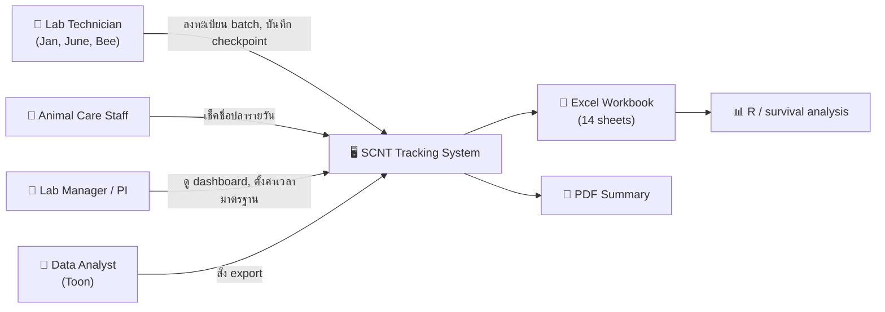
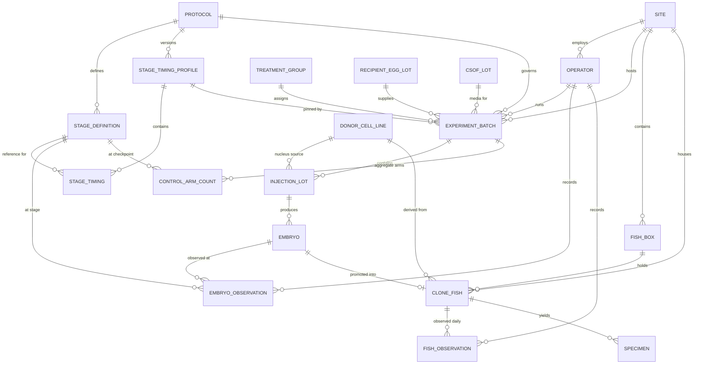
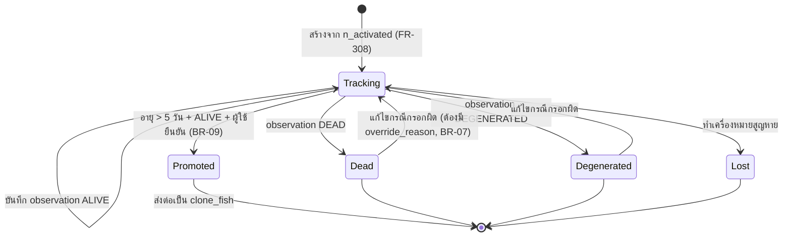
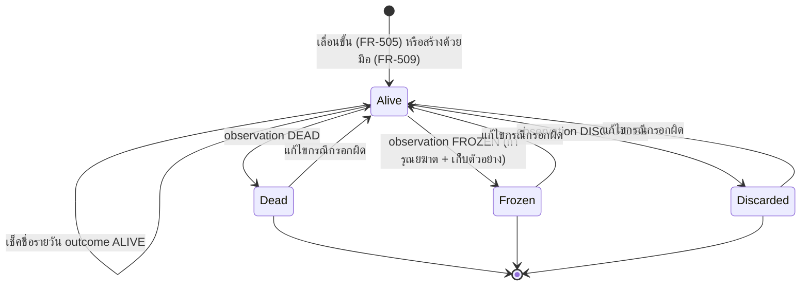

# Software Requirements Specification (SRS)
## ระบบติดตามผลการทดลอง Cloning ปลา — Zebrafish SCNT Tracking System

| | |
|---|---|
| **เอกสาร** | Software Requirements Specification |
| **เวอร์ชัน** | 1.0 |
| **วันที่** | 2026-08-20 |
| **ลูกค้า** | ห้องปฏิบัติการ Cloning โรงพยาบาลสัตว์ |
| **อ้างอิง** | Requirement Analysis v0.3 (เอกสารแยก) |
| **มาตรฐาน** | อ้างอิงโครงสร้างตาม ISO/IEC/IEEE 29148 |
| **สถานะ** | Baseline — พร้อมใช้เป็นฐานการพัฒนาและทดสอบ |

---

## สารบัญ

1. [บทนำ](#1-บทนำ)
2. [ภาพรวมระบบ](#2-ภาพรวมระบบ)
3. [ข้อกำหนดอินเทอร์เฟซภายนอก](#3-ข้อกำหนดอินเทอร์เฟซภายนอก)
4. [ข้อกำหนดเชิงหน้าที่](#4-ข้อกำหนดเชิงหน้าที่-functional-requirements)
5. [ข้อกำหนดข้อมูล](#5-ข้อกำหนดข้อมูล-data-requirements)
6. [กฎทางธุรกิจและสูตรคำนวณ](#6-กฎทางธุรกิจและสูตรคำนวณ)
7. [ข้อกำหนดเชิงคุณภาพ](#7-ข้อกำหนดเชิงคุณภาพ-non-functional-requirements)
8. [ข้อกำหนด API](#8-ข้อกำหนด-api)
9. [ข้อจำกัดการออกแบบ](#9-ข้อจำกัดการออกแบบ)
10. [ภาคผนวก A — Traceability Matrix](#ภาคผนวก-a--traceability-matrix)
11. [ภาคผนวก B — โครงสร้างไฟล์ Excel](#ภาคผนวก-b--โครงสร้างไฟล์-excel-ที่ส่งออก)
12. [ภาคผนวก C — ข้อมูลตั้งต้น](#ภาคผนวก-c--ข้อมูลตั้งต้น-stage-definition-และเวลามาตรฐาน)
13. [ภาคผนวก D — สถานการณ์ทดสอบ UAT](#ภาคผนวก-d--สถานการณ์ทดสอบสำหรับ-uat)

---

# 1. บทนำ

## 1.1 วัตถุประสงค์ของเอกสาร

เอกสารฉบับนี้ระบุข้อกำหนดของซอฟต์แวร์ทั้งหมดสำหรับ **ระบบติดตามผลการทดลอง Cloning ปลา (SCNT Tracking System)** ในระดับที่นักพัฒนาสามารถนำไปสร้างระบบได้โดยไม่ต้องตีความเพิ่ม และผู้ทดสอบสามารถนำไปเขียน test case ได้โดยตรง

ผู้อ่านเป้าหมาย: นักพัฒนา · ผู้ทดสอบ · ลูกค้า (ใช้ตรวจรับ) · นักวิเคราะห์ข้อมูลของแลป

## 1.2 ขอบเขตของผลิตภัณฑ์

**ชื่อระบบ:** SCNT Tracking System (ชื่อย่อภายใน: `scnt`)

ระบบเว็บสำหรับห้องปฏิบัติการโคลนปลาม้าลาย (zebrafish) ด้วยเทคนิค Somatic Cell Nuclear Transfer เพื่อ:

- ลงทะเบียนรอบทดลอง ล็อตการฉีด และตัวอ่อนรายฟอง
- บันทึกผลการติดตามการรอดชีวิตของตัวอ่อนตาม developmental checkpoint (0–5 วัน)
- บันทึกผลการติดตามปลาโคลนรายวัน (วันที่ 6 ถึงประมาณ 1 ปี)
- คำนวณเวลาที่ผ่านไปและส่วนต่างจากเวลามาตรฐานสากลโดยอัตโนมัติ
- แสดงผลเป็น dashboard แยกตามระยะ
- ส่งออกข้อมูลเป็น Excel และไฟล์สรุป PDF

**สิ่งที่ระบบไม่ทำ (v1):** ระบบบัญชีผู้ใช้/สิทธิ์ · นำเข้าข้อมูลเก่าจาก Excel · รันโมเดลสถิติในเว็บ · จัดการอาหาร/ตู้ปลา · แนบรูปจากกล้องจุลทรรศน์ · แจ้งเตือน push · ปรับเวลามาตรฐานตามอุณหภูมิ

## 1.3 นิยามศัพท์และคำย่อ

| คำ | นิยาม |
|---|---|
| **SCNT** | Somatic Cell Nuclear Transfer — เทคนิคย้ายนิวเคลียสเซลล์ร่างกายเข้าสู่ไข่ที่ดูดนิวเคลียสออกแล้ว |
| **Activation** | การกระตุ้นให้ไข่ที่ได้รับนิวเคลียสเริ่มแบ่งตัว — เป็นจุดเริ่มเวลา (T0) ของระบบ |
| **hpa** | hours post-activation — ชั่วโมงนับจาก activation |
| **Batch** | รอบทดลอง 1 ครั้ง (1 วัน × 1 ผู้ปฏิบัติงาน × 1 กลุ่มทดลอง) |
| **Injection Lot** | รอบการฉีดย่อยภายใน batch เดียวกัน มี activation time ของตัวเอง |
| **Embryo** | ตัวอ่อน 1 ฟอง — หน่วยติดตามของ Stage 1 |
| **Clone Fish** | ปลาโคลนที่เลื่อนขั้นจากตัวอ่อนแล้ว — หน่วยติดตามของ Stage 2 |
| **Checkpoint / Stage** | จุดพัฒนาการที่กำหนดไว้ล่วงหน้า เช่น `2-cell`, `Shield`, `Day 3` |
| **Stage 1** | ระยะตัวอ่อน — checkpoint ที่ 1–26 (0 ถึง 120 hpa) |
| **Stage 2** | ระยะปลา — รายวันตั้งแต่วันที่ 6 ถึงประมาณวันที่ 365 |
| **เวลามาตรฐาน / Reference timing** | ชั่วโมงที่ตัวอ่อนปกติควรใช้ถึงแต่ละ checkpoint (ค่าเริ่มต้นจาก ZFIN/Kimmel 1995) |
| **Deviation** | ส่วนต่างระหว่างเวลาจริงกับเวลามาตรฐาน (บวก = ช้ากว่า, ลบ = เร็วกว่า) |
| **Degenerated** | ตัวอ่อนสลาย — แยกจาก "ตาย" ตามที่แลปบันทึกอยู่เดิม |
| **Promotion** | การเลื่อนขั้นตัวอ่อนที่รอดเกิน 5 วันขึ้นเป็นปลาโคลน |
| **Exit event** | เหตุการณ์ที่ทำให้หยุดติดตามหน่วยนั้น (ตาย / สลาย / เลื่อนขั้น / สูญหาย) |
| **Monotonic survival** | คุณสมบัติว่าเมื่อตายแล้วไม่กลับมามีชีวิต |
| **Control arm** | กลุ่มเปรียบเทียบที่บันทึกแบบนับรวม (Natural breeding, IVF) |
| **Clutch** | ชุดไข่จากแม่ปลาชุดเดียวกัน (`E1`, `E4`, `E6`, `E7`) |
| **CSOF** | ล็อตน้ำยา/อาหารเลี้ยงที่ใช้ในรอบทดลอง |
| **Enucleation** | การดูดนิวเคลียสของไข่ผู้รับออก |
| **Fin clip / cut tail** | การตัดครีบหางไปตรวจ DNA |
| **SPA** | Single Page Application |
| **PWA** | Progressive Web App |

## 1.4 เอกสารอ้างอิง

| # | เอกสาร |
|---|---|
| R1 | Requirement Analysis — SCNT Tracking System v0.3 |
| R2 | Kimmel CB et al. (1995) *Stages of embryonic development of the zebrafish.* Developmental Dynamics 203:253–310 |
| R3 | ZFIN Zebrafish Developmental Staging Series — https://zfin.org/zf_info/zfbook/stages/ |
| R4 | ข้อมูลดิบของลูกค้า 4 ไฟล์ (`Raw data v1`, `Working data v1`, `Clean table v1`, `Raw data v2 ongoing`) |
| R5 | R Notebook วิเคราะห์ผล โดย Toon Suparat (2026-05-25) |
| R6 | ISO/IEC/IEEE 29148:2018 — Requirements engineering |

## 1.5 หลักการอ่านเอกสาร

- **MUST / ต้อง** = ข้อกำหนดบังคับใน v1 · **SHOULD / ควร** = ทำถ้าเวลาพอ · **MAY / อาจ** = เลื่อนไป v2 ได้
- ข้อกำหนดทุกข้อมีรหัสไม่ซ้ำ อ้างอิงข้ามเอกสารได้
- ข้อกำหนดที่มี **AC** (Acceptance Criteria) คือข้อที่ต้องมี automated test รองรับ
- ข้อความในกรอบ `>` คือหมายเหตุประกอบ ไม่ใช่ข้อกำหนด

---

# 2. ภาพรวมระบบ

## 2.1 บริบทของระบบ



ระบบเป็น **standalone** ไม่เชื่อมต่อกับระบบอื่นของโรงพยาบาล ไม่มี integration ภายนอกใน v1

## 2.2 หน้าที่หลักของระบบ

| # | หน้าที่ | รหัส FR |
|---|---|---|
| F1 | จัดการข้อมูลหลัก (site, operator, สายพันธุ์, ล็อตวัสดุ, กลุ่มทดลอง) | FR-100 |
| F2 | จัดการ protocol และเวลามาตรฐานต่อ checkpoint | FR-200 |
| F3 | ลงทะเบียนรอบทดลอง ล็อตการฉีด และตัวอ่อน | FR-300 |
| F4 | บันทึกผลติดตาม Stage 1 (ตัวอ่อน) | FR-400 |
| F5 | เลื่อนขั้นตัวอ่อนเป็นปลาโคลน | FR-500 |
| F6 | ลงทะเบียนและติดตามปลาโคลน Stage 2 | FR-600 |
| F7 | บันทึกกลุ่มเปรียบเทียบแบบนับรวม | FR-700 |
| F8 | แสดง Dashboard | FR-800 |
| F9 | ส่งออกข้อมูล | FR-900 |
| F10 | ความทนทานต่อเครือข่ายและการซิงก์ | FR-1000 |
| F11 | การตรวจสอบย้อนหลังและการแก้ไขข้อมูล | FR-1100 |

## 2.3 ประเภทผู้ใช้

ระบบ**ไม่มีการยืนยันตัวตน** (ตามข้อกำหนดลูกค้า) ผู้ใช้ทุกคนเข้าถึงทุกฟังก์ชันได้ แต่ต้อง **เลือกชื่อผู้ปฏิบัติงาน (Operator)** ทุก session เพื่อบันทึกว่าใครเป็นผู้กรอก

| ประเภท | จำนวน | ความถี่การใช้ | อุปกรณ์หลัก | ความชำนาญคอมพิวเตอร์ |
|---|---|---|---|---|
| Lab Technician | 3–4 | หลายครั้งต่อชั่วโมงในวันทดลอง | iPad | ปานกลาง |
| Animal Care Staff | 1–2 | วันละครั้ง | iPad / มือถือ | ปานกลาง |
| Lab Manager / PI | 1 | สัปดาห์ละครั้ง | Desktop | ปานกลาง |
| Data Analyst | 1 | เดือนละครั้ง | Desktop | สูง (ใช้ R) |
| **รวมทั้งแลป** | **5 คน** | | | |

## 2.4 สภาพแวดล้อมการทำงาน

| ด้าน | รายละเอียด |
|---|---|
| ฝั่งผู้ใช้ | เบราว์เซอร์ Safari บน iPadOS (หลัก), Chrome/Edge บน Windows/macOS |
| ขนาดหน้าจอ | 375 px (มือถือ) ถึง 2560 px (จอเดสก์ท็อป) |
| สภาพการใช้งาน | ข้างกล้องจุลทรรศน์ · ผู้ใช้สวมถุงมือ · มืออาจเปียก · แสงในห้องอาจหรี่ |
| เครือข่าย | Wi-Fi ในแลป — มีการหลุดเป็นครั้งคราวแต่ไม่บ่อย |
| ฝั่งเซิร์ฟเวอร์ | Python ASGI application + PostgreSQL 16 · deploy ด้วย container หรือ virtual environment · ยังไม่ทราบผู้ให้บริการ (ดู 9.2) |

## 2.5 ข้อจำกัด

| ID | ข้อจำกัด | ที่มา |
|---|---|---|
| CON-01 | ไม่มีระบบ login / บัญชีผู้ใช้ ใน v1 | ลูกค้ากำหนด |
| CON-02 | Frontend ต้อง build เป็นไฟล์ static เท่านั้น (ห้าม SSR / server-side rendering) | ยังไม่ทราบ hosting — ดู 9.2 |
| CON-03 | Backend ต้องส่งมอบเป็น Docker image ที่ version-pin แล้ว และต้องรันแบบ native ด้วย Python virtual environment ได้ | รองรับทั้ง container hosting และเครื่องที่ทีมดูแลเอง |
| CON-04 | ห้ามใช้ฟีเจอร์เฉพาะของฐานข้อมูลใดฐานข้อมูลหนึ่ง (materialized view, stored procedure, Postgres-only operators) | ต้องย้ายไป MySQL ได้ |
| CON-05 | Backend ต้อง stateless — ห้ามเก็บ state ถาวรบน local filesystem | รองรับ serverless และการย้ายเครื่อง |
| CON-06 | ไม่นำเข้าข้อมูลเดิมจาก Excel | ลูกค้ากำหนด |
| CON-07 | เวลาทั้งหมดเก็บเป็น UTC แสดงผลเป็น `Asia/Bangkok` | ความถูกต้องของการคำนวณ deviation |
| CON-08 | ห้ามลบข้อมูลถาวร ใช้ soft delete เท่านั้น | ข้อมูลงานวิจัยต้องตรวจย้อนหลังได้ |

## 2.6 สมมติฐานและสิ่งที่พึ่งพา

ข้อกำหนดต่อไปนี้สร้างขึ้นบนสมมติฐานที่ยังไม่ได้ยืนยันกับลูกค้า **ทุกข้อออกแบบให้แก้ภายหลังได้โดยไม่ต้องแก้ schema**

| ID | สมมติฐาน | ถ้าผิดจะเกิดอะไร | ทางแก้ |
|---|---|---|---|
| ASM-01 | ตู้เพาะเลี้ยงตั้งอุณหภูมิ 28.5°C (ตรงกับตารางมาตรฐาน ZFIN) | ตัวอ่อนทุกตัวจะแสดงว่า "ช้ากว่าสากล" ทั้งที่พัฒนาปกติ | มีคอลัมน์ `incubation_temp_c` รออยู่แล้ว · เปิด FR-207 ใน v2 |
| ASM-02 | ค่าเวลามาตรฐานที่ลูกค้าจะยืนยันในอนาคต = ค่าที่ปรากฏในไฟล์ Excel เดิม (ตรงกับ ZFIN) | ตัวเลข deviation ไม่ตรงกับที่ลูกค้าคาดหวัง | แก้ผ่านหน้าตั้งค่า FR-203 ใช้เวลา 2 นาที |
| ASM-03 | 1 embryo ผูกกับ 1 well ในถาด 96-well และไม่ย้ายที่ระหว่างการทดลอง | ต้องเพิ่มประวัติการย้าย well | เพิ่มตาราง `embryo_well_history` ภายหลัง |
| ASM-04 | ปลา 1 ตัวอยู่ใน 1 box ณ เวลาหนึ่ง และการย้าย box ไม่ต้องเก็บประวัติใน v1 | สืบย้อนไม่ได้ว่าปลาเคยอยู่ box ไหน | เพิ่มตาราง `fish_box_history` ภายหลัง |
| ASM-05 | `running_no` ของปลาเดินต่อเนื่องทั้งระบบ (ไม่แยกตาม site) | เลขซ้ำข้าม site | เพิ่ม scope ให้ sequence |

## 2.7 การแบ่งเฟส

| ความสามารถ | v1 | v2 |
|---|---|---|
| ทุก FR ที่ระบุ **MUST** ในเอกสารนี้ | ✅ | |
| ปรับเวลามาตรฐานตามอุณหภูมิ (FR-207) | | ✅ |
| แนบรูป/วิดีโอต่อ observation | | ✅ |
| ระบบบัญชีผู้ใช้ + สิทธิ์ | | ✅ |
| แจ้งเตือนเมื่อถึงเวลาส่อง | | ✅ |
| ทำงานแบบไม่มีเครือข่ายต่อเนื่อง (Tier 2) | | ✅ |
| ประวัติการย้าย box / well | | ✅ |
| นำเข้าข้อมูลเดิมจาก Excel | | ✅ (ถ้าลูกค้าเปลี่ยนใจ) |

---

# 3. ข้อกำหนดอินเทอร์เฟซภายนอก

## 3.1 อินเทอร์เฟซผู้ใช้

### 3.1.1 หลักการทั่วไป

| ID | ข้อกำหนด | ระดับ |
|---|---|---|
| UI-01 | เป้าที่แตะได้ทุกชิ้นต้องมีขนาดอย่างน้อย **44 × 44 pt** | MUST |
| UI-02 | อัตราส่วนความต่างสีของข้อความต่อพื้นหลังต้อง ≥ **4.5:1** | MUST |
| UI-03 | ห้ามสื่อความหมายด้วยสีเพียงอย่างเดียว ต้องมีไอคอนหรือข้อความกำกับเสมอ | MUST |
| UI-04 | ทุกหน้าที่มีการกรอกข้อมูลต้องแสดง **ตัวบ่งชี้สถานะการบันทึก** ณ ตำแหน่งคงที่ | MUST |
| UI-05 | ทุกหน้าที่มีการกรอกข้อมูลต้องแสดง **ชื่อผู้ปฏิบัติงานที่เลือกอยู่** และเปลี่ยนได้ใน 1 แตะ | MUST |
| UI-06 | ภาษา UI ต้องสลับไทย/อังกฤษได้ · ชื่อ developmental stage คงเป็นภาษาอังกฤษเสมอทั้งสองภาษา | MUST |
| UI-07 | เวลาทุกจุดแสดงเป็นเขตเวลา `Asia/Bangkok` รูปแบบ 24 ชั่วโมง | MUST |
| UI-08 | การกระทำที่ทำลายข้อมูลต้องมี **Undo ภายใน 10 วินาที** หรือกล่องยืนยัน | MUST |
| UI-09 | ระบบต้องไม่ใช้ hover เป็นทางเดียวในการเข้าถึงฟังก์ชัน (iPad ไม่มี hover) | MUST |
| UI-10 | ต้องติดตั้งเป็น PWA บนหน้าจอ iPad ได้ | SHOULD |

### 3.1.2 รายการหน้าจอ

| รหัส | หน้าจอ | ผู้ใช้หลัก | อุปกรณ์หลัก |
|---|---|---|---|
| SCR-01 | หน้าแรก / รอบที่ถึงกำหนด (Due Now) | Technician | iPad |
| SCR-02 | บันทึก Checkpoint (Stage 1) | Technician | iPad |
| SCR-03 | ผัง 96-well | Technician | iPad |
| SCR-04 | รายการรอบทดลอง (Batch list) | Technician | ทุกอุปกรณ์ |
| SCR-05 | สร้าง/แก้ไขรอบทดลอง | Technician | Desktop / iPad |
| SCR-06 | จัดการล็อตการฉีด + สร้างตัวอ่อน | Technician | Desktop / iPad |
| SCR-07 | ยืนยันการเลื่อนขั้นเป็นปลาโคลน | Technician | iPad |
| SCR-08 | ทะเบียนปลาโคลน | ทุกคน | ทุกอุปกรณ์ |
| SCR-09 | รายละเอียดปลา 1 ตัว (timeline) | ทุกคน | ทุกอุปกรณ์ |
| SCR-10 | เช็คชื่อปลารายวัน | Care Staff | iPad / มือถือ |
| SCR-11 | บันทึกกลุ่มเปรียบเทียบ (Control arm) | Technician | Desktop / iPad |
| SCR-12 | Dashboard — Stage 1 | PI | Desktop |
| SCR-13 | Dashboard — Stage 2 | PI | Desktop |
| SCR-14 | Dashboard — ภาพรวม | PI | Desktop |
| SCR-15 | ตั้งค่าเวลามาตรฐาน | PI / Admin | Desktop |
| SCR-16 | จัดการข้อมูลหลัก | PI / Admin | Desktop |
| SCR-17 | ส่งออกข้อมูล | Analyst | Desktop |
| SCR-18 | ประวัติการแก้ไข (Audit log) | PI | Desktop |

### 3.1.3 พฤติกรรมตามขนาดหน้าจอ

| Breakpoint | ช่วง | พฤติกรรม |
|---|---|---|
| `sm` | 375–767 px | คอลัมน์เดียว · รายการแบบการ์ด · ปุ่มหลักลอยด้านล่าง · ซ่อนผัง 96-well ใช้รายการแทน |
| `md` | 768–1279 px (**iPad — สำคัญสุด**) | สองคอลัมน์ · ซ้าย = ผัง/รายการตัวอ่อน · ขวา = แผงสถานะและปุ่มลัด |
| `lg` | ≥ 1280 px | สามคอลัมน์ · ตารางแบบหนาแน่น · รองรับคีย์ลัด |

## 3.2 อินเทอร์เฟซซอฟต์แวร์

| ID | ข้อกำหนด |
|---|---|
| SI-01 | Frontend สื่อสารกับ Backend ผ่าน **HTTP/JSON เท่านั้น** ตามสัญญาที่ระบุใน OpenAPI 3.1 |
| SI-02 | ไม่มีการเรียกฟังก์ชันข้ามฝั่ง ไม่มี RPC เฉพาะภาษา ไม่มี server component |
| SI-03 | Backend ต่อฐานข้อมูลผ่าน SQLAlchemy โดยระบุ driver และ connection URL ผ่าน environment variable |
| SI-04 | ไม่มี integration กับระบบภายนอกใด ๆ ใน v1 |
| SI-05 | ไฟล์ Excel ที่ส่งออกต้องเปิดได้ด้วย Microsoft Excel 2016+, LibreOffice Calc 7+, `pandas.read_excel`, และ `readxl::read_excel` ของ R |

## 3.3 อินเทอร์เฟซการสื่อสาร

| ID | ข้อกำหนด |
|---|---|
| CI-01 | ใช้ HTTPS เท่านั้น |
| CI-02 | รองรับ CORS เพราะ frontend และ backend อาจอยู่คนละโดเมน — รายชื่อ origin ที่อนุญาตตั้งผ่าน environment variable |
| CI-03 | Payload ทุกชนิดเป็น `application/json; charset=utf-8` ยกเว้นการดาวน์โหลดไฟล์ |
| CI-04 | เวลาใน payload ใช้รูปแบบ ISO 8601 พร้อม timezone offset เสมอ (เช่น `2026-08-20T13:24:00+07:00`) |
| CI-05 | ทุก response ที่เป็น error ใช้โครงสร้างเดียวกันตาม 8.6 |

## 3.4 อินเทอร์เฟซฮาร์ดแวร์

ไม่มีข้อกำหนดเฉพาะ — ระบบไม่เชื่อมต่อกล้องจุลทรรศน์ เครื่องอ่านบาร์โค้ด หรืออุปกรณ์ใด ๆ ใน v1

---

# 4. ข้อกำหนดเชิงหน้าที่ (Functional Requirements)

## 4.0 สารบัญ Use Case

| UC | ชื่อ | ผู้กระทำ | FR ที่เกี่ยวข้อง |
|---|---|---|---|
| UC-01 | ตั้งค่าข้อมูลหลัก | PI/Admin | FR-101 ถึง FR-107 |
| UC-02 | ตั้งค่าเวลามาตรฐาน | PI/Admin | FR-201 ถึง FR-206 |
| UC-03 | สร้างรอบทดลอง | Technician | FR-301 ถึง FR-305 |
| UC-04 | เพิ่มล็อตการฉีดและสร้างตัวอ่อน | Technician | FR-306 ถึง FR-310 |
| UC-05 | บันทึกผล checkpoint | Technician | FR-401 ถึง FR-412 |
| UC-06 | บันทึกกลุ่มเปรียบเทียบ | Technician | FR-701 ถึง FR-703 |
| UC-07 | เลื่อนขั้นเป็นปลาโคลน | Technician | FR-501 ถึง FR-506 |
| UC-08 | เช็คชื่อปลารายวัน | Care Staff | FR-601 ถึง FR-606 |
| UC-09 | บันทึกข้อมูลย้อนหลัง | ทุกคน | FR-413, FR-607 |
| UC-10 | แก้ไขข้อมูลที่กรอกผิด | ทุกคน | FR-1101 ถึง FR-1104 |
| UC-11 | ดู Dashboard | PI | FR-801 ถึง FR-815 |
| UC-12 | ส่งออกข้อมูล | Analyst | FR-901 ถึง FR-908 |
| UC-13 | บันทึกตัวอย่าง DNA | Technician | FR-608 ถึง FR-610 |
| UC-14 | ระบุเพศปลา | Care Staff | FR-611 |

---

## 4.1 FR-100 — จัดการข้อมูลหลัก

| ID | ข้อกำหนด | ระดับ |
|---|---|---|
| FR-101 | ระบบต้องให้ผู้ใช้สร้าง แก้ไข และปิดใช้งาน **Site** ได้ โดยมีฟิลด์ `code` (ไม่ซ้ำ) และ `name` | MUST |
| FR-102 | ระบบต้องให้ผู้ใช้สร้าง แก้ไข และปิดใช้งาน **Operator** ได้ โดยผูกกับ Site | MUST |
| FR-103 | ระบบต้องให้ผู้ใช้สร้างและแก้ไข **Donor Cell Line** โดยมี `strain`, `preparation`, `batch_code` — คู่ (`strain`,`preparation`,`batch_code`) ต้องไม่ซ้ำ | MUST |
| FR-104 | ระบบต้องให้ผู้ใช้สร้างและแก้ไข **Recipient Egg Lot** (`breed`, `lot_date`, `label`) | MUST |
| FR-105 | ระบบต้องให้ผู้ใช้สร้างและแก้ไข **CSOF Lot** (`lot_code` ไม่ซ้ำ) | MUST |
| FR-106 | ระบบต้องให้ผู้ใช้สร้างและแก้ไข **Treatment Group** (`code`, `arm_type`) | MUST |
| FR-107 | ระบบต้องให้ผู้ใช้สร้างและแก้ไข **Fish Box** (`box_code`, ผูกกับ Site) | SHOULD |
| FR-108 | ระบบต้อง **ตัดช่องว่างหน้า-หลัง (trim)** ของค่าข้อความทุกฟิลด์ก่อนบันทึกเสมอ | MUST |
| FR-109 | ระบบต้องปฏิเสธการสร้างข้อมูลหลักที่มีค่า unique ซ้ำ โดยเทียบแบบ **ไม่สนตัวพิมพ์เล็ก-ใหญ่ และไม่สนช่องว่างหน้า-หลัง** | MUST |
| FR-110 | ระบบต้องไม่อนุญาตให้ลบข้อมูลหลักที่ถูกอ้างถึงแล้ว — ให้ปิดใช้งาน (`active = false`) แทน | MUST |
| FR-111 | ข้อมูลหลักที่ปิดใช้งานแล้วต้องไม่ปรากฏใน dropdown สำหรับสร้างรายการใหม่ แต่ยังต้องแสดงในข้อมูลเก่าที่อ้างถึงมัน | MUST |

> **AC-101** — กำหนดว่ามี CSOF Lot ชื่อ `CSOF 2021-3` อยู่แล้ว เมื่อผู้ใช้พยายามสร้าง `CSOF 2021-3 ` (มีช่องว่างท้าย) หรือ `csof 2021-3` ระบบต้องปฏิเสธพร้อมข้อความว่ามีอยู่แล้ว
> *(แก้ปัญหา P11 ที่พบในข้อมูลจริง ซึ่งมี `CSOF 2021-3` และ `CSOF 2021-3 ` เป็นคนละค่า)*

## 4.2 FR-200 — Protocol และเวลามาตรฐาน

### 4.2.1 Stage Definition

| ID | ข้อกำหนด | ระดับ |
|---|---|---|
| FR-201 | ระบบต้องมี **Protocol** อย่างน้อยหนึ่งรายการ ซึ่งกำหนดชุด checkpoint และค่า `stage1_max_age_days` | MUST |
| FR-202 | ระบบต้องติดตั้งพร้อม Stage Definition **36 รายการ** ตามภาคผนวก C โดยรายการที่ 1–26 มี `stage_scope = STAGE_1` และ 27–36 มี `stage_scope = STAGE_2` | MUST |

### 4.2.2 เวลามาตรฐาน (Timing Profile)

| ID | ข้อกำหนด | ระดับ |
|---|---|---|
| FR-203 | ระบบต้องมีหน้าจอให้ผู้ใช้แก้ค่า **เวลามาตรฐาน (`expected_hpa`)** ของแต่ละ checkpoint ในรูปแบบตาราง แล้วกดบันทึกครั้งเดียว | MUST |
| FR-204 | ทุกครั้งที่บันทึก ระบบต้องสร้าง **Timing Profile เวอร์ชันใหม่** ทั้งชุด และตั้งเป็นเวอร์ชันปัจจุบัน — ห้ามแก้เวอร์ชันเดิมทับ | MUST |
| FR-205 | รอบทดลองที่สร้างไปแล้วต้องยังคงผูกกับ Timing Profile เวอร์ชันที่ใช้ ณ วันที่สร้าง | MUST |
| FR-206 | ระบบต้องให้ผู้ใช้นำเข้าและส่งออกตารางเวลามาตรฐานเป็นไฟล์ CSV | SHOULD |
| FR-207 | ระบบอาจปรับเวลามาตรฐานตามอุณหภูมิด้วยสูตร BR-05 | **v2** |
| FR-208 | ระบบต้องแสดงประวัติเวอร์ชันของ Timing Profile พร้อมวันที่ ผู้แก้ไข และค่าที่เปลี่ยน | SHOULD |

> **AC-204** — กำหนดว่ามีรอบทดลอง B1 ที่ผูกกับ Timing Profile v1 และมี observation ที่คำนวณ `deviation_h = +0.13` ไว้แล้ว เมื่อผู้ใช้แก้ `expected_hpa` ของ checkpoint นั้นแล้วบันทึก (เกิด v2) ค่า `deviation_h` ของ observation เดิมต้อง **ยังคงเป็น +0.13 ไม่เปลี่ยนแปลง** และรอบทดลองใหม่ที่สร้างหลังจากนี้ต้องผูกกับ v2

## 4.3 FR-300 — ลงทะเบียนรอบทดลองและตัวอ่อน

### 4.3.1 รอบทดลอง (Experiment Batch)

| ID | ข้อกำหนด | ระดับ |
|---|---|---|
| FR-301 | ระบบต้องให้ผู้ใช้สร้างรอบทดลองโดยระบุ: วันที่ทดลอง, Site, Operator, Treatment Group, Recipient Egg Lot, CSOF Lot, `clutch_code`, `replicate_no`, Protocol | MUST |
| FR-302 | ระบบต้อง**เสนอ** `batch_code` อัตโนมัติในรูปแบบ `{day_no}_{operator}_{treatment_group}` และให้ผู้ใช้แก้ไขได้ | MUST |
| FR-303 | ระบบต้องผูก Timing Profile เวอร์ชันปัจจุบันเข้ากับรอบทดลองโดยอัตโนมัติ ณ ขณะสร้าง | MUST |
| FR-304 | ระบบต้องให้ผู้ใช้บันทึก `incubation_temp_c` ได้ (ไม่บังคับ) โดยยังไม่นำไปใช้คำนวณใน v1 | MUST |
| FR-305 | ระบบต้องให้ผู้ใช้สร้างรอบทดลองใหม่โดย**คัดลอกค่าจากรอบก่อนหน้า** (ยกเว้นวันที่และเวลา) และเลือกคัดลอกค่าตั้งต้นของ Injection Lot เป็น draft ที่ยังไม่มีตัวอ่อนและ T0 ได้ | SHOULD |

### 4.3.2 ล็อตการฉีดและตัวอ่อน

| ID | ข้อกำหนด | ระดับ |
|---|---|---|
| FR-306 | ระบบต้องให้ผู้ใช้เพิ่มล็อตการฉีดในรอบทดลอง โดยระบุ `lot_no`, Donor Cell Line, `enu_power_pct`, `enu_pulse_us`, `enu_led`, `enu_start_at`, `enu_finish_at`, **`activated_at`**, `n_eggs`, `n_activated` | MUST |
| FR-307 | `activated_at` เป็นฟิลด์บังคับก่อนเริ่มติดตามล็อต และต้องรับค่าผ่านตัวเลือกวันที่-เวลา ห้ามรับเป็นข้อความอิสระ; ยกเว้นเฉพาะ draft ที่ระบบสร้างจาก FR-305 ซึ่งต้องยังสร้างตัวอ่อนหรือบันทึกผลไม่ได้จนกว่าจะ activate | MUST |
| FR-308 | เมื่อผู้ใช้ระบุ `n_activated = N` ระบบต้องสร้างระเบียนตัวอ่อน **N ระเบียนทันที** พร้อม `embryo_code` = `{batch_code}_{lot_no}_{seq}` โดย `seq` เริ่มที่ 1 | MUST |
| FR-309 | ระบบต้องให้ผู้ใช้ระบุ `well_position` ของตัวอ่อนแต่ละตัว โดยเลือกจากผัง 96-well หรือพิมพ์รหัส (`A1` ถึง `H12`) | SHOULD |
| FR-310 | ระบบต้องให้ผู้ใช้เพิ่มหรือลบตัวอ่อนในล็อตได้ภายหลัง หากจำนวนจริงไม่ตรงกับที่ระบุไว้ตอนแรก | MUST |

> **AC-308** — เมื่อผู้ใช้สร้างล็อต `lot_no = 2` ในรอบ `1_Jan_Control` และระบุ `n_activated = 3` ระบบต้องสร้างตัวอ่อน 3 ระเบียนที่มีรหัส `1_Jan_Control_2_1`, `1_Jan_Control_2_2`, `1_Jan_Control_2_3`
> *(รูปแบบตรงกับที่ลูกค้าใช้อยู่แล้วในไฟล์ v2)*

> **AC-307** — เมื่อผู้ใช้พยายามบันทึกล็อตโดยไม่ระบุ `activated_at` ระบบต้องปฏิเสธ · เมื่อผู้ใช้ระบุ `enu_finish_at` ที่มาหลัง `activated_at` ระบบต้องเตือน (แต่ยอมให้บันทึกได้ เพราะพบกรณีนี้ในข้อมูลจริง)

## 4.4 FR-400 — บันทึกผลติดตาม Stage 1

### 4.4.1 หน้ารอบที่ถึงกำหนด

| ID | ข้อกำหนด | ระดับ |
|---|---|---|
| FR-401 | หน้าแรกต้องแสดงรายการ **(ล็อตการฉีด × checkpoint) ที่ถึงกำหนดสังเกตแล้วแต่ยังไม่มีการบันทึก** เรียงตามความเร่งด่วนจากมากไปน้อย | MUST |
| FR-402 | รายการต้องแสดง: `batch_code`, `lot_no`, ชื่อ checkpoint, และเวลาที่เลย/เหลือถึงกำหนด | MUST |
| FR-403 | หน้าดังกล่าวต้องรีเฟรชข้อมูลอัตโนมัติอย่างน้อยทุก 60 วินาทีเมื่อออนไลน์ | SHOULD |
| FR-404 | หน้าดังกล่าวต้องแสดงจำนวนตัวอ่อนที่รอการเลื่อนขั้นเป็นปลา (ดู FR-501) | MUST |

### 4.4.2 การบันทึก checkpoint

| ID | ข้อกำหนด | ระดับ |
|---|---|---|
| FR-405 | หน้าบันทึก checkpoint ต้องแสดง**เฉพาะตัวอ่อนที่ยังไม่มี exit event** เท่านั้น | MUST |
| FR-406 | ค่าเริ่มต้นของตัวอ่อนทุกตัวคือ `ALIVE` ผู้ใช้แตะเฉพาะตัวที่เปลี่ยนสถานะ | MUST |
| FR-407 | การแตะที่ตัวอ่อนหนึ่งครั้งต้องวนสถานะตามลำดับ `ALIVE → DEAD → DEGENERATED → ALIVE` | MUST |
| FR-408 | ต้องมีปุ่มลัด **"รอดทั้งหมด"** และ **"ตายทั้งหมดที่เหลือ"** | MUST |
| FR-409 | ต้องมีตัวเลือก `condition` ค่า `NORMAL` / `ABNORMAL` / `UNDETERMINED` โดยค่าเริ่มต้นสืบทอดจาก observation ก่อนหน้าของตัวอ่อนนั้น (ถ้าไม่มี ใช้ `NORMAL`) | MUST |
| FR-410 | ระบบต้องกำหนด `observed_at` เป็นเวลาปัจจุบันโดยอัตโนมัติ และให้ผู้ใช้แก้ไขได้ | MUST |
| FR-411 | ระบบต้องแสดง **เวลาที่ผ่านไปจาก activation** (`T+HH:MM`) แบบสดตลอดเวลาที่อยู่ในหน้านี้ | MUST |
| FR-412 | ระบบต้องแสดง **ส่วนต่างจากเวลามาตรฐาน** ในรูปแบบ `จริง H:MM · สากล H:MM · ช้ากว่าสากล N นาที` (หรือ `เร็วกว่าสากล`) โดย**ไม่มีการตัดสินว่าปกติหรือผิดปกติ** | MUST |
| FR-413 | ระบบต้องให้ผู้ใช้กำหนด `observed_at` ย้อนหลังได้ และต้องบันทึกธง `is_backdated = true` เมื่อ `observed_at` ต่างจากเวลาที่บันทึกจริงเกิน 15 นาที | MUST |
| FR-414 | ระบบต้องให้ผู้ใช้ใส่ `notes` อิสระต่อ observation ได้ | MUST |
| FR-415 | ระบบต้องมีมุมมองผัง 96-well ที่แตะบนตำแหน่งได้โดยตรง | SHOULD |
| FR-416 | ระบบต้องแสดงแถบความคืบหน้าในรูปแบบ `checkpoint X/26 · เหลือรอด M/N` | SHOULD |
| FR-417 | ระบบต้องอนุญาตให้บันทึก checkpoint ได้แม้จะข้าม checkpoint ก่อนหน้าไป (ดู BR-08) | MUST |

> **AC-406** — กำหนดว่าล็อตมีตัวอ่อน 45 ตัว ยังรอด 18 ตัว เมื่อผู้ใช้เปิดหน้าบันทึก checkpoint แตะที่ตัวอ่อน 2 ตัวให้เป็น `DEAD` แล้วกดบันทึก ระบบต้องบันทึก observation ทั้งหมด 18 รายการ (ALIVE 16 + DEAD 2) และตัวอ่อน 2 ตัวนั้นต้องมี exit event
>
> **AC-412** — กำหนดว่า `activated_at = 2026-08-20T10:00:00+07:00`, checkpoint `256-cell` มี `expected_hpa = 2.5` เมื่อผู้ใช้บันทึกที่ `observed_at = 2026-08-20T12:38:00+07:00` ระบบต้องแสดง `จริง 2:38 · สากล 2:30 · ช้ากว่าสากล 8 นาที` และบันทึก `hpa_actual = 2.6333`, `hpa_expected_snapshot = 2.5`, `deviation_h = 0.1333`

### 4.4.3 การตรวจสอบความถูกต้อง

| ID | ข้อกำหนด | ระดับ |
|---|---|---|
| FR-418 | ระบบต้องปฏิเสธ observation ที่มี `observed_at` **ก่อน** `activated_at` ของล็อตนั้น | MUST |
| FR-419 | ระบบต้องปฏิเสธ observation ที่มี `observed_at` **หลังเวลาปัจจุบัน** เกิน 5 นาที | MUST |
| FR-420 | ระบบต้องเตือนเมื่อผู้ใช้พยายามบันทึก `ALIVE` ให้ตัวอ่อนที่มี exit event เป็น `DEAD` หรือ `DEGENERATED` ไปแล้ว และต้องบังคับให้ระบุเหตุผลก่อนยอมรับ (ดู BR-07) | MUST |
| FR-421 | ระบบต้องปฏิเสธการบันทึก observation ซ้ำสำหรับคู่ (embryo, stage) เดิม เว้นแต่เป็นการแก้ไขผ่าน FR-1101 | MUST |

## 4.5 FR-500 — การเลื่อนขั้นเป็นปลาโคลน

| ID | ข้อกำหนด | ระดับ |
|---|---|---|
| FR-501 | ระบบต้องตรวจหาตัวอ่อนที่**เข้าเกณฑ์เลื่อนขั้น** ตาม BR-09 และแสดงจำนวนบนหน้าแรก | MUST |
| FR-502 | หน้ายืนยันการเลื่อนขั้นต้องแสดงรายการตัวอ่อนที่เข้าเกณฑ์ พร้อม `embryo_code`, DOB, สายพันธุ์, `condition` ล่าสุด และจุดที่พบความผิดปกติครั้งแรก (ถ้ามี) | MUST |
| FR-503 | ระบบต้อง**เสนอ** `fish_code` และ `running_no` ให้อัตโนมัติ (ดู BR-13, BR-14) และให้ผู้ใช้แก้ไข `fish_code` ได้ | MUST |
| FR-504 | ผู้ใช้ต้องยืนยันการเลื่อนขั้น — ระบบต้อง**ไม่**เลื่อนขั้นอัตโนมัติโดยไม่มีการยืนยัน | MUST |
| FR-505 | เมื่อยืนยัน ระบบต้องสร้างระเบียนปลาโคลนที่สืบทอด `dob`, Donor Cell Line, Site, `condition`, `first_abnormal_*` จากตัวอ่อน และตั้ง `embryo.exit_reason = PROMOTED` | MUST |
| FR-506 | ระบบต้องอนุญาตให้เลื่อนขั้นตัวอ่อนที่มี `condition = ABNORMAL` ได้ตามปกติ | MUST |
| FR-507 | ระบบต้องให้ผู้ใช้เลือก Fish Box ขณะเลื่อนขั้นได้ | SHOULD |
| FR-508 | ระบบต้องให้ผู้ใช้เลื่อนขั้นหลายตัวพร้อมกันด้วยการยืนยันครั้งเดียว | MUST |
| FR-509 | ระบบต้องให้ผู้ใช้สร้างระเบียนปลาโคลนด้วยมือโดยไม่ผ่านตัวอ่อนได้ (`embryo_id` เป็นค่าว่าง) | MUST |

> **AC-505** — กำหนดตัวอ่อน `1_Jan_Control_2_1` ที่มี `activated_at = 2026-04-24T10:59:00+07:00` และมี observation ล่าสุดเป็น `ALIVE` เมื่อเวลาปัจจุบันเกิน `2026-04-29T10:59:00+07:00` (120 ชั่วโมง) ตัวอ่อนนี้ต้องปรากฏในรายการรอเลื่อนขั้น และเมื่อยืนยัน ระบบต้องสร้างปลาโคลนที่มี `dob = 2026-04-24` (ไม่ใช่วันที่เลื่อนขั้น)

## 4.6 FR-600 — ติดตามปลาโคลน (Stage 2)

### 4.6.1 ทะเบียนและการเช็คชื่อ

| ID | ข้อกำหนด | ระดับ |
|---|---|---|
| FR-601 | ระบบต้องมีหน้าทะเบียนปลาที่กรองตาม Site, Box, สถานะ, สายพันธุ์, กลุ่มทดลอง และช่วง DOB ได้ | MUST |
| FR-602 | หน้าเช็คชื่อรายวันต้องแสดง**เฉพาะปลาที่มีสถานะ `ALIVE`** พร้อมอายุเป็นจำนวนวัน (คำนวณตาม BR-10) | MUST |
| FR-603 | ปลาแต่ละตัวต้องมีปุ่ม `ยังอยู่` / `ตาย` / `แช่แข็ง` / `คัดออก` ที่แตะได้ใน 1 ครั้ง | MUST |
| FR-604 | ต้องมีปุ่ม **"ทั้งหมดยังอยู่"** ที่บันทึก observation `ALIVE` ให้ปลาทุกตัวในรายการที่กรองอยู่ด้วยการกดครั้งเดียว | MUST |
| FR-605 | ปลาที่เคยพบความผิดปกติต้องแสดงเครื่องหมายกำกับ พร้อมข้อความว่าพบตั้งแต่อายุกี่วัน | MUST |
| FR-606 | เมื่อบันทึก `DEAD` / `FROZEN` / `DISCARDED` ระบบต้องตั้ง `clone_fish.status`, `exit_date` และ `exit_reason` ตามนั้น และนำปลาออกจากรายการเช็คชื่อของวันถัดไป | MUST |
| FR-607 | ระบบต้องให้ผู้ใช้เลือกวันที่ย้อนหลังเพื่อเช็คชื่อ และต้องรองรับการบันทึกช่วงวันติดต่อกันในครั้งเดียว (เช่น กลับจากวันหยุด 3 วัน) | SHOULD |
| FR-608 | ระบบต้องแสดงหน้ารายละเอียดปลา 1 ตัว ที่มี timeline ของ observation ทั้งหมด สถานะ และตัวอย่าง DNA ที่เก็บ | MUST |

> **AC-604** — กำหนดว่ามีปลาสถานะ `ALIVE` 14 ตัว เมื่อผู้ใช้กด "ทั้งหมดยังอยู่" ระบบต้องสร้าง `fish_observation` 14 รายการที่มี `outcome = ALIVE` และ `observed_on` เป็นวันที่ที่เลือก โดยใช้การเรียก API ครั้งเดียว
>
> **AC-606** — เมื่อผู้ใช้ทำเครื่องหมาย `FROZEN` ให้ปลาตัวหนึ่งในวันที่ 20 ส.ค. ปลาตัวนั้นต้องไม่ปรากฏในหน้าเช็คชื่อของวันที่ 21 ส.ค. และ `clone_fish.status` ต้องเป็น `FROZEN`, `exit_date = 2026-08-20`

### 4.6.2 ข้อมูลเพิ่มเติมของปลา

| ID | ข้อกำหนด | ระดับ |
|---|---|---|
| FR-609 | ระบบต้องให้ผู้ใช้บันทึกเพศ (`M` / `F` / `UNKNOWN`) ได้ทุกเมื่อ โดยค่าเริ่มต้นคือ `UNKNOWN` | MUST |
| FR-610 | ระบบต้องให้ผู้ใช้ทำเครื่องหมาย `fin_clipped` และสร้างระเบียน Specimen พร้อมกันได้ | SHOULD |
| FR-611 | ระเบียน Specimen ต้องมี `specimen_code`, `specimen_kind` (`CL`/`RT`/`DC`), `specimen_type` (`WHOLE_EMBRYO`/`CAUDAL_FIN_CLIP`), `collected_on`, `frozen_on`, `storage` (`-20`/`-80`) | SHOULD |
| FR-612 | ระบบต้องให้ผู้ใช้ย้ายปลาไป Fish Box อื่นได้ | SHOULD |
| FR-613 | ระบบต้องให้ผู้ใช้แก้ `remarks` ของปลาได้ | MUST |

## 4.7 FR-700 — กลุ่มเปรียบเทียบแบบนับรวม

| ID | ข้อกำหนด | ระดับ |
|---|---|---|
| FR-701 | ระบบต้องให้ผู้ใช้บันทึกจำนวน `n_normal` และ `n_abnormal` ของกลุ่ม `NATURAL_BREEDING` และ `IVF` ต่อรอบทดลอง ณ checkpoint ที่กำหนด | MUST |
| FR-702 | checkpoint ที่ต้องรองรับอย่างน้อย: `4-cell`, `Shield` ถึง `75% epiboly`, `Day 1`, `Day 2`, `Day 3` | MUST |
| FR-703 | ระบบต้องไม่สร้างระเบียนตัวอ่อนรายฟองสำหรับกลุ่มเหล่านี้ | MUST |
| FR-704 | Dashboard ต้องแสดงกลุ่มเหล่านี้เทียบกับกลุ่ม SCNT ได้ | MUST |

## 4.8 FR-800 — Dashboard

### 4.8.1 ทั่วไป

| ID | ข้อกำหนด | ระดับ |
|---|---|---|
| FR-801 | Dashboard ต้องแบ่งเป็น 3 แท็บ: **Stage 1 (ตัวอ่อน)**, **Stage 2 (ปลา)**, **ภาพรวม** | MUST |
| FR-802 | ตัวกรองร่วมต้องมี: ช่วงวันที่, Site, Operator, Treatment Group, Donor Cell Line / strain, Batch | MUST |
| FR-803 | ตัวกรองที่เลือกต้องสะท้อนใน URL เพื่อให้คัดลอกลิงก์แชร์ได้ | SHOULD |
| FR-804 | ทุกกราฟต้องแสดงจำนวนตัวอย่าง (n) ที่ใช้คำนวณ | MUST |
| FR-805 | เมื่อไม่มีข้อมูลตามตัวกรอง ต้องแสดงข้อความอธิบายว่าต้องกรอกอะไรก่อน ไม่ใช่กราฟเปล่า | MUST |

### 4.8.2 แท็บ Stage 1

| ID | ส่วนประกอบ | ข้อกำหนด | ระดับ |
|---|---|---|---|
| FR-806 | KPI | จำนวนไข่ที่ activate · รอดถึง Shield · รอดถึง Day 1 · เลื่อนขั้นเป็นปลา · % Normal | MUST |
| FR-807 | Development funnel | แท่งลดหลั่นตาม 26 checkpoint แสดงทั้งจำนวนและ % เทียบ Activated | MUST |
| FR-808 | Survival curve | กราฟขั้นบันได แกน X = checkpoint ตามลำดับ, Y = ความน่าจะเป็นการรอด (BR-15), สีตาม strain, แยกแผงตาม Site | MUST |
| FR-809 | Stage attrition | อันดับ checkpoint ที่สูญเสียตัวอ่อนมากที่สุด | MUST |
| FR-810 | Timing deviation | การกระจายของ `deviation_h` ต่อ checkpoint (box plot) | MUST |
| FR-811 | Timing deviation เทียบกลุ่ม | เส้น deviation ต่อ checkpoint แยกตาม Treatment Group / Donor Cell Line | MUST |
| FR-812 | จุดเริ่มผิดปกติ | ฮิสโทแกรมว่าความผิดปกติถูกพบครั้งแรกที่ checkpoint ใด | MUST |
| FR-813 | เปรียบเทียบกลุ่มควบคุม | ตารางเทียบ SCNT vs Natural breeding vs IVF ที่ checkpoint หลัก | MUST |
| FR-814 | ตารางผลรายรอบ | เรียงรอบทดลองตาม % รอดถึง Day 5 | SHOULD |

### 4.8.3 แท็บ Stage 2

| ID | ส่วนประกอบ | ข้อกำหนด | ระดับ |
|---|---|---|---|
| FR-815 | KPI | ปลาทั้งหมด · ยังมีชีวิต · แช่แข็ง · คัดออก · ตาย · อายุเฉลี่ยของปลาที่ยังมีชีวิต | MUST |
| FR-816 | Survival curve รายวัน | แกน X = อายุ (วัน), สีตาม strain / Treatment Group | MUST |
| FR-817 | Normal vs Abnormal | เส้นรอดของกลุ่ม Normal เทียบ Abnormal | MUST |
| FR-818 | สัดส่วนสถานะตามเวลา | กราฟพื้นที่ซ้อนแสดงสัดส่วน Alive/Dead/Frozen/Discarded | SHOULD |
| FR-819 | การกระจายอายุ | ฮิสโทแกรมอายุของปลาที่ยังมีชีวิต | SHOULD |
| FR-820 | อัตราส่วนเพศ | M / F / UNKNOWN | SHOULD |
| FR-821 | จำนวนปลาต่อ Box | รายการปลาที่ยังมีชีวิตแยกตาม Box | SHOULD |
| FR-822 | ช่องว่างการบันทึก | รายการปลาที่ขาดการเช็คชื่อเกิน 1 วัน เพื่อเตือนให้กรอกย้อนหลัง | MUST |

### 4.8.4 แท็บภาพรวม

| ID | ข้อกำหนด | ระดับ |
|---|---|---|
| FR-823 | ต้องแสดง funnel ต่อเนื่องจากไข่ที่ activate จนถึงปลาที่ยังมีชีวิตปัจจุบัน โดยเชื่อม Stage 1 และ Stage 2 เข้าด้วยกัน | MUST |
| FR-824 | ต้องแสดงจำนวนและเปอร์เซ็นต์เทียบขั้นก่อนหน้าและเทียบจุดเริ่มต้น | MUST |

## 4.9 FR-900 — การส่งออกข้อมูล

| ID | ข้อกำหนด | ระดับ |
|---|---|---|
| FR-901 | ระบบต้องส่งออกไฟล์ Excel (`.xlsx`) ที่มี 14 sheet ตามภาคผนวก B | MUST |
| FR-902 | ทุก sheet ต้องเป็นตารางแบน **หัวตารางแถวเดียว ไม่มีเซลล์ผสาน (merged cell)** | MUST |
| FR-903 | sheet `00_Metadata` ต้องระบุ ช่วงข้อมูล, ตัวกรองที่ใช้, วันเวลาที่ส่งออก, เวอร์ชันระบบ, **เวอร์ชัน Timing Profile**, และจำนวนแถวของแต่ละ sheet | MUST |
| FR-904 | sheet `12_R_Analysis_Table` ต้องมีคอลัมน์ `Sites`, `Strain`, `Replicate`, `Strain_Rep` ตามด้วยคอลัมน์ checkpoint และต้องอ่านด้วย `readxl::read_excel()` ได้โดยไม่ต้องข้ามแถว | MUST |
| FR-905 | การส่งออกต้องใช้ตัวกรองเดียวกับที่เลือกอยู่บน dashboard | MUST |
| FR-906 | ระบบต้องสร้างไฟล์สรุป Dashboard เป็น PDF ที่มี KPI, funnel, survival curve, แผง timing deviation และตารางเปรียบเทียบกลุ่ม | MUST |
| FR-907 | PDF ต้องสร้างจากฝั่งเบราว์เซอร์ผ่าน print stylesheet — ห้าม backend พึ่งพา headless browser | MUST |
| FR-908 | ระบบต้องส่งออก CSV รายตารางได้ | SHOULD |
| FR-909 | ไฟล์ส่งออกต้องสร้างสด ๆ ต่อคำขอ ห้ามเขียนลง local filesystem ถาวร | MUST |

> **AC-904** — เมื่อส่งออกไฟล์แล้วนำไปเปิดด้วยคำสั่ง `readxl::read_excel(path, sheet = "12_R_Analysis_Table")` ใน R ผลลัพธ์ต้องเป็น data frame ที่มีคอลัมน์ตามชื่อในแถวแรกทันที และค่าคอลัมน์ checkpoint ต้องเป็นชนิดตัวเลข

## 4.10 FR-1000 — ความทนทานต่อเครือข่าย

| ID | ข้อกำหนด | ระดับ |
|---|---|---|
| FR-1001 | ทุกการบันทึกต้องอัปเดตหน้าจอทันทีโดยไม่รอผลตอบกลับจากเซิร์ฟเวอร์ (optimistic UI) | MUST |
| FR-1002 | การบันทึกที่ยังส่งไม่สำเร็จต้องเก็บไว้ในคิวบนเครื่อง (IndexedDB) และต้อง**ไม่สูญหาย**แม้ผู้ใช้รีเฟรชหน้าหรือปิดแท็บ | MUST |
| FR-1003 | ทุก observation ต้องมี `client_uuid` ที่สร้างจากฝั่งผู้ใช้ และเซิร์ฟเวอร์ต้องใช้เป็นกุญแจ idempotency | MUST |
| FR-1004 | ระบบต้องส่งซ้ำอัตโนมัติแบบ exponential backoff เมื่อส่งไม่สำเร็จ | MUST |
| FR-1005 | ต้องแสดงสถานะ `บันทึกแล้ว` / `กำลังส่ง…` / `ค้าง N รายการ` ณ ตำแหน่งคงที่ | MUST |
| FR-1006 | ต้องเตือนผู้ใช้ก่อนปิดแท็บหากยังมีรายการค้างส่ง | MUST |
| FR-1007 | ระบบควรแคช app shell ด้วย Service Worker เพื่อให้เปิดหน้าเว็บได้เมื่อสัญญาณวูบชั่วคราว | SHOULD |
| FR-1008 | ระบบอาจทำงานได้เต็มรูปแบบโดยไม่มีเครือข่ายต่อเนื่อง พร้อมการแก้ไขความขัดแย้ง | **v2** |

> **AC-1003** — เมื่อฝั่งผู้ใช้ส่ง observation ที่มี `client_uuid = X` ไปยังเซิร์ฟเวอร์สำเร็จ แล้วส่งซ้ำด้วย `client_uuid = X` เดิมอีก 3 ครั้ง ฐานข้อมูลต้องมีระเบียนนั้นเพียง **1 ระเบียน** และทุกคำขอต้องได้รับ HTTP 200 พร้อมข้อมูลระเบียนเดิม
>
> **AC-1002** — เมื่อผู้ใช้บันทึก checkpoint ขณะไม่มีเครือข่าย แล้วรีเฟรชหน้าเว็บ ข้อมูลที่บันทึกต้องยังอยู่ในคิวและถูกส่งสำเร็จเมื่อเครือข่ายกลับมา

## 4.11 FR-1100 — การแก้ไขและตรวจสอบย้อนหลัง

| ID | ข้อกำหนด | ระดับ |
|---|---|---|
| FR-1101 | ระบบต้องให้ผู้ใช้แก้ไข observation ที่บันทึกผิดได้ | MUST |
| FR-1102 | ทุกการสร้าง แก้ไข และปิดใช้งาน ต้องบันทึกลงตาราง audit พร้อม: ตาราง, รหัสระเบียน, การกระทำ, ค่าเดิม, ค่าใหม่, ผู้ปฏิบัติงาน, รหัสอุปกรณ์, เวลา | MUST |
| FR-1103 | ระบบต้องแสดงประวัติการแก้ไขของระเบียนใด ๆ ได้ | SHOULD |
| FR-1104 | ระบบต้องไม่ลบข้อมูลถาวร — ใช้ `deleted_at` แทน และข้อมูลที่ทำเครื่องหมายลบต้องไม่ปรากฏในผลลัพธ์ปกติหรือการส่งออก | MUST |
| FR-1105 | ระบบต้องบันทึก `device_id` (สร้างครั้งแรกที่เปิดใช้ เก็บในเครื่อง) ไปกับทุกการบันทึก เพื่อชดเชยการไม่มีระบบ login | MUST |

---

# 5. ข้อกำหนดข้อมูล (Data Requirements)

## 5.1 หลักการทั่วไปของ schema

| ID | ข้อกำหนด |
|---|---|
| DR-01 | ทุกตารางมีคอลัมน์ `id` ชนิด `CHAR(36)` เป็น primary key เก็บ UUID v7 ในรูปแบบข้อความมาตรฐาน |
| DR-02 | ทุกตารางมี `created_at`, `updated_at` ชนิด `DATETIME` เก็บเป็น **UTC** และ `deleted_at` ชนิด `DATETIME NULL` สำหรับ soft delete |
| DR-03 | ห้ามใช้ชนิดข้อมูลหรือฟังก์ชันเฉพาะของฐานข้อมูลใดฐานข้อมูลหนึ่ง (ดู CON-04) |
| DR-04 | ค่า enum เก็บเป็น `VARCHAR` พร้อม `CHECK` constraint ไม่ใช้ชนิด `ENUM` ของฐานข้อมูล |
| DR-05 | ค่าเวลาเชิงชั่วโมงเก็บเป็น `DECIMAL(10,4)` เพื่อความแม่นยำ ไม่ใช้ `FLOAT` |
| DR-06 | ทุก foreign key มี index · ทุกคอลัมน์ที่ใช้กรองบ่อยมี index ตาม 5.13 |
| DR-07 | คอลัมน์ข้อความที่เป็นค่าไม่ซ้ำ ต้องมี unique index บนค่าที่ normalize แล้ว (trim + lower) |

## 5.2 แผนภาพความสัมพันธ์



## 5.3 ตารางข้อมูลหลัก

### `site`

| คอลัมน์ | ชนิด | Null | ค่าเริ่มต้น | หมายเหตุ |
|---|---|---|---|---|
| `id` | CHAR(36) | ไม่ | — | PK |
| `code` | VARCHAR(20) | ไม่ | — | unique (normalize) เช่น `KU`, `MSU` |
| `name` | VARCHAR(200) | ไม่ | — | |
| `active` | BOOLEAN | ไม่ | `true` | |

### `operator`

| คอลัมน์ | ชนิด | Null | ค่าเริ่มต้น | หมายเหตุ |
|---|---|---|---|---|
| `id` | CHAR(36) | ไม่ | — | PK |
| `site_id` | CHAR(36) | ได้ | — | FK → `site` |
| `name` | VARCHAR(100) | ไม่ | — | unique (normalize) เช่น `Jan`, `June`, `Bee`, `Toon` |
| `active` | BOOLEAN | ไม่ | `true` | |

### `donor_cell_line`

| คอลัมน์ | ชนิด | Null | ค่าเริ่มต้น | หมายเหตุ |
|---|---|---|---|---|
| `id` | CHAR(36) | ไม่ | — | PK |
| `strain` | VARCHAR(50) | ไม่ | — | `AB`, `TU`, `NHGRI` |
| `preparation` | VARCHAR(50) | ไม่ | — | `DISSOCIATED`, `CHUNKS` |
| `batch_code` | VARCHAR(100) | ได้ | — | เช่น `AB240426_e48h` |
| `active` | BOOLEAN | ไม่ | `true` | |
| | | | | unique (`strain`,`preparation`,`batch_code`) |

### `recipient_egg_lot`

| คอลัมน์ | ชนิด | Null | หมายเหตุ |
|---|---|---|---|
| `id` | CHAR(36) | ไม่ | PK |
| `breed` | VARCHAR(100) | ไม่ | เช่น `TAB Taiwan` |
| `lot_date` | DATE | ได้ | |
| `label` | VARCHAR(200) | ไม่ | unique (normalize) เช่น `TAB Taiwan 29-04-2025` |
| `active` | BOOLEAN | ไม่ | |

### `csof_lot`

| คอลัมน์ | ชนิด | Null | หมายเหตุ |
|---|---|---|---|
| `id` | CHAR(36) | ไม่ | PK |
| `lot_code` | VARCHAR(100) | ไม่ | unique (normalize) เช่น `CSOF 2024-19` |
| `active` | BOOLEAN | ไม่ | |

### `treatment_group`

| คอลัมน์ | ชนิด | Null | หมายเหตุ |
|---|---|---|---|
| `id` | CHAR(36) | ไม่ | PK |
| `code` | VARCHAR(50) | ไม่ | unique (normalize) เช่น `CONTROL`, `RK701` |
| `name` | VARCHAR(200) | ได้ | |
| `arm_type` | VARCHAR(20) | ไม่ | CHECK ∈ {`SCNT`,`NATURAL_BREEDING`,`IVF`} |
| `active` | BOOLEAN | ไม่ | |

### `fish_box`

| คอลัมน์ | ชนิด | Null | หมายเหตุ |
|---|---|---|---|
| `id` | CHAR(36) | ไม่ | PK |
| `box_code` | VARCHAR(50) | ไม่ | unique ต่อ site เช่น `Box-4` |
| `site_id` | CHAR(36) | ได้ | FK → `site` |
| `active` | BOOLEAN | ไม่ | |

## 5.4 ตาราง Protocol และเวลามาตรฐาน

### `protocol`

| คอลัมน์ | ชนิด | Null | ค่าเริ่มต้น | หมายเหตุ |
|---|---|---|---|---|
| `id` | CHAR(36) | ไม่ | — | PK |
| `name` | VARCHAR(200) | ไม่ | — | เช่น `SCNT standard` |
| `stage1_max_age_days` | INT | ไม่ | `5` | เกณฑ์เลื่อนขั้น (BR-09) |
| `active` | BOOLEAN | ไม่ | `true` | |

### `stage_definition`

| คอลัมน์ | ชนิด | Null | หมายเหตุ |
|---|---|---|---|
| `id` | CHAR(36) | ไม่ | PK |
| `protocol_id` | CHAR(36) | ไม่ | FK → `protocol` |
| `stage_order` | INT | ไม่ | 1–36 · unique ต่อ protocol |
| `code` | VARCHAR(50) | ไม่ | unique ต่อ protocol เช่น `stage_02_2C` |
| `label` | VARCHAR(100) | ไม่ | เช่น `2-cell` — คงภาษาอังกฤษเสมอ |
| `short_label` | VARCHAR(20) | ไม่ | เช่น `2C` |
| `phase` | VARCHAR(20) | ไม่ | CHECK ∈ {`CLEAVAGE`,`BLASTULA`,`GASTRULA`,`LARVAL`} |
| `stage_scope` | VARCHAR(10) | ไม่ | CHECK ∈ {`STAGE_1`,`STAGE_2`} |

### `stage_timing_profile`

| คอลัมน์ | ชนิด | Null | ค่าเริ่มต้น | หมายเหตุ |
|---|---|---|---|---|
| `id` | CHAR(36) | ไม่ | — | PK |
| `protocol_id` | CHAR(36) | ไม่ | — | FK → `protocol` |
| `version` | INT | ไม่ | — | เพิ่มทีละ 1 ต่อ protocol · unique (`protocol_id`,`version`) |
| `name` | VARCHAR(200) | ไม่ | — | เช่น `ZFIN 28.5C (default)` |
| `reference_temp_c` | DECIMAL(4,1) | ได้ | `28.5` | ใช้ใน v2 |
| `auto_temp_adjust` | BOOLEAN | ไม่ | `false` | v1 ต้องเป็น `false` เสมอ |
| `source_note` | VARCHAR(500) | ได้ | — | เช่น `Kimmel 1995 / ZFIN` |
| `is_current` | BOOLEAN | ไม่ | `false` | มีได้เพียง 1 แถวต่อ protocol |
| `created_by_operator_id` | CHAR(36) | ได้ | — | FK → `operator` |

### `stage_timing`

| คอลัมน์ | ชนิด | Null | หมายเหตุ |
|---|---|---|---|
| `id` | CHAR(36) | ไม่ | PK |
| `protocol_id` | CHAR(36) | ไม่ | ใช้ใน composite FK เพื่อบังคับให้ profile และ stage อยู่ใน protocol เดียวกัน |
| `profile_id` | CHAR(36) | ไม่ | (`profile_id`,`protocol_id`) FK → `stage_timing_profile` |
| `stage_definition_id` | CHAR(36) | ไม่ | (`stage_definition_id`,`protocol_id`) FK → `stage_definition` · unique (`profile_id`,`stage_definition_id`) |
| `expected_hpa` | DECIMAL(10,4) | ไม่ | ชั่วโมงหลัง activation · CHECK ≥ 0 |

## 5.5 ตารางการทดลอง

### `experiment_batch`

| คอลัมน์ | ชนิด | Null | หมายเหตุ |
|---|---|---|---|
| `id` | CHAR(36) | ไม่ | PK |
| `batch_code` | VARCHAR(100) | ไม่ | unique (normalize) เช่น `1_Jan_Control` |
| `experiment_date` | DATE | ไม่ | |
| `day_no` | INT | ได้ | ลำดับวันในชุดการทดลอง |
| `site_id` | CHAR(36) | ไม่ | FK → `site` |
| `operator_id` | CHAR(36) | ไม่ | FK → `operator` |
| `protocol_id` | CHAR(36) | ไม่ | FK → `protocol` |
| `timing_profile_id` | CHAR(36) | ไม่ | FK → `stage_timing_profile` · **ผูก ณ ขณะสร้าง (FR-303)** |
| `treatment_group_id` | CHAR(36) | ไม่ | FK → `treatment_group` |
| `recipient_egg_lot_id` | CHAR(36) | ได้ | FK → `recipient_egg_lot` |
| `csof_lot_id` | CHAR(36) | ได้ | FK → `csof_lot` |
| `clutch_code` | VARCHAR(50) | ได้ | เช่น `E6` |
| `replicate_no` | INT | ได้ | ใช้ในตาราง R export |
| `incubation_temp_c` | DECIMAL(4,1) | ได้ | บันทึกไว้ ยังไม่ใช้คำนวณใน v1 (ASM-01) |
| `notes` | TEXT | ได้ | |

### `injection_lot`

| คอลัมน์ | ชนิด | Null | หมายเหตุ |
|---|---|---|---|
| `id` | CHAR(36) | ไม่ | PK |
| `batch_id` | CHAR(36) | ไม่ | FK → `experiment_batch` |
| `lot_no` | VARCHAR(20) | ไม่ | unique ต่อ batch · เป็นข้อความเพราะข้อมูลจริงมีทั้ง `1` และ `June_2` |
| `donor_cell_line_id` | CHAR(36) | ไม่ | FK → `donor_cell_line` |
| `enu_power_pct` | INT | ได้ | เช่น 100 |
| `enu_pulse_us` | INT | ได้ | เช่น 500 |
| `enu_led` | INT | ได้ | เช่น 80, 85, 90 |
| `enu_start_at` | DATETIME | ได้ | UTC |
| `enu_finish_at` | DATETIME | ได้ | UTC |
| **`activated_at`** | DATETIME | ได้แบบมีเงื่อนไข | UTC · **T0 ของทั้งระบบ (BR-01)** · เป็น `NULL` ได้เฉพาะ draft จาก FR-305 และต้องกำหนดก่อนสร้างตัวอ่อน/บันทึกผล |
| `n_eggs` | INT | ได้ | จำนวนไข่ที่ใช้ |
| `n_activated` | INT | ไม่ | จำนวนที่ activate สำเร็จ = จำนวนตัวอ่อนที่สร้าง |
| `notes` | TEXT | ได้ | |

### `embryo`

| คอลัมน์ | ชนิด | Null | หมายเหตุ |
|---|---|---|---|
| `id` | CHAR(36) | ไม่ | PK |
| `injection_lot_id` | CHAR(36) | ไม่ | FK → `injection_lot` |
| `seq_in_lot` | INT | ไม่ | unique ต่อ lot |
| `embryo_code` | VARCHAR(150) | ไม่ | unique · `{batch_code}_{lot_no}_{seq}` |
| `well_position` | VARCHAR(5) | ได้ | `A1`–`H12` |
| `exit_stage_id` | CHAR(36) | ได้ | FK → `stage_definition` · checkpoint ที่ออกจากการติดตาม |
| `exit_at` | DATETIME | ได้ | UTC |
| `exit_reason` | VARCHAR(20) | ได้ | CHECK ∈ {`DEAD`,`DEGENERATED`,`PROMOTED`,`LOST`} |
| `first_abnormal_observation_id` | CHAR(36) | ได้ | FK → `embryo_observation` · ตั้งครั้งเดียว (BR-12) |

### `embryo_observation`

| คอลัมน์ | ชนิด | Null | หมายเหตุ |
|---|---|---|---|
| `id` | CHAR(36) | ไม่ | PK |
| `client_uuid` | CHAR(36) | ไม่ | **unique ทั้งตาราง** · กุญแจ idempotency (BR-18) |
| `embryo_id` | CHAR(36) | ไม่ | FK → `embryo` |
| `stage_definition_id` | CHAR(36) | ไม่ | FK → `stage_definition` · unique (`embryo_id`,`stage_definition_id`) เมื่อ `deleted_at IS NULL` |
| `observed_at` | DATETIME | ไม่ | UTC |
| `hpa_actual` | DECIMAL(10,4) | ไม่ | คำนวณ (BR-02) |
| `hpa_expected_snapshot` | DECIMAL(10,4) | ไม่ | **แช่ค่าไว้ ณ ขณะบันทึก (BR-03)** |
| `deviation_h` | DECIMAL(10,4) | ไม่ | คำนวณ (BR-04) |
| `outcome` | VARCHAR(20) | ไม่ | CHECK ∈ {`ALIVE`,`DEAD`,`DEGENERATED`,`NOT_OBSERVED`} |
| `condition` | VARCHAR(20) | ไม่ | CHECK ∈ {`NORMAL`,`ABNORMAL`,`UNDETERMINED`} |
| `operator_id` | CHAR(36) | ไม่ | FK → `operator` |
| `device_id` | VARCHAR(64) | ได้ | ระบุอุปกรณ์ (FR-1105) |
| `is_backdated` | BOOLEAN | ไม่ | ค่าเริ่มต้น `false` |
| `override_reason` | VARCHAR(500) | ได้ | บังคับเมื่อละเมิด monotonic (FR-420) |
| `notes` | TEXT | ได้ | |

### `control_arm_count`

| คอลัมน์ | ชนิด | Null | หมายเหตุ |
|---|---|---|---|
| `id` | CHAR(36) | ไม่ | PK |
| `batch_id` | CHAR(36) | ไม่ | FK → `experiment_batch` |
| `arm_type` | VARCHAR(20) | ไม่ | CHECK ∈ {`NATURAL_BREEDING`,`IVF`} |
| `stage_definition_id` | CHAR(36) | ไม่ | FK → `stage_definition` |
| `n_normal` | INT | ไม่ | CHECK ≥ 0 |
| `n_abnormal` | INT | ไม่ | CHECK ≥ 0 |
| | | | unique (`batch_id`,`arm_type`,`stage_definition_id`) |

## 5.6 ตารางปลาโคลน

### `clone_fish`

| คอลัมน์ | ชนิด | Null | หมายเหตุ |
|---|---|---|---|
| `id` | CHAR(36) | ไม่ | PK |
| `embryo_id` | CHAR(36) | ได้ | FK → `embryo` · unique เมื่อไม่เป็นค่าว่าง |
| `fish_code` | VARCHAR(150) | ไม่ | unique เช่น `No.6_Clone3-AB cell-16` |
| `running_no` | INT | ไม่ | unique · เดินต่อเนื่องทั้งระบบ (ASM-05) |
| **`dob`** | DATE | ไม่ | **= วันที่ของ `activated_at` (BR-10)** |
| `donor_cell_line_id` | CHAR(36) | ไม่ | FK → `donor_cell_line` |
| `site_id` | CHAR(36) | ได้ | FK → `site` |
| `fish_box_id` | CHAR(36) | ได้ | FK → `fish_box` |
| `status` | VARCHAR(20) | ไม่ | CHECK ∈ {`ALIVE`,`DEAD`,`FROZEN`,`DISCARDED`} · เริ่มต้น `ALIVE` |
| `condition` | VARCHAR(20) | ไม่ | CHECK ∈ {`NORMAL`,`ABNORMAL`,`UNDETERMINED`} |
| `first_abnormal_on` | DATE | ได้ | ตั้งครั้งเดียว (BR-12) |
| `first_abnormal_age_days` | INT | ได้ | คำนวณจาก `dob` |
| `first_abnormal_stage_id` | CHAR(36) | ได้ | FK → `stage_definition` · กรณีพบตั้งแต่ Stage 1 |
| `sex` | VARCHAR(10) | ไม่ | CHECK ∈ {`M`,`F`,`UNKNOWN`} · เริ่มต้น `UNKNOWN` |
| `fin_clipped` | BOOLEAN | ไม่ | เริ่มต้น `false` |
| `exit_date` | DATE | ได้ | วันที่ออกจากการติดตาม |
| `exit_reason` | VARCHAR(20) | ได้ | CHECK ∈ {`DEAD`,`FROZEN`,`DISCARDED`,`LOST`} |
| `remarks` | TEXT | ได้ | |

### `fish_observation`

| คอลัมน์ | ชนิด | Null | หมายเหตุ |
|---|---|---|---|
| `id` | CHAR(36) | ไม่ | PK |
| `client_uuid` | CHAR(36) | ไม่ | **unique ทั้งตาราง** |
| `clone_fish_id` | CHAR(36) | ไม่ | FK → `clone_fish` |
| `observed_on` | DATE | ไม่ | วันที่ตามเขตเวลา `Asia/Bangkok` · unique (`clone_fish_id`,`observed_on`) เมื่อ `deleted_at IS NULL` |
| `age_days` | INT | ไม่ | คำนวณ (BR-11) |
| `outcome` | VARCHAR(20) | ไม่ | CHECK ∈ {`ALIVE`,`DEAD`,`FROZEN`,`DISCARDED`,`NOT_OBSERVED`} |
| `condition` | VARCHAR(20) | ไม่ | CHECK ∈ {`NORMAL`,`ABNORMAL`,`UNDETERMINED`} |
| `operator_id` | CHAR(36) | ไม่ | FK → `operator` |
| `device_id` | VARCHAR(64) | ได้ | |
| `is_backdated` | BOOLEAN | ไม่ | เริ่มต้น `false` |
| `notes` | TEXT | ได้ | |

### `specimen`

| คอลัมน์ | ชนิด | Null | หมายเหตุ |
|---|---|---|---|
| `id` | CHAR(36) | ไม่ | PK |
| `clone_fish_id` | CHAR(36) | ไม่ | FK → `clone_fish` |
| `specimen_code` | VARCHAR(50) | ไม่ | unique เช่น `CL1`, `RT3`, `DC2` |
| `specimen_kind` | VARCHAR(5) | ไม่ | CHECK ∈ {`CL`,`RT`,`DC`} |
| `specimen_type` | VARCHAR(30) | ไม่ | CHECK ∈ {`WHOLE_EMBRYO`,`CAUDAL_FIN_CLIP`} |
| `collected_on` | DATE | ได้ | |
| `frozen_on` | DATE | ได้ | |
| `storage` | VARCHAR(10) | ได้ | CHECK ∈ {`-20`,`-80`} |
| `notes` | TEXT | ได้ | |

## 5.7 ตารางระบบ

### `audit_log`

| คอลัมน์ | ชนิด | Null | หมายเหตุ |
|---|---|---|---|
| `id` | CHAR(36) | ไม่ | PK |
| `table_name` | VARCHAR(64) | ไม่ | |
| `record_id` | CHAR(36) | ไม่ | |
| `action` | VARCHAR(10) | ไม่ | CHECK ∈ {`INSERT`,`UPDATE`,`DELETE`} |
| `old_values` | TEXT | ได้ | JSON เป็นข้อความ (portable) |
| `new_values` | TEXT | ได้ | JSON เป็นข้อความ |
| `operator_id` | CHAR(36) | ได้ | FK → `operator` |
| `device_id` | VARCHAR(64) | ได้ | |
| `occurred_at` | DATETIME | ไม่ | UTC |

## 5.8 ดัชนี (Index) ที่ต้องมี

| ตาราง | ดัชนี | เหตุผล |
|---|---|---|
| `embryo_observation` | (`embryo_id`, `stage_definition_id`) unique partial | กันซ้ำ + ค้นเร็ว |
| `embryo_observation` | (`client_uuid`) unique | idempotency |
| `embryo_observation` | (`stage_definition_id`, `outcome`) | นับยอดต่อ checkpoint |
| `embryo_observation` | (`observed_at`) | กรองช่วงวันที่ |
| `embryo` | (`injection_lot_id`, `exit_reason`) | หาตัวอ่อนที่ยังรอด |
| `embryo` | (`exit_reason`, `exit_at`) | รายการรอเลื่อนขั้น |
| `injection_lot` | (`batch_id`, `activated_at`) | หน้า Due Now |
| `fish_observation` | (`clone_fish_id`, `observed_on`) unique partial | กันซ้ำ |
| `fish_observation` | (`client_uuid`) unique | idempotency |
| `fish_observation` | (`observed_on`, `outcome`) | เช็คชื่อรายวัน |
| `clone_fish` | (`status`, `fish_box_id`) | รายการเช็คชื่อ |
| `clone_fish` | (`dob`) | cohort analysis |
| `experiment_batch` | (`experiment_date`, `site_id`, `treatment_group_id`) | ตัวกรอง dashboard |
| `audit_log` | (`table_name`, `record_id`, `occurred_at`) | ดูประวัติ |

> **หมายเหตุ:** "unique partial" หมายถึง unique เฉพาะแถวที่ `deleted_at IS NULL` — PostgreSQL ใช้ partial unique index ส่วน MySQL ใช้คอลัมน์ generated ที่เป็น `NULL` เมื่อถูกลบ เพื่อให้พฤติกรรมเหมือนกันทั้งสองฐาน

---

# 6. กฎทางธุรกิจและสูตรคำนวณ

> ทุกกฎในหัวข้อนี้ต้องมี unit test รองรับ เพราะเป็นแหล่งความถูกต้องของตัวเลขที่จะถูกนำไปตีพิมพ์

## 6.1 นาฬิกาอ้างอิงและการคำนวณเวลา

### BR-01 — จุดเริ่มเวลา (T0)

จุดเริ่มเวลาของหน่วยติดตามทุกหน่วยคือ **`injection_lot.activated_at`** ไม่ใช่วันฟัก ไม่ใช่วันลงทะเบียน

*ที่มา:* ตรวจสอบข้อมูลจริงพบว่า `DOB` ของปลาโคลนทั้ง 46 ตัวใน `Cloned fish status` ตรงกับวันที่ทำการทดลองใน `raw data` ครบ 100%

### BR-02 — เวลาจริงที่ผ่านไป

```
hpa_actual = (observed_at − injection_lot.activated_at) ÷ 3600 วินาที
```
ปัดเป็นทศนิยม 4 ตำแหน่ง · หน่วยเป็นชั่วโมง · คำนวณจากค่า UTC ทั้งสองฝั่ง

### BR-03 — เวลามาตรฐาน

```
hpa_expected = stage_timing.expected_hpa
   โดยเลือกจาก profile ที่ experiment_batch.timing_profile_id ชี้ไป
   และ stage_definition_id ตรงกับ checkpoint ที่บันทึก
```
ค่านี้ต้องถูก **คัดลอกลงคอลัมน์ `hpa_expected_snapshot` ของ observation ณ ขณะบันทึก** และห้ามคำนวณใหม่ภายหลัง

### BR-04 — ส่วนต่างจากเวลามาตรฐาน

```
deviation_h   = hpa_actual − hpa_expected_snapshot
deviation_pct = (deviation_h ÷ hpa_expected_snapshot) × 100      เมื่อ hpa_expected_snapshot > 0
                NULL                                             เมื่อ hpa_expected_snapshot = 0
```
- ค่าเป็น **บวก** = ใช้เวลานานกว่าสากล
- ค่าเป็น **ลบ** = เร็วกว่าสากล
- **ไม่มีเกณฑ์ตัดสินว่าปกติหรือผิดปกติ** ระบบรายงานตัวเลขตรงไปตรงมาเท่านั้น

> **ตัวอย่าง** `activated_at = 2026-08-20T10:00+07:00`, `observed_at = 2026-08-20T12:38+07:00`, checkpoint `256-cell` มี `expected_hpa = 2.5`
> `hpa_actual = 2.6333` · `deviation_h = +0.1333` (8 นาที) · `deviation_pct = +5.33%`
> แสดงผลว่า **"ช้ากว่าสากล 8 นาที"**

### BR-05 — การปรับตามอุณหภูมิ *(v2 — ไม่ทำใน v1)*

```
hpa_expected(T) = hpa_reference ÷ (0.055 × T − 0.57)        ใช้ได้ในช่วง T = 25–33 °C
```
`hpa_reference` = ค่าที่ 28.5°C · `T` = `experiment_batch.incubation_temp_c`
*ที่มา:* Kimmel et al. 1995 (R2, R3)

### BR-06 — ส่วนต่างรายช่วง (Interval deviation)

สำหรับ checkpoint ลำดับ `k` ที่มี checkpoint ก่อนหน้าที่บันทึกไว้จริงคือลำดับ `j`:

```
interval_actual    = hpa_actual(k) − hpa_actual(j)
interval_expected  = hpa_expected(k) − hpa_expected(j)
interval_deviation = interval_actual − interval_expected
```
ใช้ระบุว่า *ช่วงเปลี่ยนผ่านช่วงไหน* ที่ช้าลง ต่างจาก BR-04 ที่บอกความช้าสะสม
คำนวณตอน query เท่านั้น ไม่เก็บลงฐานข้อมูล

### BR-23 — รูปแบบการแสดงส่วนต่าง

| เงื่อนไข | รูปแบบที่แสดง |
|---|---|
| `\|deviation_h\| < 1/60` (น้อยกว่า 1 นาที) | `ตรงกับสากล` |
| `deviation_h > 0` และ `< 1` ชั่วโมง | `ช้ากว่าสากล N นาที` |
| `deviation_h > 0` และ `≥ 1` ชั่วโมง | `ช้ากว่าสากล H ชม. M นาที` |
| `deviation_h < 0` | เหมือนข้างบนแต่ใช้คำว่า `เร็วกว่าสากล` |

## 6.2 กฎการรอดชีวิต

### BR-07 — Monotonic survival

เมื่อตัวอ่อนหรือปลามี exit event เป็น `DEAD` หรือ `DEGENERATED` แล้ว จะไม่สามารถมี observation ที่เป็น `ALIVE` ณ checkpoint หรือวันที่หลังจากนั้นได้

หากผู้ใช้พยายามบันทึกเช่นนั้น ระบบต้อง:
1. แสดงคำเตือนอธิบายความขัดแย้ง
2. บังคับให้กรอก `override_reason` ก่อนยอมรับ
3. บันทึกลง audit log พร้อมธงว่าเป็นการ override
4. หากยอมรับ ให้ล้าง exit event เดิมออกและถือว่า observation เดิมเป็นการกรอกผิด

### BR-08 — การเติมค่าที่ไม่ได้สังเกต (Implied survival)

ระบบเก็บ observation แบบ **sparse** (เฉพาะที่สังเกตจริง) การสร้างตารางสถานะเต็มรูปแบบสำหรับ checkpoint ลำดับ `k` ของตัวอ่อน `E` ให้ใช้กฎนี้:

| เงื่อนไข | สถานะที่ `k` |
|---|---|
| มี observation ที่ `k` โดยตรง | ใช้ค่า `outcome` นั้น |
| `E.exit_reason = PROMOTED` และ `k ≤ 26` | `ALIVE` |
| มี exit event ที่ลำดับ `e` และ `k < e` | `ALIVE` (เติมย้อนหลัง) |
| มี exit event ที่ลำดับ `e` และ `k ≥ e` | `ไม่มีชีวิต` |
| ไม่มี exit event และ `k ≤ ลำดับสูงสุดที่บันทึกว่า ALIVE` | `ALIVE` |
| ไม่มี exit event และ `k > ลำดับสูงสุดที่บันทึกว่า ALIVE` | **`ยังไม่ถึง` (ค่าว่าง — ไม่ใช่ตาย)** |

> **สำคัญ:** แถวสุดท้ายคือความแตกต่างจากไฟล์ Excel เดิม ซึ่งเติม `0` ให้ทุกช่องที่ยังไม่มีข้อมูล ทำให้ตัวอ่อนที่ยัง**กำลังติดตามอยู่**ถูกนับเป็นตาย และทำให้อัตราการรอดต่ำกว่าความจริง

### BR-16 — ชุดเสี่ยง (Risk set) และการนับยอดต่อ checkpoint

สำหรับ checkpoint ลำดับ `k` ภายในกลุ่มที่กรอง:

```
risk_set(k) = จำนวนตัวอ่อนที่ "ถึงเวลาของ checkpoint k แล้ว"
              คือตัวอ่อนที่  now ≥ activated_at + expected_hpa(k)  ชั่วโมง
              (ไม่นับตัวอ่อนที่ยังไม่ถึงเวลา)

alive(k)    = จำนวนตัวอ่อนใน risk_set(k) ที่มีสถานะ ALIVE ที่ k ตาม BR-08
n_prev(k)   = alive(k−1)      สำหรับ k > 1
            = alive(1)        สำหรับ k = 1
n_dead(k)   = max(n_prev(k) − alive(k), 0)
```

`n_dead` ถูกบังคับให้ไม่ติดลบเพื่อให้ตรงกับวิธีที่นักวิเคราะห์ใช้อยู่ใน R notebook เดิม (R5)

### BR-15 — ความน่าจะเป็นการรอด (Discrete-time survival)

```
surv(1) = 1
surv(k) = surv(k−1) × ( alive(k) ÷ n_prev(k) )      เมื่อ n_prev(k) > 0
surv(k) = surv(k−1)                                 เมื่อ n_prev(k) = 0
```

> ระบบต้องส่งออกค่า `alive`, `n_prev`, `n_dead` แบบดิบไปด้วยเสมอ (sheet `04_Stage_Counts`) เพื่อให้นักวิเคราะห์คำนวณด้วยวิธีของตนเองได้ ไม่ต้องเชื่อค่า `surv` ของระบบเพียงอย่างเดียว

### BR-17 — เปอร์เซ็นต์พัฒนาการ

```
pct_of_development(k) = ( alive(k) ÷ alive(1) ) × 100
```
โดย `alive(1)` คือจำนวนที่ activate สำเร็จ — ตรงกับวิธีคิดใน sheet `% of development` เดิม
**ต้องคำนวณสดทุกครั้ง ห้ามเก็บลงฐานข้อมูล**

## 6.3 กฎการเลื่อนขั้นและอายุ

### BR-09 — เกณฑ์เลื่อนขั้นเป็นปลาโคลน

ตัวอ่อนเข้าเกณฑ์เมื่อ **ครบทุกเงื่อนไข**:

1. `now − injection_lot.activated_at > protocol.stage1_max_age_days × 24` ชั่วโมง (ค่าเริ่มต้น = 120 ชั่วโมง)
2. `embryo.exit_reason IS NULL` (ยังไม่มี exit event)
3. observation ล่าสุดของตัวอ่อนมี `outcome = ALIVE`

ตัวอ่อนที่มี `condition = ABNORMAL` **เข้าเกณฑ์ได้ตามปกติ**

การเลื่อนขั้นต้องได้รับการยืนยันจากผู้ใช้เสมอ ห้ามทำอัตโนมัติ

### BR-10 — วันเกิดของปลาโคลน

```
clone_fish.dob = DATE( injection_lot.activated_at  แปลงเป็นเขตเวลา Asia/Bangkok )
```
**ไม่ใช่**วันที่กดยืนยันการเลื่อนขั้น

### BR-11 — อายุปลา

```
age_days(observed_on) = จำนวนวันตามปฏิทินระหว่าง clone_fish.dob กับ observed_on
```
วันเกิดคือวันที่ 0 · วันถัดไปคืออายุ 1 วัน — ตรงกับคอลัมน์ `d1`, `d2`, … ในไฟล์เดิม

> **ตรวจสอบกับข้อมูลจริง:** ปลา `No.1` มี `DOB = 2025-09-16`, `AGE of clone = 6`, วันแช่แข็ง `2025-09-22` → `2025-09-16 + 6 = 2025-09-22` ✓

### BR-12 — จุดที่พบความผิดปกติครั้งแรก

- เมื่อบันทึก observation แรกที่มี `condition = ABNORMAL` ระบบต้องตั้ง `first_abnormal_*` ของหน่วยนั้น
- **ตั้งได้ครั้งเดียว** — observation ที่เป็น `ABNORMAL` ครั้งถัด ๆ ไปไม่เปลี่ยนค่านี้
- การเปลี่ยนค่าทำได้เฉพาะผ่านการแก้ไข observation ที่กรอกผิด (FR-1101) และต้องบันทึก audit
- ความผิดปกติ **ไม่ทำให้หยุดติดตาม** — หน่วยนั้นยังอยู่ในรายการจนกว่าจะมี exit event จริง
- เมื่อเลื่อนขั้น ค่า `first_abnormal_*` ของตัวอ่อนต้องถูกสืบทอดไปยังปลาโคลน

### BR-13 — การเสนอรหัสปลา

```
fish_code ที่ระบบเสนอ = "No.{running_no}_Clone{seq_in_lot}-{strain} cell-{DD}"
```
โดย `{DD}` คือวันที่ของ `dob` แบบสองหลัก · ผู้ใช้แก้ไขได้ก่อนยืนยัน
*รูปแบบอ้างอิงจากข้อมูลจริง เช่น `No.6_Clone3-AB cell-16`*

### BR-14 — การจ่ายเลขลำดับปลา

```
running_no ถัดไป = MAX(running_no ที่มีอยู่) + 1
```
จ่ายเลขในธุรกรรมเดียวกับการสร้างระเบียน เพื่อกันการชนกันเมื่อผู้ใช้หลายคนเลื่อนขั้นพร้อมกัน

## 6.4 กฎการบันทึกและความถูกต้อง

### BR-18 — Idempotency

- ฝั่งผู้ใช้สร้าง `client_uuid` (UUID v7) ต่อ observation หนึ่งรายการ ก่อนส่ง
- เซิร์ฟเวอร์ทำ upsert โดยใช้ `client_uuid` เป็นกุญแจ
- คำขอที่มี `client_uuid` ซ้ำต้องคืน HTTP 200 พร้อมระเบียนเดิม **ห้ามสร้างระเบียนใหม่และห้ามคืน error**

### BR-19 — การตรวจสอบเวลา

| กฎ | การกระทำเมื่อละเมิด |
|---|---|
| `observed_at ≥ injection_lot.activated_at` | ปฏิเสธ (HTTP 422) |
| `observed_at ≤ now + 5 นาที` | ปฏิเสธ (HTTP 422) |
| `observed_on ≥ clone_fish.dob` | ปฏิเสธ (HTTP 422) |
| `\|observed_at − received_at\| > 15 นาที` | ยอมรับ แต่ตั้ง `is_backdated = true` |
| `enu_finish_at > activated_at` | ยอมรับ แต่แสดงคำเตือนบน UI |

### BR-20 — Soft delete

- การลบทุกชนิดตั้ง `deleted_at` เป็นเวลาปัจจุบัน ไม่ลบแถวจริง
- ทุก query ปกติ การนับยอด และการส่งออก ต้องกรอง `deleted_at IS NULL`
- unique constraint ต้องบังคับเฉพาะแถวที่ยังไม่ถูกลบ

### BR-21 — การจัดเวอร์ชันเวลามาตรฐาน

เมื่อผู้ใช้บันทึกการแก้ไขเวลามาตรฐาน ระบบต้องทำในธุรกรรมเดียว:

1. สร้าง `stage_timing_profile` แถวใหม่ `version = MAX(version) + 1`
2. คัดลอก `stage_timing` **ทุกแถว** ของเวอร์ชันเดิมมา แล้วทับด้วยค่าที่ผู้ใช้แก้
3. ตั้ง `is_current = false` ให้เวอร์ชันเดิม และ `is_current = true` ให้เวอร์ชันใหม่
4. **ห้ามแตะต้อง** `experiment_batch.timing_profile_id` ของรอบทดลองที่มีอยู่แล้ว
5. **ห้ามคำนวณ** `hpa_expected_snapshot` หรือ `deviation_h` ของ observation เดิมใหม่

### BR-22 — การคำนวณรายการที่ถึงกำหนด (Due Now)

สำหรับทุกล็อตการฉีดที่ยังมีตัวอ่อนที่ไม่มี exit event:

```
สำหรับแต่ละ checkpoint k ที่ stage_scope = STAGE_1 :
   due_at(k)  = activated_at + expected_hpa(k) ชั่วโมง
   ถึงกำหนด   เมื่อ now ≥ due_at(k)  และยังไม่มี observation ของ checkpoint k ในล็อตนี้
   ความเร่งด่วน = now − due_at(k)      (มากกว่า = เร่งด่วนกว่า)
```
เรียงลำดับจากค่าความเร่งด่วนมากไปน้อย และแสดง checkpoint ถัดไปที่ยังไม่ถึงกำหนดพร้อมเวลาที่เหลือด้วย

## 6.5 State machine

### 6.5.1 วงจรชีวิตตัวอ่อน



### 6.5.2 วงจรชีวิตปลาโคลน



> ทั้งสองแผนภาพ: สถานะ `ABNORMAL` **ไม่ใช่สถานะในวงจรชีวิต** แต่เป็นคุณลักษณะที่ติดมากับหน่วยนั้น (BR-12) — ตัวอ่อนหรือปลาที่ผิดปกติเดินตามวงจรเดียวกันทุกประการ

---

# 7. ข้อกำหนดเชิงคุณภาพ (Non-Functional Requirements)

## 7.1 สมรรถนะ

| ID | ข้อกำหนด | วิธีวัด |
|---|---|---|
| NFR-101 | หน้าบันทึก checkpoint ต้องแสดงผลพร้อมใช้งานภายใน **1 วินาที** เมื่อเครือข่ายปกติ | Lighthouse TTI บน iPad รุ่นล่าสุด 2 รุ่น |
| NFR-102 | การแตะเปลี่ยนสถานะตัวอ่อนต้องสะท้อนบนหน้าจอภายใน **100 มิลลิวินาที** | วัดจาก interaction latency |
| NFR-103 | API ที่ใช้อ่านข้อมูลปกติต้องตอบภายใน **300 มิลลิวินาที** ที่ p95 | โหลดทดสอบด้วยข้อมูลจำลอง |
| NFR-104 | Dashboard ทุกแท็บต้องแสดงผลครบภายใน **3 วินาที** ที่ปริมาณข้อมูล 5 ปี | ดู 7.2 สำหรับนิยามปริมาณ |
| NFR-105 | การส่งออก Excel ที่ข้อมูลเต็มระบบต้องเสร็จภายใน **30 วินาที** | |
| NFR-106 | ขนาดไฟล์ JS ที่ต้องโหลดครั้งแรก (gzip) ต้องไม่เกิน **500 KB** | เพราะ Wi-Fi แลปไม่เสถียรเสมอไป |

## 7.2 ปริมาณข้อมูลที่ต้องรองรับ

| หน่วย | ปริมาณ 5 ปี (ประมาณ) |
|---|---|
| รอบทดลอง | 500 |
| ล็อตการฉีด | 3,000 |
| ตัวอ่อน | 50,000 |
| observation ของตัวอ่อน | 500,000 |
| ปลาโคลน | 1,000 |
| observation ของปลา | 200,000 |
| แถว audit log | 1,500,000 |

## 7.3 ความน่าเชื่อถือและความถูกต้องของข้อมูล

| ID | ข้อกำหนด |
|---|---|
| NFR-201 | การบันทึกที่ยังส่งไม่สำเร็จต้องไม่สูญหายเมื่อผู้ใช้รีเฟรชหน้า ปิดแท็บ หรือเครื่องหลับ |
| NFR-202 | การส่งคำขอซ้ำต้องไม่ทำให้เกิดข้อมูลซ้ำในทุกกรณี (BR-18) |
| NFR-203 | ค่า `deviation_h` ของ observation ที่บันทึกไปแล้ว ต้องไม่เปลี่ยนแปลงไม่ว่าจะมีการแก้ไขค่าตั้งต้นใด ๆ ในภายหลัง |
| NFR-204 | ต้องสำรองฐานข้อมูลอัตโนมัติทุกวัน เก็บย้อนหลัง 30 วัน และต้องทดสอบการกู้คืนอย่างน้อยหนึ่งครั้งก่อนส่งมอบ |
| NFR-205 | ต้องไม่มีการลบข้อมูลถาวรจากทุกช่องทางของแอปพลิเคชัน |
| NFR-206 | ระบบต้องคืนค่าที่คำนวณได้เหมือนเดิมทุกครั้งสำหรับชุดข้อมูลเดียวกัน (deterministic) |

## 7.4 ความสามารถในการใช้งาน

| ID | ข้อกำหนด | วิธีวัด |
|---|---|---|
| NFR-301 | การบันทึก checkpoint ที่ไม่มีตัวอ่อนตายเลย ต้องทำได้ภายใน **3 การแตะ** (เปิดหน้า → รอดทั้งหมด → บันทึก) | นับจาก UI flow |
| NFR-302 | การเช็คชื่อปลารายวันที่ทุกตัวยังมีชีวิต ต้องทำได้ภายใน **2 การแตะ** และไม่เกิน **5 วินาที** | จับเวลาผู้ใช้จริง |
| NFR-303 | ผู้ใช้ใหม่ต้องบันทึก checkpoint แรกได้สำเร็จภายใน 5 นาที โดยไม่ต้องอ่านคู่มือ | ทดสอบกับผู้ใช้จริงใน UAT |
| NFR-304 | ทุกข้อความแสดงข้อผิดพลาดต้องบอกว่าเกิดอะไรและต้องทำอะไรต่อ ห้ามแสดงรหัสข้อผิดพลาดดิบ | ตรวจด้วยมือ |

## 7.5 ความเข้ากันได้

| ID | ข้อกำหนด |
|---|---|
| NFR-401 | ต้องทำงานได้บน Safari (iPadOS) สองเวอร์ชันหลักล่าสุด — **เป็นเป้าหมายหลัก** |
| NFR-402 | ต้องทำงานได้บน Chrome และ Edge สองเวอร์ชันล่าสุด บน Windows และ macOS |
| NFR-403 | ต้องรองรับหน้าจอกว้างตั้งแต่ 375 px ถึง 2560 px |
| NFR-404 | ต้องไม่พึ่งพา API ของเบราว์เซอร์ที่ Safari ไม่รองรับ โดยไม่มีทางสำรอง |

## 7.6 ความสามารถในการบำรุงรักษาและย้ายที่ติดตั้ง

| ID | ข้อกำหนด |
|---|---|
| NFR-501 | Frontend ต้อง build ออกมาเป็นไฟล์ static ที่เปิดใช้งานได้ด้วยเว็บเซิร์ฟเวอร์ธรรมดาที่เสิร์ฟไฟล์ได้อย่างเดียว |
| NFR-502 | Backend ต้องส่งมอบ Docker image ที่มี Python runtime/dependencies ครบ และต้องมีวิธีติดตั้งแบบ native จาก dependency lock/constraints ที่ทำซ้ำได้ |
| NFR-503 | การตั้งค่าทั้งหมดต้องอ่านจาก environment variable — ห้ามมีค่าที่ต้องแก้ในโค้ดแล้ว build ใหม่ |
| NFR-504 | ไฟล์ migration ต้องเป็น `.sql` ธรรมดาที่อ่านและรันด้วยมือได้ |
| NFR-505 | ชุดทดสอบอัตโนมัติต้องรันผ่านทั้งบน **PostgreSQL และ MySQL 8** ใน CI ทุกครั้งที่ push |
| NFR-506 | Business logic ต้องอยู่ใน service layer ที่แยกจาก HTTP handler และชั้นเข้าถึงข้อมูล |
| NFR-507 | ต้องส่งมอบ Dockerfile, Python application/dependency manifest และ frontend static files สำหรับสภาพแวดล้อมที่รัน container ไม่ได้ |
| NFR-508 | ความครอบคลุมของ unit test สำหรับ business rule ในหัวข้อ 6 ต้องไม่น้อยกว่า **90%** |

> **NFR-505 คือข้อที่สำคัญที่สุดในหมวดนี้** — ความสามารถในการย้ายฐานข้อมูลที่ไม่ได้ทดสอบทุกวัน จะพังเงียบ ๆ และรู้ตัวตอนที่สายเกินแก้

## 7.7 ความปลอดภัย

ระบบไม่มีการยืนยันตัวตนตามข้อกำหนดลูกค้า (CON-01) จึงต้องชดเชยด้วย:

| ID | ข้อกำหนด |
|---|---|
| NFR-601 | ต้องเข้าถึงผ่าน HTTPS เท่านั้น |
| NFR-602 | ต้องรองรับการจำกัดการเข้าถึงที่ระดับเครือข่าย (IP allowlist หรือ VPN) ผ่านการตั้งค่า |
| NFR-603 | ทุกการเขียนข้อมูลต้องบันทึก `operator_id` และ `device_id` |
| NFR-604 | ต้องตรวจสอบและทำความสะอาดข้อมูลนำเข้าทุกจุดเพื่อป้องกัน SQL injection และ XSS |
| NFR-605 | ต้องจำกัดอัตราการเรียก API (rate limit) เพื่อป้องกันการใช้งานผิดปกติ |
| NFR-606 | ห้ามบันทึกข้อมูลที่ระบุตัวบุคคลลงใน log ของระบบ |

## 7.8 ความเข้าถึงได้และภาษา

| ID | ข้อกำหนด |
|---|---|
| NFR-701 | ต้องผ่านเกณฑ์ WCAG 2.1 ระดับ AA ในส่วนความต่างของสีและขนาดเป้าที่แตะได้ |
| NFR-702 | ต้องรองรับภาษาไทยและอังกฤษ สลับได้จากใน UI |
| NFR-703 | ชื่อ developmental stage และค่า enum ทางวิทยาศาสตร์ต้องคงเป็นภาษาอังกฤษในทุกภาษา |
| NFR-704 | ต้องแสดงผลฟอนต์ไทยได้ถูกต้องรวมถึงสระและวรรณยุกต์ซ้อน |

---

# 8. ข้อกำหนด API

## 8.1 หลักการ

| ID | ข้อกำหนด |
|---|---|
| API-01 | ทุก endpoint อยู่ภายใต้ `/api/v1` |
| API-02 | ต้องมีเอกสาร OpenAPI 3.1 ที่เป็นแหล่งความจริงเดียว และใช้ generate client ฝั่ง frontend |
| API-03 | ทุกคำขอที่เขียนข้อมูลต้องส่ง header `X-Operator-Id` และ `X-Device-Id` |
| API-04 | รายการที่มีจำนวนเพิ่มขึ้นไม่จำกัดต้องรองรับ `?limit=` และ `?cursor=`; รายการ master data ขนาดจำกัดคืนได้ทั้งชุด |
| API-05 | ทุก endpoint ที่เขียนข้อมูลแบบกลุ่มต้องเป็น idempotent ผ่าน `clientUuid` ของแต่ละรายการ |

## 8.2 ข้อมูลหลักและการตั้งค่า

| Method | Path | คำอธิบาย | FR |
|---|---|---|---|
| GET/POST | `/sites` | รายการ / สร้าง Site | FR-101 |
| PATCH | `/sites/{id}` | แก้ไข | FR-101 |
| GET/POST/PATCH | `/operators`, `/operators/{id}` | รายการ / สร้าง / แก้ไขหรือปิดใช้งาน | FR-102 |
| GET/POST/PATCH | `/donor-cell-lines`, `/donor-cell-lines/{id}` | รายการ / สร้าง / แก้ไขหรือปิดใช้งาน | FR-103 |
| GET/POST/PATCH | `/recipient-egg-lots`, `/recipient-egg-lots/{id}` | รายการ / สร้าง / แก้ไขหรือปิดใช้งาน | FR-104 |
| GET/POST/PATCH | `/csof-lots`, `/csof-lots/{id}` | รายการ / สร้าง / แก้ไขหรือปิดใช้งาน | FR-105 |
| GET/POST/PATCH | `/treatment-groups`, `/treatment-groups/{id}` | รายการ / สร้าง / แก้ไขหรือปิดใช้งาน | FR-106 |
| GET/POST/PATCH | `/fish-boxes`, `/fish-boxes/{id}` | รายการ / สร้าง / แก้ไขหรือปิดใช้งาน | FR-107 |
| GET | `/protocols` | รายการ protocol | FR-201 |
| GET | `/protocols/{id}/stages` | รายการ checkpoint ทั้ง 36 | FR-202 |
| GET | `/timing-profiles/current` | เวลามาตรฐานที่ใช้อยู่ | FR-203 |
| GET | `/timing-profiles` | ประวัติทุกเวอร์ชัน | FR-208 |
| POST | `/timing-profiles` | บันทึกการแก้ไข → สร้างเวอร์ชันใหม่ | FR-204 |
| GET/POST | `/timing-profiles/csv` | นำเข้า/ส่งออก CSV | FR-206 |

## 8.3 การทดลองและตัวอ่อน

| Method | Path | คำอธิบาย | FR |
|---|---|---|---|
| GET/POST | `/batches` | รายการ / สร้างรอบทดลอง | FR-301 |
| GET/PATCH | `/batches/{id}` | | FR-301 |
| POST | `/batches/{id}/duplicate` | คัดลอกเป็นรอบใหม่ | FR-305 |
| POST | `/batches/{id}/injection-lots` | เพิ่มล็อต + สร้างตัวอ่อนอัตโนมัติ | FR-306, FR-308 |
| PATCH | `/injection-lots/{id}` | activate draft lot และสร้างตัวอ่อน โดยห้ามเปลี่ยน T0 หลัง activate | FR-305, FR-307, FR-308 |
| GET | `/injection-lots/{id}/embryos` | รายการตัวอ่อนในล็อต | FR-308 |
| PATCH | `/embryos/{id}` | แก้ไข well position ฯลฯ | FR-309 |
| POST/DELETE | `/injection-lots/{id}/embryos` | เพิ่ม/ลบตัวอ่อนภายหลัง | FR-310 |
| POST | `/batches/{id}/control-arm-counts` | บันทึกกลุ่มเปรียบเทียบ | FR-701 |

## 8.4 การบันทึกผล

| Method | Path | คำอธิบาย | FR |
|---|---|---|---|
| GET | `/due-checkpoints` | รายการที่ถึงกำหนดสังเกต (BR-22) | FR-401 |
| GET | `/injection-lots/{id}/checkpoints/{stageCode}` | ข้อมูลสำหรับหน้าบันทึก | FR-405 |
| **POST** | **`/observations/embryo`** | **บันทึกแบบกลุ่ม idempotent** | FR-405–FR-421 |
| GET | `/fish/roll-call?date=&boxId=` | รายการเช็คชื่อรายวัน | FR-602 |
| **POST** | **`/observations/fish`** | **บันทึกแบบกลุ่ม idempotent** | FR-603, FR-604 |
| PATCH/DELETE | `/observations/fish/{id}` | แก้ไข / soft-delete observation พร้อมเหตุผลและ audit | FR-1101–FR-1103 |
| GET | `/promotions/pending` | ตัวอ่อนที่เข้าเกณฑ์เลื่อนขั้น (BR-09) | FR-501 |
| POST | `/promotions` | ยืนยันเลื่อนขั้นหลายตัว | FR-505, FR-508 |
| GET/POST | `/fish` | ทะเบียนปลา / สร้างด้วยมือ | FR-601, FR-509 |
| GET/PATCH | `/fish/{id}` | รายละเอียด / แก้ไข | FR-608 |
| POST | `/fish/{id}/specimens` | บันทึกตัวอย่าง DNA | FR-611 |

### ตัวอย่าง `POST /api/v1/observations/embryo`

```json
{
  "observations": [
    {
      "clientUuid": "0192f3a1-7c4e-7000-8000-1a2b3c4d5e6f",
      "embryoId": "0192f0aa-...",
      "stageCode": "stage_09_256C",
      "observedAt": "2026-08-20T12:38:00+07:00",
      "outcome": "ALIVE",
      "condition": "NORMAL",
      "notes": null
    },
    {
      "clientUuid": "0192f3a1-7c4e-7000-8000-1a2b3c4d5e70",
      "embryoId": "0192f0ab-...",
      "stageCode": "stage_09_256C",
      "observedAt": "2026-08-20T12:38:00+07:00",
      "outcome": "DEAD",
      "condition": "UNDETERMINED"
    }
  ]
}
```

**ผลตอบกลับ** — เซิร์ฟเวอร์คำนวณ `hpaActual`, `hpaExpected`, `deviationH` ให้ ไคลเอนต์ใช้ค่านี้เป็นค่าทางการ:

```json
{
  "results": [
    {
      "clientUuid": "0192f3a1-7c4e-7000-8000-1a2b3c4d5e6f",
      "id": "0192f3b0-...",
      "status": "created",
      "hpaActual": 2.6333,
      "hpaExpected": 2.5000,
      "deviationH": 0.1333,
      "deviationLabel": "ช้ากว่าสากล 8 นาที"
    },
    {
      "clientUuid": "0192f3a1-7c4e-7000-8000-1a2b3c4d5e70",
      "id": "0192f3b1-...",
      "status": "created",
      "hpaActual": 2.6333,
      "hpaExpected": 2.5000,
      "deviationH": 0.1333,
      "exitRecorded": true
    }
  ]
}
```

`status` มีค่าได้ 3 แบบ: `created` · `duplicate` (มี `clientUuid` นี้แล้ว — ไม่ใช่ error) · `rejected` (พร้อม `error` อธิบายเหตุผล)

## 8.5 Dashboard และการส่งออก

| Method | Path | คำอธิบาย | FR |
|---|---|---|---|
| GET | `/analytics/kpi` | ตัวเลข KPI ตามตัวกรอง | FR-806, FR-815 |
| GET | `/analytics/funnel` | funnel ตาม checkpoint | FR-807 |
| GET | `/analytics/survival` | `alive`, `n_prev`, `n_dead`, `surv` ต่อ checkpoint | FR-808 |
| GET | `/analytics/timing-deviation` | การกระจาย deviation ต่อ checkpoint | FR-810, FR-811 |
| GET | `/analytics/abnormality-onset` | จุดที่พบความผิดปกติครั้งแรก | FR-812 |
| GET | `/analytics/fish-survival` | เส้นรอดรายวัน | FR-816, FR-817 |
| GET | `/analytics/observation-gaps` | ปลาที่ขาดการเช็คชื่อ | FR-822 |
| GET | `/analytics/pipeline` | funnel ต่อเนื่องทั้งสอง stage | FR-823 |
| POST | `/exports/excel` | สร้างไฟล์ `.xlsx` 14 sheet | FR-901 |
| GET | `/exports/r-table` | ตาราง R แบบ CSV | FR-904 |
| GET | `/audit-log?table=&recordId=` | ประวัติการแก้ไข | FR-1103 |

ทุก endpoint ใต้ `/analytics` รับพารามิเตอร์ตัวกรองชุดเดียวกัน: `dateFrom`, `dateTo`, `siteId`, `operatorId`, `treatmentGroupId`, `donorCellLineId`, `strain`, `batchId`

## 8.6 รูปแบบข้อผิดพลาด

ทุก error ต้องใช้โครงสร้างนี้:

```json
{
  "error": {
    "code": "OBSERVATION_BEFORE_ACTIVATION",
    "message": "เวลาที่สังเกตอยู่ก่อนเวลา activation ของล็อตนี้",
    "field": "observed_at",
    "details": {
      "observed_at": "2026-08-20T09:00:00+07:00",
      "activated_at": "2026-08-20T10:59:00+07:00"
    }
  }
}
```

| HTTP | ใช้เมื่อ |
|---|---|
| 400 | รูปแบบคำขอไม่ถูกต้อง |
| 404 | ไม่พบทรัพยากร |
| 409 | ขัดแย้งกับสถานะปัจจุบัน เช่น ละเมิด monotonic โดยไม่มี `override_reason` |
| 422 | ข้อมูลถูกต้องตามรูปแบบแต่ผิดกฎทางธุรกิจ (BR-19) |
| 429 | เกินอัตราที่กำหนด |
| 500 | ข้อผิดพลาดภายใน — ต้องไม่เปิดเผยรายละเอียดภายในระบบ |

---

# 9. ข้อจำกัดการออกแบบ

## 9.1 สถาปัตยกรรมที่กำหนดไว้

| ส่วน | เทคโนโลยี | เหตุผล |
|---|---|---|
| Frontend | Vite + React + TypeScript build เป็น static | CON-02 — วางบน hosting แบบใดก็ได้ |
| Backend | Python 3.13+ + FastAPI/Uvicorn ฟังที่ `$PORT` | ดูแลง่ายสำหรับทีมปัจจุบันและ deploy ได้ทั้ง container/native |
| ฐานข้อมูล | PostgreSQL 16 (ค่าเริ่มต้น) เขียนแบบ ANSI | CON-04 — ย้ายไป MySQL 8 ได้ |
| ชั้นเข้าถึงข้อมูล | SQLAlchemy synchronous + SQL ที่ตรวจสอบได้ | transaction ชัดเจนและรองรับ PostgreSQL/MySQL |
| Migration | Python migration runner + ไฟล์ `.sql` เดิม | NFR-504 และรักษา upgrade path |
| Excel | สร้าง XLSX แบบ streaming ใน Python | ไม่เขียนไฟล์ถาวรและจำกัด memory |
| PDF | print stylesheet ฝั่งเบราว์เซอร์ | FR-907 — ไม่พึ่ง headless browser |
| สัญญา API | OpenAPI 3.1 + FastAPI contract tests + `openapi-typescript` | รักษา contract กลางโดยไม่ผูกภาษา |

## 9.2 สภาพแวดล้อมการติดตั้งที่ยังไม่ทราบ

ยังไม่ทราบว่าลูกค้าจะติดตั้งระบบที่ใด (อยู่ระหว่างประสานงานขอใช้ hosting ที่แลปมีอยู่เดิม) ข้อกำหนดในเอกสารนี้จึงเขียนโดยไม่ผูกกับผู้ให้บริการรายใด

| กรณี | ผลกระทบ |
|---|---|
| VPS หรือ cloud ที่รัน container ได้ | ติดตั้งได้ตามที่ออกแบบทุกประการ |
| Shared hosting ที่รันได้แค่เสิร์ฟไฟล์ | วาง frontend บนโดเมนลูกค้า · ย้าย backend ไปเครื่องอื่น · ไม่ต้องแก้โค้ด |
| Shared hosting ที่มีแต่ MySQL | เปลี่ยน driver + DSN — ครอบคลุมด้วย NFR-505 แล้ว |
| ต้องใช้ PHP เท่านั้น | ต้องพอร์ต service layer — ประเมินไว้ 3–5 วัน (ดู R-01b ในเอกสาร RA) |

## 9.3 สิ่งที่ห้ามทำโดยเด็ดขาด

| ID | ข้อห้าม | เหตุผล |
|---|---|---|
| DC-01 | ห้ามใช้ materialized view, stored procedure, trigger ที่มี business logic | CON-04 |
| DC-02 | ห้ามใช้ SSR หรือฟีเจอร์ที่ต้องมีเซิร์ฟเวอร์ Node ฝั่ง frontend | CON-02 |
| DC-03 | ห้ามเก็บ state ถาวรบน local filesystem ของ backend | CON-05 |
| DC-04 | ห้ามเก็บค่าที่คำนวณได้ (`age_days` ปัจจุบัน, `% of development`) ลงฐานข้อมูล ยกเว้น snapshot ที่ระบุไว้ใน BR-03 | ป้องกันข้อมูลเพี้ยนแบบที่พบในไฟล์เดิม |
| DC-05 | frontend คำนวณ deviation ชั่วคราวเพื่อ preview สดได้ แต่ backend ต้องคำนวณและคืนค่าทางการสำหรับการบันทึก รายงาน และ analytics เสมอ | UX ตอบสนองเร็วโดยยังมีแหล่งความจริงเดียว |
| DC-06 | ห้ามใช้ `FLOAT`/`DOUBLE` กับค่าเวลาและจำนวนนับ | ความแม่นยำ |

---

# ภาคผนวก A — Traceability Matrix

## A.1 ความต้องการของลูกค้า → ข้อกำหนด

| # | ความต้องการที่ลูกค้าระบุ | FR ที่รองรับ | Acceptance Criteria |
|---|---|---|---|
| 1 | ลงทะเบียนปลาได้ว่ากำลังติดตามตัวไหน พันธุ์อะไร DOB เท่าไหร่ | FR-301, FR-306, FR-308, FR-501–FR-509, FR-601 | AC-308, AC-505 |
| 2 | ทำให้การกรอกข้อมูลติดตามผลง่ายและสะดวกที่สุด | FR-401–FR-417, FR-602–FR-604, NFR-301, NFR-302 | AC-406, AC-604 |
| 2a | มี dropdown ให้กรอกว่า normal หรือ abnormal | FR-409, FR-605 | — |
| 3 | แสดงผลเป็น Dashboard พร้อมแยก stage | FR-801–FR-824 | — |
| 4 | Export เป็น Excel และไฟล์สรุปแบบ dashboard | FR-901–FR-909 | AC-904 |
| 5 | ยังไม่ต้องมีระบบ login | CON-01, FR-1105, NFR-601–NFR-603 | — |
| 6 | เก็บข้อมูลทั้งหมดใน database | หัวข้อ 5 ทั้งหมด, DR-01–DR-07 | — |
| 7 | นับเวลาอัตโนมัติตั้งแต่ activate จนถึงแต่ละช่วงที่กรอก | FR-411, BR-01, BR-02, BR-11 | AC-412 |
| 8 | ต้องมีเวลากลางต่อ stage แล้วเทียบว่าเร็ว/ช้ากว่าเท่าไหร่ | FR-203–FR-208, FR-412, BR-03, BR-04, BR-06, BR-23 | AC-204, AC-412 |
| 8a | เวลากลางต้องปรับค่าได้ง่ายที่สุด | FR-203, FR-206, BR-21 | AC-204 |
| 9 | ย้าย stage เมื่ออายุเกิน 5 วันและยังมีชีวิตรอด | FR-501–FR-509, BR-09, BR-10 | AC-505 |
| 10 | Abnormal ติดตามต่อจนตาย แค่ mark ว่าพบช่วงไหน | FR-506, FR-605, FR-812, BR-12 | — |
| 11 | ต้องการ R-ready export | FR-904, BR-15, BR-16 | AC-904 |
| 12 | Natural breeding / IVF นับรวมตาม Excel | FR-701–FR-704 | — |
| 13 | Stage 2 เช็คทุกวัน + กรอกย้อนหลังได้ | FR-602, FR-607, FR-413, FR-822, BR-19 | AC-606 |
| 14 | รองรับ desktop, iPad, smartphone | UI-01–UI-10, NFR-401–NFR-403, 3.1.3 | — |
| 15 | ทนต่อเน็ตที่หลุดเป็นครั้งคราว | FR-1001–FR-1007, NFR-201, NFR-202 | AC-1002, AC-1003 |

**ทุกความต้องการของลูกค้ามีข้อกำหนดรองรับครบถ้วน** ไม่มีข้อใดที่ตกหล่น

## A.2 หน้าจอ → ข้อกำหนด

| หน้าจอ | FR หลัก |
|---|---|
| SCR-01 รอบที่ถึงกำหนด | FR-401–FR-404, FR-501 |
| SCR-02 บันทึก Checkpoint | FR-405–FR-421 |
| SCR-03 ผัง 96-well | FR-309, FR-415 |
| SCR-04 รายการรอบทดลอง | FR-301 |
| SCR-05 สร้าง/แก้ไขรอบทดลอง | FR-301–FR-305 |
| SCR-06 ล็อตการฉีด + สร้างตัวอ่อน | FR-306–FR-310 |
| SCR-07 ยืนยันการเลื่อนขั้น | FR-502–FR-508 |
| SCR-08 ทะเบียนปลาโคลน | FR-601, FR-509 |
| SCR-09 รายละเอียดปลา | FR-608, FR-609, FR-613 |
| SCR-10 เช็คชื่อรายวัน | FR-602–FR-607 |
| SCR-11 กลุ่มเปรียบเทียบ | FR-701–FR-703 |
| SCR-12/13/14 Dashboard | FR-801–FR-824 |
| SCR-15 ตั้งค่าเวลามาตรฐาน | FR-203–FR-208 |
| SCR-16 ข้อมูลหลัก | FR-101–FR-111 |
| SCR-17 ส่งออก | FR-901–FR-909 |
| SCR-18 ประวัติการแก้ไข | FR-1102, FR-1103 |

---

# ภาคผนวก B — โครงสร้างไฟล์ Excel ที่ส่งออก

| # | Sheet | คอลัมน์ |
|---|---|---|
| 1 | `00_Metadata` | `key`, `value` — ช่วงข้อมูล, ตัวกรอง, วันเวลาส่งออก, เวอร์ชันระบบ, เวอร์ชัน Timing Profile, จำนวนแถวต่อ sheet |
| 2 | `01_Batches` | `batch_code`, `experiment_date`, `site`, `operator`, `treatment_group`, `clutch_code`, `replicate_no`, `recipient_egg_lot`, `csof_lot`, `incubation_temp_c`, `lot_no`, `donor_strain`, `donor_preparation`, `donor_batch_code`, `enu_power_pct`, `enu_pulse_us`, `enu_led`, `enu_start_at`, `enu_finish_at`, `activated_at`, `n_eggs`, `n_activated`, `notes` |
| 3 | `02_Embryo_Observations` | `embryo_code`, `batch_code`, `lot_no`, `well_position`, `stage_code`, `stage_order`, `stage_label`, `observed_at`, `hpa_actual`, `hpa_expected`, `deviation_h`, `deviation_pct`, `outcome`, `condition`, `operator`, `is_backdated`, `notes` |
| 4 | `03_Embryo_Matrix` | `embryo_code`, `batch_code`, `site`, `strain`, `treatment_group` + 26 คอลัมน์ (`stage_01_1C` … `stage_26_5D`) ค่าเป็น `1` / `0` / ว่าง ตาม BR-08 |
| 5 | `04_Stage_Counts` | `site`, `strain`, `treatment_group`, `batch_code`, `stage_order`, `stage_label`, `risk_set`, `alive`, `n_prev`, `n_dead`, `surv`, `pct_of_development` |
| 6 | `05_Timing_Deviation` | `site`, `strain`, `treatment_group`, `stage_order`, `stage_label`, `n`, `mean_deviation_h`, `median_deviation_h`, `sd_deviation_h`, `min_deviation_h`, `max_deviation_h` |
| 7 | `06_Fish_Register` | `fish_code`, `running_no`, `dob`, `strain`, `donor_batch_code`, `site`, `fish_box`, `status`, `condition`, `first_abnormal_on`, `first_abnormal_age_days`, `sex`, `fin_clipped`, `exit_date`, `exit_reason`, `age_days_current`, `embryo_code`, `remarks` |
| 8 | `07_Fish_Observations` | `fish_code`, `observed_on`, `age_days`, `outcome`, `condition`, `operator`, `is_backdated`, `notes` |
| 9 | `08_Fish_Matrix` | `fish_code`, `dob`, `strain`, `status` + คอลัมน์ `d1`…`dN` โดย N = อายุสูงสุดที่มีข้อมูลจริง |
| 10 | `09_Control_Arms` | `batch_code`, `experiment_date`, `site`, `arm_type`, `stage_label`, `n_normal`, `n_abnormal` |
| 11 | `10_Specimens` | `specimen_code`, `fish_code`, `specimen_kind`, `specimen_type`, `collected_on`, `frozen_on`, `storage`, `notes` |
| 12 | `11_Summary` | `strain`, `n_batches`, `n_eggs`, `n_activated`, `n_reached_shield`, `n_reached_day1`, `n_promoted`, `n_normal`, `n_abnormal`, `pct_normal`, `pct_abnormal` |
| 13 | `12_R_Analysis_Table` | `Sites`, `Strain`, `Replicate`, `Strain_Rep` + คอลัมน์ checkpoint 26 คอลัมน์ (ค่าเป็นจำนวนตัวอ่อนที่รอด) |
| 14 | `13_Stage_Timing_Reference` | `stage_order`, `stage_code`, `stage_label`, `expected_hpa`, `phase`, `stage_scope`, `profile_version`, `reference_temp_c`, `source_note` |

> sheet ที่ 13 มีเพื่อให้ผู้รับไฟล์รู้ว่าค่า `deviation` ในไฟล์นั้นเทียบกับเวลามาตรฐานชุดใด — จำเป็นต่อการทำซ้ำผลวิเคราะห์

---

# ภาคผนวก C — ข้อมูลตั้งต้น: Stage Definition และเวลามาตรฐาน

**Timing Profile เริ่มต้น:** `ZFIN 28.5°C (default)` เวอร์ชัน 1
**แหล่งอ้างอิง:** Kimmel et al. 1995 / ZFIN Zebrafish Developmental Staging Series (R2, R3)
**หมายเหตุ:** ค่าทั้งหมดตรงกับที่ปรากฏในหัวคอลัมน์ไฟล์ Excel ของลูกค้าอยู่แล้ว ยกเว้น `2-cell` ที่ sheet `raw data` พิมพ์ผิดเป็น `1 h`

| order | code | label | short | expected_hpa | phase | scope |
|---|---|---|---|---|---|---|
| 1 | `stage_01_1C` | Activated (1-cell) | 1C | 0 | CLEAVAGE | STAGE_1 |
| 2 | `stage_02_2C` | 2-cell | 2C | **0.75** | CLEAVAGE | STAGE_1 |
| 3 | `stage_03_4C` | 4-cell | 4C | 1.00 | CLEAVAGE | STAGE_1 |
| 4 | `stage_04_8C` | 8-cell | 8C | 1.25 | CLEAVAGE | STAGE_1 |
| 5 | `stage_05_16C` | 16-cell | 16C | 1.50 | CLEAVAGE | STAGE_1 |
| 6 | `stage_06_32C` | 32-cell | 32C | 1.75 | CLEAVAGE | STAGE_1 |
| 7 | `stage_07_64C` | 64-cell | 64C | 2.00 | CLEAVAGE | STAGE_1 |
| 8 | `stage_08_128C` | 128-cell | 128C | 2.25 | CLEAVAGE | STAGE_1 |
| 9 | `stage_09_256C` | 256-cell | 256C | 2.50 | CLEAVAGE | STAGE_1 |
| 10 | `stage_10_512C` | 512-cell | 512C | 2.75 | CLEAVAGE | STAGE_1 |
| 11 | `stage_11_1K` | 1k-cell | 1K | 3.00 | BLASTULA | STAGE_1 |
| 12 | `stage_12_HI` | High | HI | 3.33 | BLASTULA | STAGE_1 |
| 13 | `stage_13_OB` | Oblong | OB | 3.66 | BLASTULA | STAGE_1 |
| 14 | `stage_14_SPH` | Sphere | SPH | 4.00 | BLASTULA | STAGE_1 |
| 15 | `stage_15_DO` | Dome | DO | 4.33 | BLASTULA | STAGE_1 |
| 16 | `stage_16_30EPI` | 30% epiboly | 30EPI | 4.66 | GASTRULA | STAGE_1 |
| 17 | `stage_17_50EPI` | 50% epiboly | 50EPI | 5.25 | GASTRULA | STAGE_1 |
| 18 | `stage_18_GR` | Germ ring | GR | 5.66 | GASTRULA | STAGE_1 |
| 19 | `stage_19_SH` | Shield | SH | 6.00 | GASTRULA | STAGE_1 |
| 20 | `stage_20_75EPI` | 75% epiboly | 75EPI | 8.00 | GASTRULA | STAGE_1 |
| 21 | `stage_21_90EPI` | 90% epiboly | 90EPI | 9.00 | GASTRULA | STAGE_1 |
| 22 | `stage_22_1D` | Day 1 | 1D | 24 | LARVAL | STAGE_1 |
| 23 | `stage_23_2D` | Day 2 | 2D | 48 | LARVAL | STAGE_1 |
| 24 | `stage_24_3D` | Day 3 | 3D | 72 | LARVAL | STAGE_1 |
| 25 | `stage_25_4D` | Day 4 | 4D | 96 | LARVAL | STAGE_1 |
| 26 | `stage_26_5D` | Day 5 | 5D | 120 | LARVAL | STAGE_1 |
| 27 | `stage_27_6D` | Day 6 | 6D | 144 | LARVAL | **STAGE_2** |
| 28 | `stage_28_7D` | Day 7 | 7D | 168 | LARVAL | STAGE_2 |
| 29 | `stage_29_8D` | Day 8 | 8D | 192 | LARVAL | STAGE_2 |
| 30 | `stage_30_9D` | Day 9 | 9D | 216 | LARVAL | STAGE_2 |
| 31 | `stage_31_10D` | Day 10 | 10D | 240 | LARVAL | STAGE_2 |
| 32 | `stage_32_11D` | Day 11 | 11D | 264 | LARVAL | STAGE_2 |
| 33 | `stage_33_12D` | Day 12 | 12D | 288 | LARVAL | STAGE_2 |
| 34 | `stage_34_13D` | Day 13 | 13D | 312 | LARVAL | STAGE_2 |
| 35 | `stage_35_14D` | Day 14 | 14D | 336 | LARVAL | STAGE_2 |
| 36 | `stage_36_15D` | Day 15 | 15D | 360 | LARVAL | STAGE_2 |

**ข้อมูลหลักที่ต้อง seed เพิ่ม (จากค่าที่พบในข้อมูลจริงของลูกค้า):**

| ตาราง | ค่าที่ seed |
|---|---|
| `site` | `KU`, `MSU` |
| `operator` | `Jan`, `June`, `Bee`, `Toon` |
| `donor_cell_line` | strain `AB`, `TU`, `NHGRI` × preparation `DISSOCIATED`, `CHUNKS` |
| `treatment_group` | `CONTROL` (SCNT), `RK701` (SCNT), `NATURAL_BREEDING`, `IVF` |
| `protocol` | `SCNT standard` โดย `stage1_max_age_days = 5` |

---

# ภาคผนวก D — สถานการณ์ทดสอบสำหรับ UAT

| # | สถานการณ์ | ผลที่คาดหวัง | FR |
|---|---|---|---|
| T-01 | สร้างรอบทดลองใหม่ 1 รอบ พร้อม 3 ล็อต ล็อตละ 5 ตัวอ่อน | ได้ตัวอ่อน 15 ระเบียน รหัสถูกต้องตามรูปแบบ | FR-301, FR-308 |
| T-02 | บันทึก checkpoint `2-cell` โดยไม่มีตัวไหนตาย | ใช้ 3 การแตะ · ได้ observation 15 รายการ | FR-406, NFR-301 |
| T-03 | บันทึก checkpoint `4-cell` โดยมี 2 ตัวตาย | ตัวที่ตายหายจากหน้าถัดไป · มี exit event | FR-405, FR-407 |
| T-04 | บันทึกช้ากว่ากำหนด 25 นาที | แสดง `ช้ากว่าสากล 25 นาที` และเก็บ `deviation_h` ถูกต้อง | FR-412, BR-04 |
| T-05 | ข้าม checkpoint 3 จุด แล้วบันทึกจุดที่ 4 | ระบบยอมรับ · จุดที่ข้ามถือว่ารอดตาม BR-08 | FR-417, BR-08 |
| T-06 | ปิด Wi-Fi แล้วบันทึก 2 checkpoint จากนั้นเปิด Wi-Fi | ข้อมูลถูกส่งครบ ไม่ซ้ำ ไม่หาย | FR-1002, AC-1003 |
| T-07 | ปิด Wi-Fi บันทึก แล้วรีเฟรชหน้าเว็บก่อนเปิด Wi-Fi | ข้อมูลยังอยู่ในคิวและส่งสำเร็จ | AC-1002 |
| T-08 | แก้เวลามาตรฐานของ `256-cell` แล้วดู observation เก่า | ค่า `deviation_h` เดิมไม่เปลี่ยน · รอบใหม่ใช้ค่าใหม่ | AC-204, BR-21 |
| T-09 | รอให้ตัวอ่อนอายุเกิน 5 วัน (หรือปรับเวลาทดสอบ) | ปรากฏในรายการรอเลื่อนขั้น | BR-09 |
| T-10 | ยืนยันเลื่อนขั้น 3 ตัวพร้อมกัน | ได้ปลา 3 ตัว `dob` = วัน activation · `running_no` ไม่ซ้ำ | AC-505, BR-14 |
| T-11 | เลื่อนขั้นตัวอ่อนที่เป็น Abnormal | เลื่อนได้ตามปกติ · มีธงกำกับพร้อมอายุที่พบ | FR-506, BR-12 |
| T-12 | เช็คชื่อปลารายวันโดยทุกตัวยังอยู่ | ใช้ 2 การแตะ ภายใน 5 วินาที | AC-604, NFR-302 |
| T-13 | ทำเครื่องหมายแช่แข็งปลา 1 ตัว | หายจากรายการวันถัดไป · สถานะและวันที่ถูกต้อง | AC-606 |
| T-14 | กรอกย้อนหลัง 3 วันที่ขาดไป | บันทึกครบ · ทุกรายการมี `is_backdated = true` | FR-607, BR-19 |
| T-15 | พยายามบันทึก `ALIVE` ให้ตัวอ่อนที่ตายแล้ว | ระบบเตือนและบังคับกรอกเหตุผล | FR-420, BR-07 |
| T-16 | พยายามบันทึกเวลาก่อน activation | ระบบปฏิเสธพร้อมข้อความอธิบาย | FR-418, BR-19 |
| T-17 | สร้าง CSOF Lot ชื่อซ้ำแต่มีช่องว่างท้าย | ระบบปฏิเสธ | AC-101 |
| T-18 | เปิด Dashboard ทั้ง 3 แท็บ พร้อมตัวกรอง | แสดงครบภายใน 3 วินาที · ตัวเลขตรงกับที่นับด้วยมือ | NFR-104 |
| T-19 | ส่งออก Excel แล้วเปิดด้วย R | `readxl` อ่าน sheet `12_R_Analysis_Table` ได้ทันที | AC-904 |
| T-20 | ส่งออก PDF สรุป Dashboard | ได้ไฟล์ที่มีกราฟครบและอ่านออก | FR-906, FR-907 |
| T-21 | ใช้งานหน้าบันทึกทั้งหมดบน iPad จริงโดยสวมถุงมือ | แตะได้แม่นยำทุกปุ่ม | UI-01, NFR-401 |
| T-22 | รันชุดทดสอบทั้งหมดกับ MySQL 8 | ผ่านทุกกรณีเช่นเดียวกับ PostgreSQL | NFR-505 |
| T-23 | เดินระบบคู่ขนานกับ Excel เดิม 1 รอบทดลองเต็ม | ตัวเลขทุกตัวตรงกัน | — |

---

*เอกสารนี้เป็น baseline เวอร์ชัน 1.0 — การเปลี่ยนแปลงข้อกำหนดหลังจากนี้ต้องบันทึกเป็น change request พร้อมประเมินผลกระทบต่อ FR และ AC ที่เกี่ยวข้อง*
